# Tonverk

User Manual 

# FCC compliance statement

This device complies with part 15 of the FCC rules. Operation is subject to the following two conditions: (1) This device may not cause harmful interference, and (2) this device must accept any interference received, including interference that may cause undesired operation. 

NOTE: This equipment has been tested and found to comply with the limits for a Class B digital device, pursuant to Part 15 of the FCC Rules. These limits are designed to provide reasonable protection against harmful interference in a residential installation. This equipment generates, uses and can radiate radio frequency energy and, if not installed and used in accordance with the instructions, may cause harmful interference to radio communications. However, there is no guarantee that interference will not occur in a particular installation. If this equipment does cause harmful interference to radio or television reception, which can be determined by turning the equipment off and on, the user is encouraged to try to correct the interference by one or more of the following measures: 

• Reorient or relocate the receiving antenna. 

• Increase the separation between the equipment and receiver. 

• Connect the equipment into an outlet on a circuit different from that to which the receiver is connected. 

• Consult the dealer or an experienced radio/TV technician for help. 

This equipment complies with FCC radiation exposure limits set forth for an uncontrolled environment. This equipment should be installed and operated with minimum distance 20 cm between the radiator & your body. 

Changes or modifications not expressly approved by the party responsible for compliance could void the user’s authority to operate the equipment. 

This product contains a button cell battery. If the button cell battery is swallowed, it can cause severe internal burns in just 2 hours and can lead to death. Keep new and used batteries away from children. If you think batteries might have been swallowed or placed inside any part of the body, seek immediate medical attention. 

WARNING: Cancer and Reproductive Harm – www.P65Warnings.ca.gov 

AVERTISSEMENT: Cancer et effet nocif sur la reproduction – www.P65Warnings.ca.gov 

ADVERTENCIA: Cáncer y Daño Reproductivo – www.P65Warnings.ca.gov 

# AWARNING

·INGESTIoN HAZARD: This product contains a button cell orcoinbattery. 

·DEATHorseriousinjurycan occurif ingested 

·A swallowed button cell or coin battery can cause Internal ChemicalBurnsinaslittleas2hours 

· KEEP new and used batteries OUT OF REACH of CHILDREN 

·Seek immediate medical attention if a battery is suspected tobeswallowed or inserted insideanypartof the body. 

• The product contains non-replaceable batteries. 

• Remove and immediately recycle or dispose of used batteries according to local regulations and keep away from children. Do NOT dispose of batteries in household trash or incinerate.”- Even used batteries may cause severe injury or death. 

• Call a local poison control center for treatment information. 

• This product contains a CR2032 battery with a nominal voltage of 3V. 

• Non-rechargeable batteries are not to be recharged. 

• Do not force discharge, recharge, disassemble, heat above (manufacturer's specified temperature rating) or incinerate. Doing so may result in injury due to venting, leakage or explosion resulting in chemical burns. 

# Canada

This apparatus complies with CAN ICES (B) / NMB (B). 

Cet appareil est conforme aux normes ICES (B) / NMB (B) du Canada. 

This device contains licence-exempt transmitter(s)/receiver(s) that comply with Innovation, Science and Economic Development Canada’s licence-exempt RSS(s). Operation is subject to the following two conditions: (1) This device may not cause interference. (2) This device must accept any interference, including interference that may cause undesired operation of the device. 

L’émetteur/récepteur exempt de licence contenu dans cet appareil est conforme aux CNR d’ISDE Canada applicables aux appareils radio exempts de licence. L’exploitation est autorisée aux deux conditions suivantes: (1) l’appareil ne doit pas produire de brouillage, et (2) l’appareil doit accepter tout brouillage radioélectrique subi, même si le brouillage est susceptible d’en compromettre le fonctionnement. 

This equipment complies with IC radiation exposure limits set forth for an uncontrolled environment. This equipment should be installed and operated with minimum distance 20 cm between the radiator & your body. 

Cet équipement est conforme aux limites d’exposition aux rayonnements ISED établies pour un environnement non contrôlé. Cet équipement doit être installé et utilisé à plus de 20 cm entre le radiateur et votre corps. 

This product contains a button cell battery. If the button cell battery is swallowed, it can cause severe internal burns in just 2 hours and can lead to death. Keep new and used batteries away from children. If you think batteries might have been swallowed or placed inside any part of the body, seek immediate medical attention. 

Ce produit contient une pile bouton. Si la pile bouton est avalée, elle peut provoquer de graves brûlures internes en seulement 2 heures et entraîner la mort. Gardez les piles neuves et usagées hors de portée des enfants. Si vous pensez que des piles ont pu être avalées ou placées à l’intérieur d’une partie du corps, consultez immédiatement un médecin. 

# European Union regulation compliance statement

This product has been tested to comply with the Low Voltage Directive 2014/35/EU and the Electromagnetic Compatibility Directive 2014/30/EU. The product meets the requirements of RoHS 2 Directive 2011/65/EU and (EU) 2015/863. 

This symbol indicates that your product must be disposed of properly according to local laws and regulations. 

# Legal disclaimer

The information in this document is subject to change without notice and should not be construed as a commitment by Elektron. Elektron assumes no responsibility for any errors that may appear in this document. Elektron may also make improvements and/or changes in the products and programs described in this document at any time without notice. In no event shall Elektron be liable for any special, indirect, or consequential damages or any damages whatsoever resulting from loss of use, data, or profits, whether in an action of contract, negligence, or other action, arising out of or in connection with the use or performance of this information. 

# IMPORTANT SAFETY AND MAINTENANCE INSTRUCTIONS

Please read these instructions carefully and adhere to the operating advice. 

1. Do not use this unit near water. 

2. Never use aggressive cleaners on the casing or on the screen. Remove dust, dirt and fingerprints with a soft, dry and non-abrasive cloth. More persistent dirt can be removed with a slightly damp cloth using only water. Disconnect all cables while doing this. Only reconnect them when the product is safely dry. 

3. Install in accordance with the manufacturer’s instructions. Make sure you place the unit on a stable surface before use. If you mount the unit in a rack, be sure to tighten all four screws in the rack mount holes. 

4. Connect the unit to an easily accessible electrical outlet close to the unit. 

5. When transporting the unit, use accessories recommended by the manufacturer or the original box and padding. 

6. Do not install near any heat sources such as radiators, heat registers, stoves, or any other equipment (including amplifiers) producing heat. 

7. Do not cover the unit while the unit is powered on. 

8. This product, by itself or in combination with amplifiers, headphones or speakers, is capable of producing sound levels that may cause permanent hearing loss. Do not operate at a high volume level or at a level that is uncomfortable. 

9. Protect the power cord from being walked on or pinched particularly at plugs, convenience receptacles, and the point where they exit from the unit. 

10. Only use attachments/accessories specified by the manufacturer. 

11. Unplug this unit during lightning storms or when it is not used for long periods of time. 

12. Refer all servicing to qualified service technicians. Servicing is required when the unit has been damaged in any way, liquid has been spilled or objects have fallen into the unit, the unit has been exposed to rain or moisture, does not operate normally, or has been dropped. 

# WARNING

To reduce the risk of fire, electrical shock or product damage: 

• Do not expose the unit to rain, moisture, dripping or splashing and also avoid placing objects filled with liquid, such as vases, on the unit. 

• Do not expose the unit to direct sunlight, nor use it in ambient temperatures exceeding $4 0 ^ { \circ } \mathsf { C }$ or below $0 \%$ as this can lead to malfunction. 

• Do not open the casing. There are no user repairable or adjustable parts inside. Leave service and repairs to trained service technicians only. 

• Do not exceed the limitations specified in the Electrical specifications. 

# SAFETY INSTRUCTIONS FOR THE POWER ADAPTER

• The adapter is not safety grounded and may only be used indoors. 

• To ensure good ventilation for the adapter, do not place it in tight spaces. To prevent risk of electric shock and fire because of overheating, ensure that curtains and other objects do not prevent adapter ventilation. 

• Do not expose the power adapter to direct sunlight, nor use it in ambient temperatures exceeding $4 0 ^ { \circ } \mathsf { C }$ or below $0 \%$ as this can lead to malfunction. 

• Connect the adapter to an easily accessible electrical outlet close to the unit. 

• The adapter is in standby mode when the power cord is connected. The primary circuit is always active when the cord is connected to the power outlet. Pull out the cord to completely disconnect the adapter. 

• In the EU, only use CE approved power cords. 

# TABLE OF CONTENTS

1. INTRODUCTION. . 12 

1.1 CONVENTIONS IN THIS MANUAL. . . 12 

2. THE TONVERK. . 13 

3. PANEL LAYOUT . . 14 

3.1 FRONT PANEL ... 14 

3.2 REAR PANEL . . . 16 

3.3 SETTING UP AND STARTING TONVERK. . . 16 

4. TONVERK SOUND ARCHITECTURE. . 17 

4.1 AUDIO VOICES. . . 17 

4.2 INSERT FX / BUSES. . . 17 

4.3 SEND FX / MIXER / OUTPUTS. . . 17 

4.4 THE ROUTING MENU ... 17 

4.4.1 ROUTING TRACKS. . . 18 

5. OVERVIEW OF THE TONVERK STRUCTURE. . 19 

5.1 SD CARD. . . 19 

5.2 DATA STRUCTURE. . . 19 

5.2.1 PROJECT. . . 19 

5.2.2 SONGS ... 19 

5.2.3 PATTERNS. . . 19 

5.2.4 SAMPLES. . . 19 

5.3 MACHINES AND TRACKS... 19 

5.3.1 MACHINES. . 20 

5.3.2 AUDIO TRACKS (TRACK 1–8). .20 

5.3.3 BUS TRACKS (TRACK 9–12). . 20 

5.3.4 SEND FX TRACKS (TRACK 13–15). . 20 

5.3.5 MIX TRACK (TRACK 16). . 20 

5.3.6 MIDI TRACKS (TRACK 1–12). . 20 

5.3.7 SELECTING TRACKS. . 20 

6. INTERACTING WITH TONVERK. . 21 

6.1 SETTING THE VOLUME. . . 21 

6.2 SCREEN NAVIGATION. . . 21 

6.3 PARAMETER EDITING . . . 21 

6.3.1 PARAMETER SNAP VALUES. . 22 

6.4 [FUNC] KEY PRESS COMBINATIONS. . . 22 

6.5 QUICK SCROLLING. . . 22 

6.6 COPY, CLEAR, AND PASTE. . . 22 

6.7 THE NAMING SCREEN. . . 22 

6.7.1 POP-UP NAMING. . 22 

6.8 CLASS COMPLIANT DEVICE. . . 23 

6.9 BACKING UP TONVERK. . . 23 

6.9.1 BACKING UP TONVERK DATA TO A COMPUTER. . 23 

6.9.2 TRANSFERRING BACKED UP DATA TO TONVERK. . 23 

6.10 OS UPGRADE. . . 23 

6.10.1 UPGRADING THE OS.. . 24 

6.11 SAMPLE BROWSER . . . 24 

7. QUICK START ... 26 

7.1 SELECTING AND PLAYING THE PRESETS. . . 26 

7.2 PLAYING THE FACTORY PRESET PATTERNS. . 26 

7.3 USING THE [KEYBOARD] KEYS . . . 26 

7.4 USING MUTE MODE. . . 26 

7.5 TEMPO AND METRONOME. . . 26 

7.5.1 TEMPO.. 26 

7.5.2 METRONOME. . 27 

7.6 EDITING PARAMETERS... 27 

# 8. TONVERK CONTROLS. . . 28

8.1 TRIG KEYS. . . 28 

8.2 ROTARY ENCODERS. . . 28 

8.3 KEY BEHAVIOR. . . 28 

8.4 MIDI NOTES AND MESSAGES. . . 28 

8.5 THE [KEYBOARD]. . . 28 

8.5.1 CHORD/SCALE SETUP MENU. . 28 

8.6 MUTE MODE. . 29 

8.7 TRIG MODES . . 30 

# 9. PATTERNS, PRESETS, INSTRUMENTS AND SAMPLES. . 31

9.1 THE FILE MENU. . . 31 

9.1.1 PROJECT. . . 31 

9.1.2 SONG . 32 

9.1.3 PATTERN. . 32 

9.1.4 PRESET . 32 

9.2 PLAYING A PRESET. . 33 

9.2.1 PLAYING A PRESET WITH AN EXTERNAL MIDI DEVICE 33 

9.3 EDITING A PRESET. . 33 

9.4 ARPEGGIATOR MENU. . 34 

9.4.1 MODE . . 34 

9.4.2 SPEED. . 34 

9.4.3 RANGE. . 34 

9.4.4 N.LEN. . 34 

9.4.5 OFFSET. . 34 

9.4.6 ARP LENGTH. . 34 

# 10. THE SEQUENCER. . . 35

10.1 PATTERN OPERATIONS... 35 

10.1.1 SELECTING BANK AND PATTERN. . 35 

10.1.2 PATTERN CONTROL. . 35 

10.1.3 CHAINS. . 35 

10.1.4 TRANSITION MODE. . 36 

10.2 EDITING A PATTERN. . 36 

10.2.1 TRIG TYPES 36 

10.3 GRID RECORDING MODE ... 37 

10.3.1 STEP EDIT. . 37 

10.3.2 SEQUENCE LANE. . 37 

10.4 LIVE RECORDING MODE. . 38 

10.5 MICRO TIMING. . 39 

10.6 TRANSFORM MENU. 39 

10.7 RETRIGS 39 

10.8 QUANTIZE MENU. . 39 

10.9 PAGE SETUP MENU. . 40 

# 10.10 SEQUENCER FEATURES. . 40

10.10.1 PARAMETER LOCKS .. 40 

10.10.2 TRIG CONDITIONS AND CONDITIONAL LOCKS. . 41 

10.10.3 FILL MODE. . 42 

10.10.4 COPY, PASTE, AND CLEAR OPERATIONS. . 42 

10.10.5 TEMPORARY MEMORIZE AND RECALL PATTERN. . 43 

10.10.6 TRACK TRANSPOSE. . 43 

# 10.11 SONG MODE.. 43

10.11.1 THE SONG EDIT SCREEN. . 43 

10.11.2 CREATING AND EDITING A SONG. . 44 

10.11.3 PLAYING A SONG. . 45 

# 10.12 PERFORM MODE. . 45

# 11. THE TRACK SETUP MENU ... 46

# 11.1 TRIG. . . 46

11.1.1 PLAY MODE. . 46 

11.1.2 MONO NOTE PRIO. .46 

11.1.3 REUSE VOICES. . 46 

11.1.4 PORTAMENTO. . .46 

11.1.5 LOOP MODE .. 47 

11.1.6 OCTAVE. . 47 

11.1.7 PITCH BEND DEPTH. . 47 

11.1.8 PITCH BEND. . 47 

11.1.9 AFTERTOUCH. . 47 

11.1.10 MODULATION WHEEL.. 47 

11.1.11 BREATH CONTROLLER. . 47 

# 11.2 SRC. . . 47

# 11.3 FLTR. . 48

11.3.1 ROUTING. . 48 

# 11.4 AMP . . 48

11.4.1 VELOCITY TO VOL. .48 

11.4.2 ENVELOPE MODE . . 48 

11.4.3 ENVELOPE RESET. . 49 

# 11.5 FX . . 49

# 11.6 MOD. . 49

# 12. AUDIO TRACK PARAMETERS. . . 50

# 12.1 EDITING THE TRACK PARAMETERS . . 50

12.2 TRIG PAGE 1. . 50 

12.3 TRIG PAGE 2. . . 51 

12.4 SRC PAGE. . . 51 

12.5 FLTR PAGE 1. . . 51 

12.6 FLTR PAGE 2. . . 52 

12.7 AMP PAGE . . 53 

12.8 FX PAGE 1 (TRACK ROUTING). . 54 

12.9 FX PAGE 2 (INSERT FX 1/2). . 54 

12.10 FX PAGE 3 (INSERT FX 2/2). . . . 54 

12.11 THE MODULATION PAGES. . . 55 

12.12 MOD PAGE 1 (VOICE LFO 1) . . . 55 

12.13 MOD PAGE 2 (VOICE LFO 2) . . 56 

12.14 MOD PAGE 3 (MOD ENVELOPE). . 56 

12.15 MOD PAGE 4 (FX LFO 1) .. 56 

12.16 MOD PAGE 5 (FX LFO 2). . . 57 

# 13. BUS TRACK PARAMETERS. . . 59

13.1 EDITING THE BUS TRACK PARAMETERS. . 59 

13.2 TRIG PAGE . 59 

13.3 SRC, FLTR, AMP PAGES 60 

13.4 FX PAGE 1 (TRACK ROUTING). . 60 

13.5 FX PAGE 2 (INSERT FX 1/2). . 60 

13.6 FX PAGE 3 (INSERT FX 2/2). . 60 

13.7 MOD PAGE 1 (LFO 1). . . 61 

13.8 MOD PAGE 2 (LFO 2). . . 61 

# 14. SEND FX TRACK PARAMETERS... 62

14.1 EDITING THE SEND FX TRACK PARAMETERS. . . 62 

14.2 TRIG PAGE .. 62 

14.3 SRC, FLTR, AMP PAGES 63 

14.4 FX PAGE 1 (TRACK ROUTING). . 63 

14.5 FX PAGE 2 (SEND FX). . 63 

14.6 MOD PAGE 1 (LFO 1). . 63 

14.7 MOD PAGE 2 (LFO 2). . 63 

# 15. MIX TRACK PARAMETERS. . . 64

15.1 EDITING THE MIX TRACK PARAMETERS. . 64 

15.2 TRIG PAGE . 64 

15.3 SRC PAGE. . 65 

15.4 FLTR PAGE .. 65 

15.5 AMP PAGE. . 66 

15.6 FX PAGE. . 66 

15.7 MOD PAGE 1 (LFO 1). . 66 

15.8 MOD PAGE 2 (LFO 2). . 66 

# 16. SAMPLING. . . 67

16.1 THE SAMPLING MENU. . . 67 

16.1.1 REC. . 67 

16.1.2 ARM. . 67 

16.1.3 RLEN. . 67 

16.1.4 THR. . 67 

16.1.5 SRC. . . 67 

16.1.6 MON. . 67 

16.2 SAMPLING AUDIO USING THE RECORDER. . . 67 

16.3 THE AUTO SAMPLER . . 68 

16.3.1 SAMPLING AUDIO USING THE AUTO SAMPLER. . 68 

16.4 TRANSFERRING SAMPLES FROM A COMPUTER TO TONVERK. . 69 

# 17. SETTINGS MENU . . 70

17.1 USB DISK MODE. . . 70 

17.1.1 USING USB DISK MODE. . 70 

17.2 MIDI CONFIG. . . 70 

17.2.1 SYNC . . 70 

17.2.2 PORT CONFIG. . . 71 

17.2.3 CHANNELS. . . 71 

17.3 PERSONALIZE. . . 72 

17.3.1 LED BACKLIGHT. . 72 

17.3.2 LED INTENSITY. . 72 

17.4 SYSTEM . . . 72 

17.4.1 OS UPGRADE. . 72 

17.4.2 SAVE DIAGNOSTICS. . 72 

17.4.3 DEVICE INFO. . 72 

18. RESCUE MODE. . 73 

18.1 RESET ACTIVE PROJ.. . . 73 

18.2 OS UPGRADE. . . 73 

18.3 SAVE DIAGNOSTICS. . . 73 

18.4 EXIT (REBOOT). . . 73 

19. KEY COMBINATIONS. . 74 

20. TECHNICAL INFORMATION. . 

21. CREDITS AND CONTACT INFORMATION. . . 78 

APPENDIX A: MACHINES ... 79 

A.1 ASSIGNING MACHINES TO THE ACTIVE TRACK. . . 79 

A.2 SRC MACHINES. . . 79 

A.2.1 SINGLE PLAYER. . 79 

A.2.2 MULTI PLAYER. . . 81 

A.2.3 SUBTRACKS. . . 81 

A.2.4 MIDI .. 82 

A.3 FX MACHINES. . 85 

A.3.1 BYPASS. . 86 

A.3.2 CHRONO PITCH. . . . 86 

A.3.3 COMB $\pm$ FILTER. . 87 

A.3.4 COMPRESSOR. . 87 

A.3.5 DAISY DELAY. . 88 

A.3.6 DEGRADER. . 89 

A.3.7 DIRTSHAPER. . 90 

A.3.8 FILTERBANK. . 90 

A.3.9 FREQUENCY WARPER. . . 91 

A.3.10 INFINITE FLANGER. . 92 

A.3.11 LOW-PASS FILTER. . 92 

A.3.12 MULTIMODE FILTER. . 93 

A.3.13 PANORAMIC CHORUS. . 93 

A.3.14 PHASE 98. . 94 

A.3.15 RUMSKLANG REVERB. . 94 

A.3.16 SATURATOR DELAY. . 95 

A.3.17 SUPERVOID REVERB. . 96 

A.3.18 WARBLE. . 97 

APPENDIX B: LFO/MOD ENVELOPE MODULATION DESTINATIONS. . . 98 

APPENDIX C: KEYBOARD SCALES. . . 102 

APPENDIX D: MIDI. . . 103 

D.1 CC VALUES AND PARAMETERS. . 103 

D.2 NRPN VALUES AND PARAMETERS FOR AUDIOTRACKS. . . 105 

D.3 NRPN VALUES AND PARAMETERS FOR THE SUBTRACKS SRC MACHINE. . 106 

APPENDIX E: SFZ SUPPORT. . . 108 

E.1 HEADERS. . 108 

E.1.1 OTHER HEADERS. . 108 

E.2 CONTROL OPCODES. . 108 

E.2.1 IGNORED CONTROL OPCODES .. 108 

E.3 REGION OPCODES.. 108 

E.3.1 REQUIRED OPCODES .. 108 

E.3.2 ZONES. . 109 

E.3.3 PLAYBACK. . 109 

E.3.4 OTHER OPCODES.. 109 

INDEX. . 110 

# 1. INTRODUCTION

To get the most out of your Tonverk, we recommend that you read this manual in its entirety. 

# 1.1 CONVENTIONS IN THIS MANUAL

We have used the following conventions throughout the manual: 

• Key names are written in upper case, bold style and within brackets. For instance, the key labeled “FUNC” on the main panel is written as [FUNC]. 

• Knobs are written in upper case, bold, italic letters. For instance, the knob “Level/Data” is written LEVEL/DATA. 

• Menu names are written in upper case letters. The SETTINGS menu is an example of that. 

• Parameter names and certain menu options where settings can be made or actions performed are written in bold, upper case letters. For example, NOTE. 

• Upper case letters are used for parameter setting alternatives. For example, OFF. 

• Messages visible on the screen are written in upper case letters with quotation marks. For example, “QUANTIZED RECORDING”. 

• LED indicators like the keyboard octave LEDs are written like this: <KEYBOARD OCTAVE>. 

The following symbols are used throughout the manual: 

Important information that you should pay attention to. 

A tip that will make it easier for you to interact with Tonverk. 

# 2. THE TONVERK

We’re thrilled to introduce you to Tonverk. In many ways, Tonverk is an instrument synonymous with the journey, with adventure. Its own arrival is the result of plenty of exciting twists and turns. From launch, it opens up countless sonic journeys in different directions, and in many respects, its own path is only just beginning. 

As we dreamt up this machine, we knew it would be more than just a new instrument. It would signal the first steps on the latest Elektron platform, injecting new possibilities into our portfolio. With broader answers possible, we considered how we sample, and how we sculpt sound. Where could Tonverk take us, and what more could we do along the way? 

The result is a powerful workstation. A versatile, playful, creative one. It adapts to whatever you want to do with it. A labyrinth full of routes, a pathfinder full of revelations. Sixteen varied tracks - eight of them audio with multiple machines, polyphonic stereo sampling, a kaleidoscope of effects and modulation, multisampled instruments, subtracks within tracks, and routing itself pushed until it becomes a playground. Whether you’re multisampling your favorite synth, building unique drum kits, or routing sounds out and back in again for further alchemy, Tonverk is ready to take you there. 

Its journey - and yours with it - has only just begun. 

Sincerely, 

The Elektron Team 

Tonverk User Manual. This manual is copyright $\circledcirc$ 2025 Elektron Music Machines MAV AB. All reproduction, digital or printed, without written authorization is strictly prohibited. The information in this manual may change without notice. Elektron’s product names, logotypes, titles, words or phrases may be registered and protected by Swedish and international law. All other brand or product names are trademarks or registered trademarks of their respective holders. This manual for Tonverk OS version 1.0.2 was last updated October 27, 2025. 

# 3. PANEL LAYOUT

# 3.1 FRONT PANEL

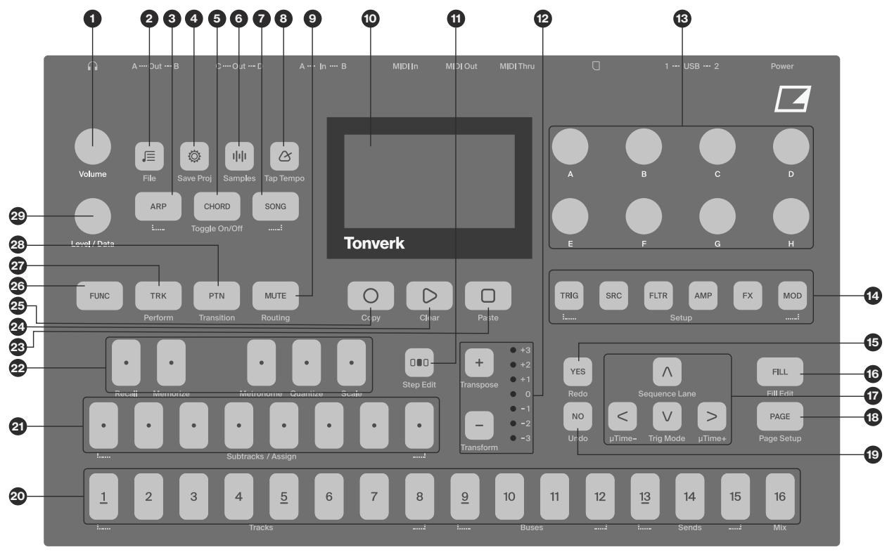

1. MAIN VOLUME sets the volume for the A/B outputs and the Headphones outputs. 

2. [PRESET] opens the LOAD PRESET section of the FILE menu. The secondary function opens the FILE menu. 

3. [ARPEGGIATOR] opens the ARPEGGIATOR menu. The secondary function toggles the arpeggiator on/off. 

4. [SETTINGS] opens the SETTINGS menu, which contains project management, MIDI configuration, and system settings. The secondary function saves the active project. 

5. [CHORD] opens the CHORD/SCALE SETUP menu. The secondary function toggles the CHORD mode on/off. 

6. [SAMPLING] opens the SAMPLING menu, which contains tools for recording audio. The secondary function opens the Sample browser. 

7. [SONG] opens the Song selection screen. The secondary function toggles the SONG mode on/off. 

8. [TEMPO] opens the TEMPO menu, where you can adjust the tempo and swing. Here, you also set parameters related to the metronome. The secondary function enables tapping the tempo. 

9. [MUTE] accesses the track mute functionality. The secondary function accesses the ROUTING menu. 

10. Screen. 

11. [STEP EDIT] accesses the Step Edit functionality. 

12. $[ + ] / [ - ]$ are used for transposing the [KEYBOARD]. The <KEYBOARD OCTAVE $>$ LEDs shows the currently selected octave. The secondary functions access the sequencer track transpose and open the TRANSFORM menu, respectively. 

13. DATA ENTRY knobs A-H. Used for setting parameter values. Press and turn the knobs to change values in larger increments. 

14. [PARAMETER PAGE] keys access the PARAMETER pages of the active track. The secondary functions access different sections of the TRACK SETUP menu. 

• [TRIG PARAMETERS] accesses parameters such as NOTE, VELOCITY, and other trig-related parameters. The secondary page accesses a number of track and keyboard-related settings in the TRACK SETUP. 

• [SRC] accesses the SRC pages. Here you can find parameters related to the SRC machines. For MIDI tracks, this page has parameters such as CHANNEL, PROGRAM, and AFTERTOUCH. The secondary page accesses the SRC machine selection in the TRACK SETUP menu. 

• [FLTR] accesses the FILTER pages. Here are the parameters for the Base-width and Multimode filters. On MIDI tracks, you find the CC value and select settings for the first eight assignable CC commands. The secondary function accesses filter-related settings in the TRACK SETUP menu. 

• [AMP] takes you to the AMP page, where you find parameters for the amplitude envelope. On MIDI tracks, you find the CC value and select settings for eight additional assignable CC commands. The secondary function accesses amp-related settings in the TRACK SETUP menu. 

• [FX] takes you to the FX pages, where you can find parameters for the selected FX machines, the effect send levels, and the track routing. The secondary page accesses the FX machine selection in the TRACK SETUP menu. 

• [MOD] accesses the LFO and Mod Envelope parameters for the active track. 

15. [YES] key. Used for entering sub-menus, selecting, and confirming. 

16. [FILL] Activates FILL mode. The secondary function accesses the FILL EDIT menu. 

17. The [ARROW] keys. Used for navigation and for setting parameter values. They are separately referred to as [UP], [DOWN], [LEFT], and [RIGHT]. The secondary function for [UP] accesses the SEQUENCE LANE menu. The secondary function for [DOWN] accesses the TRIG MODE menu. 

18. [PAGE] selects the active pattern page if the pattern has more than 16 steps. The secondary function accesses the PAGE SETUP menu. 

19. [NO] key. Used for exiting an active menu, backing up one step, and negating. 

20.[TRIG] keys are used for entering or removing sequencer trigs, and parameter locks, in combination with the DATA ENTRY knobs. They are also used to select a track, bank, pattern, and song in combination with the [TRK], [PTN], and [SONG] keys. 

The [TRIG] key lights indicate trigs on the sequencer by lit red keys, while flashing red or yellow keys indicate parameter locks, in GRID RECORDING. When a pattern is playing, or when LIVE RECORDING is enabled, a light moves along the 16 steps of the sequencer across all (up to sixteen) pages at the set tempo. 

21. [KEYBOARD] (bottom row) / [SUBTRACKS] are used to select subtracks when the Subtracks machine is selected, and their secondary function is to select samples for the subtracks. These keys, together with the top row [KEYBOARD] keys, are used for playing presets and assigning note values to note trigs. The specific keys are called [KEYBOARD C1–C2] from left to right. 

22. [KEYBOARD] (top row) These [KEYBOARD] keys, together with the bottom row [KEYBOARD] keys, are used for playing presets and assigning note values to note trigs. The specific keys are called [KEY-BOARD C1#–A1#] from left to right. The keys’ secondary functions are: [KEYBOARD C#1] performs a recall from the previously memorized state of the active pattern. [KEYBOARD D#1] memorizes the state of the active pattern. [KEYBOARD F#1] toggles the metronome on/off. [KEYBOARD G#1] opens the QUANTIZE menu. [KEYBOARD A#1] opens the SCALE menu. 

23. [STOP] stops playback. The secondary function is a paste operation. 

24. [PLAY] starts the sequencer playback. Pressing [PLAY] a second time pauses playback. The secondary function is a clear operation. 

25. [RECORD] key. Activates/deactivates GRID RECORDING mode. Press [RECORD] $^ +$ [PLAY] to activate LIVE RECORDING mode. The secondary function is a copy operation. 

26. [FUNC] key. Press and hold [FUNC], and then press another key to access the secondary function of that key. The mint green text on the Tonverk front panel shows the keys’ secondary functions. 

27. [TRK] key. Press [TRK] $^ +$ one of the [TRIG] keys to select a track for editing. The secondary function accesses the PERFORM mode. 

28. [PTN] selects the bank and pattern in combination with the [KEYBOARD] (bottom row) and [TRIG 1–16] keys. 

29. LEVEL/DATA sets the overall volume level of the active track. It is also used for setting parameters and scrolling through lists. 

# 3.2 REAR PANEL

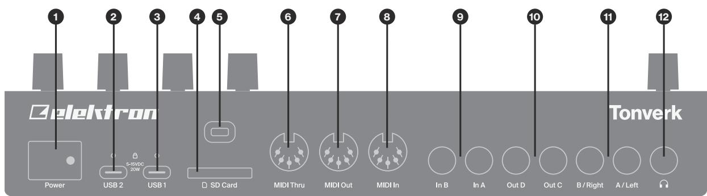

1. POWER Switch is used to turn the device on and off. To turn the device off, press POWER and then press [YES] or press POWER twice. Ensure the device is fully powered off (all the leds and backlight are turned off) before you remove the USB power cable. 

2. USB 2 For connecting a power supply to Tonverk. Use the included PSU-5 power adapter, connected to a power outlet. Make sure to use the fastening screws to secure the USB cable to the device. 

3. USB 1 For connecting to a computer to transfer audio, MIDI, and files. Use the included USB-C to USB-C connector cable to connect to a computer host. 

4. SD card reader. The recommended minimum card size is 2 GB, and it must be formatted to exFAT. The write-protect switch on the SD card must be set to OFF if you want to write to the card. 

5. Kensington Security Slot. For connecting a Kensington lock and cable. 

6. MIDI THRU Forwards data from MIDI IN. Use a standard MIDI cable to connect another MIDI device. 

7. MIDI OUT MIDI data output. Use a standard MIDI cable to connect to the MIDI In of an external MIDI device. 

8. MIDI IN, MIDI data input. Use a standard MIDI cable to connect to the MIDI Out of an external MIDI device. 

9. IN A/B, These audio inputs are used for processing audio from external sources and for sampling external audio. Use either 1/4” (Tip/Ring/Sleeve) phone plugs (balanced connection) or $1 / 4 "$ mono phone plugs (unbalanced connection). 

10.OUT C/D, Audio outputs. Use either a 1/4” (Tip/Ring/Sleeve) phone plug (balanced connection) or a 1/4” mono phone plug (unbalanced connection). 

11. OUT A/B, Main audio outputs. Use either a 1/4” (Tip/Ring/Sleeve) phone plug (balanced connection) or a 1/4” mono phone plug (unbalanced connection). 

12.OUT E/F (HEADPHONES), Audio output for stereo headphones and other audio equipment. Use 1/4” Tip/Ring/Sleeve phone plug for headphones. You can also use a splitter cable with 1/4” Tip/Ring/Sleeve phone plug to two 1/4” mono phone plugs. 

If the device becomes unresponsive, you can force it to turn off by pressing and holding the POWER button until the device turns off. Please note that unsaved work might be lost. 

# 3.3 SETTING UP AND STARTING TONVERK

Place Tonverk on a stable support, such as a sturdy table, with sufficient space for the cables. Make sure to switch off all devices before you connect Tonverk to other devices. 

1. Plug the supplied DC adapter into a power outlet and connect the USB plug to the USB 2 connector on Tonverk. 

2. Connect OUT A/B from Tonverk to your mixer, amplifier, or use headphones plugged into the HEAD-PHONES jack. 

3. To control Tonverk from a computer, connect a USB cable between the computer and the USB 1 connector on Tonverk. 

4. To use MIDI to control Tonverk, connect the MIDI OUT port of the device you wish to send data from to the MIDI IN port of Tonverk. If you want to use Tonverk to control other devices, connect the MIDI OUT port of Tonverk to the MIDI IN port of the device you want to control. 

5. Connect an audio source to IN A/B or via USB to process audio from external sources. 

6. Switch on all units. Press the POWER switch located at the back of Tonverk to switch it on. 

# 4. TONVERK SOUND ARCHITECTURE

The illustrations below show the Tonverk internal sound architecture. 

# 4.1 AUDIO VOICES

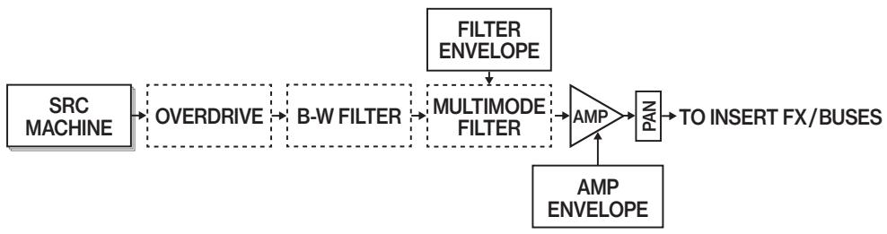

The Overdrive, Base-width filter, and the Multimode filter can all be routed in any order you choose. ForMACHINE OVERDRIVE AMP PA TO INSERT FX/BUSESFILTERB-W FILTER ENVELOPE more information, please see “11.3.1 ROUTING” on page 48. 

# 4.2 INSERT FX / BUSES

Each Audio track and Bus track has its own two selectable insert FXs and routing destination.ENVELOPE 

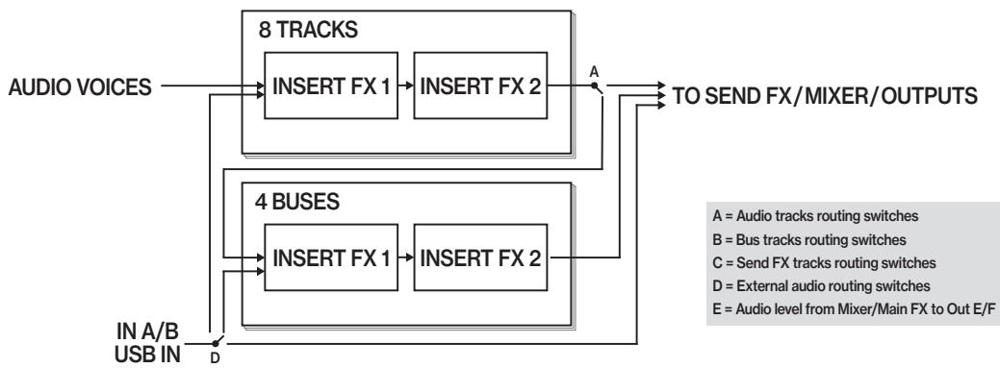

# FROM TRACKS MIXERA A4.3 SEND FX / MIXER / OUTPUTS

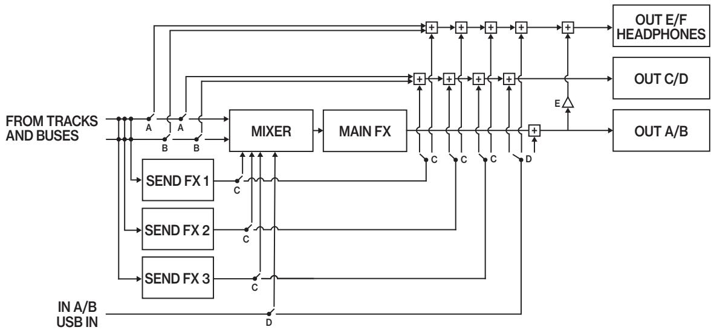

# 4.4 THE ROUTING MENU

FADETonverk features a flexible routing setup that allows you to direct sound from multiple sources (audio tracks, buses, send FXs, and external inputs) to various destinations (device outputs, buses, and tracks). Every audio track, bus, and send FX has its own routing. Routing is primarily performed in the Routing menu. You FROM EFFECT SENDSLFO DESTINATIONcan also route the active audio track, bus, or send FX using the ROUT parameter on FX PAGE 1. You can INTERNALINSERT FX 1 INSERT FX 2only route the external inputs on the Mix track’s SRC page. 

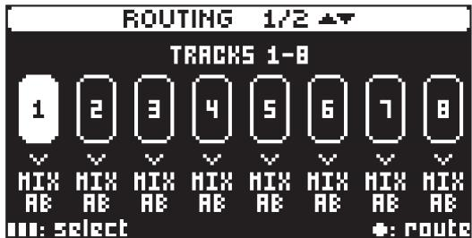

# 4.4.1 ROUTING TRACKS

1. Press [FUNC] $^ +$ [MUTE] to open the ROUTING menu. 

2. Use [UP]/[DOWN] to select the track group you want to view (tracks, buses/send FX). 

3. Use the [TRIG] keys to select the track you want to route, and then use LEVEL/DATA to select a routing destination. 

4. Press [NO] to exit and close the ROUTING menu. 

The possible routing destinations vary depending on the track type/source. 

• Audio track sound destinations: MIX AB, OUT CD, OUT EF, BUS 1–4 Routing switches are shown with “A” in the sound architecture illustrations above. 

Bus track sound destinations: MIX AB, OUT CD, OUT EF Routing switches are shown with “B” in the sound architecture illustrations above. 

Send FX track sound destinations: MIX AB, OUT CD, OUT EF, Routing switches are shown with $" C '$ in the sound architecture illustrations above. 

The MIX AB destination is always routed (through the main FX) to outputs A/B. It is also, by default, routed to outputs E/F (Headphones). The level of the signal to E/F (Headphones) can be set on the MIX track’s FLTR page using the HP.MON parameter. This level control is indicated by the letter “E” in the sound architecture illustrations above. 

You can also use a key combination to route the track to different destinations in the ROUTING menu. Press and hold the [TRIG] key(s) for the track(s) you want to route, then press the [TRIG] key representing the routing destination. The OUT CD and OUT EF destinations is selected with [KEYBOARD A] and [KEYBOARD B] respectively. 

The external audio inputs can also be routed to several destinations: MIX AB, OUT AB, OUT CD, OUT EF, BUS 1–4, TRK 1–8. However, these settings can only be performed on the SRC page of the Mix track, and not in the ROUTING menu. Routing switches for the external inputs are indicated by the letter “D” in the sound architecture illustrations above. 

The two sources of external audio input, audio over USB and audio from the IN A/B inputs, are merged, processed, and treated as a single source of input. 

• When selecting a track as a destination for the external inputs, the audio is routed directly to the insert effects and not through the track’s overdrive, filters, or amp. 

# 5. OVERVIEW OF THE TONVERK STRUCTURE

The illustration below outlines the Tonverk structure. 

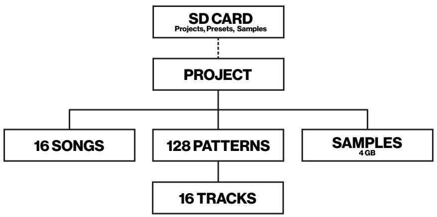

# 5.1 SD CARD

The SD card contains Tonverk data, where Projects, Presets, Instruments, Samples, and global settings are stored. The amount of data you can store on the SD card depends on the size of the SD card. Tonverk comes with a 64 GB SD card. The recommended minimum card size is 2 GB, and it must be formatted in exFAT format. For more information, please see “6.11 SAMPLE BROWSER” on page 24. 

# 5.2 DATA STRUCTURE

# 5.2.1 PROJECT

A project contains 128 patterns. The project also stores general settings and states. The currently loaded project becomes the active working state of Tonverk. From here, it is possible to edit the patterns and presets of the project. Every time Tonverk is switched on, it boots to the active working state, the active project. Projects are saved, loaded, and managed in the FILE menu. For more information, please see $^ { * } 9 . 1$ THE FILE MENU” on page 31. 

# 5.2.2 SONGS

A song is an arrangement of patterns set up to play in sequence. Each row in the SONG mode arrangement can have separate settings for pattern, row repeat, row length, and tempo. A song can be up to 99 rows in length, and each project can contain up to 16 songs. For more information, please see “10.11 SONG MODE” on page 43. 

# 5.2.3 PATTERNS

The patterns are the primary data container for Tonverk. Sixteen patterns are available for each of the eight banks, resulting in 128 patterns for each project. A pattern contains up to 12 presets (one for each audio or MIDI track), plus sequencer data like trigs and parameter locks. It also includes the settings on the TRIG page, as well as BPM, length, swing, and time signature settings. For more information, please see “10. THE SEQUENCER” on page 35. 

# 5.2.4 SAMPLES

Tonverk can load and play WAV and AIFF audio files (samples) with 16/24/32-bit depth (floating and fixed point) and a sample rate of 48 kHz (mono and stereo interleaved). Files with other sample rates (44.1 kHz/ 88.2 kHz/96 kHz) can also be loaded, but they will gracefully degrade in quality when played back. You can load up to 4 GB of samples in a project’s internal memory, using a maximum of 1023 sample slots. Samples are stored on the SD card, and the size and number of those samples are limited only by the available free space on the SD card. For more information, please see ${ } ^ { " 9 . }$ . PATTERNS, PRESETS, IN-STRUMENTS AND SAMPLES” on page 31. 

All samples that are played on a track in Tonverk are played back with an attenuation (lowering of volume) of -22dB to maintain headroom in the device. The sample files themselves are unaffected. 

# 5.3 MACHINES AND TRACKS

The Tonverk sequencer has 16 tracks. 8 Audio/MIDI tracks, 4 Bus and MIDI tracks, 3 Send FX tracks, and one Mix track. 

# 5.3.1 MACHINES

A machine is a module within Tonverk that has specific functionality. A machine can be replaced with another machine of the same category. For example, different audio sample playback engines (SRC machines) or a selection of effects (FX machines). Every machine has a specific set of parameters tailored to give you the most useful sound-shaping possibilities for that particular machine. For more information, please see “APPENDIX A: MACHINES” on page 79. 

# 5.3.2 AUDIO TRACKS (TRACK 1–8)

Tracks 1–8 can be used as audio tracks. This is the default setting for these tracks. Each audio track contains a preset. The preset contains the settings in the PARAMETER pages (SRC, FLTR, AMP, FX, and MOD), the settings in the PRESET SETUP menu, and the ARPEGGIATOR menu. Tracks 1–8 can also be used with a MIDI SRC machine, which then converts the audio track into a MIDI track. Each audio track has two insert effect slots, separate sends to the three send effects, two voice LFOs, a modulation envelope, and two FX LFOs dedicated as modulation sources for the track’s selected FX machines 

# 5.3.3 BUS TRACKS (TRACK 9–12)

A bus lets you route multiple tracks into one channel to process them simultaneously—you can use one signal chain to affect an entire group of tracks, adding effects, and adjusting the level for the whole group. Tonverk has four separate buses, each with its own sequencer track. Each bus has two insert effect slots, separate sends to the three send effects, and two LFOs. The bus tracks can also simultaneously function as MIDI tracks, using the parameters on the SRC, FLTR, and AMP pages. 

# 5.3.4 SEND FX TRACKS (TRACK 13–15)

Tonverk has three Send FX tracks. For each track, you can select an FX machine that will be one of the pattern’s Send FXs. You also have two LFOs on each track, dedicated as modulation sources for the track’s selected FX machine. 

# 5.3.5 MIX TRACK (TRACK 16)

Tonverk also has a Mix track. This track allows you to control the Mixer parameters, including track levels and audio input settings. Here, you can select an FX machine to be the pattern’s main FX. You also have two LFOs on the track dedicated as modulating sources for the selected FX machine. 

# 5.3.6 MIDI TRACKS (TRACK 1–12)

The MIDI tracks function almost identically to the audio tracks. Parameter locks, LFO modulation, and copy/paste commands are available. Each MIDI track also features micro timing, individual track length, and time signature settings. The primary difference is that the MIDI tracks do not generate sound; instead, the sequencer data is transmitted through the MIDI OUT or USB ports. 

Any of the tracks 1–12 can be used as a MIDI track. They are used to control external, MIDI-equipped gear. Each MIDI track can trigger up to 16 notes per step with adjustable parameters, including velocity and length, as well as control pitch bend and aftertouch. Additionally, 16 freely assignable MIDI control change parameters (MIDI CCs) are available. For more information, please see “A.2.4 MIDI” on page 82. Any MIDI channel can be assigned to a MIDI track, and several tracks can share the same channel. If several tracks are assigned to the same MIDI channel, the track with the lowest number has priority in the event of parameter conflicts. 

To use tracks 1–12 as a MIDI track, you must first assign a MIDI machine to it. 

1. Press [FUNC] $^ +$ [SRC] to open the MACHINE menu. 

2. Use [UP]/[DOWN] to select the MIDI machine, and then press [YES] to assign it to the track. 

• If you select a MIDI machine for a Bus track (tracks 9–12), the Bus track doubles as a MIDI track, with both the MIDI and bus-related parameters available. 

• Both Audio- and Bus tracks retain their selected FX machines even if you assign a MIDI SRC machine to the track. 

# 5.3.7 SELECTING TRACKS

Press [TRK] $^ +$ [TRIG 1–16] to select a track without triggering the track’s preset (if it is an audio track). When not in any recording mode, press [TRIG 1–16] to select a track and trigger its preset (if it is an audio track). If you select track 9–16 and your previously selected track was an audio track, the [KEY-BOARD] still plays the previously selected audio track. 

The complete track preset, with all its parameter settings may be copied to another track (if the selected target track is in the same track type (Audio/MIDI tracks, Bus tracks, Send FX tracks). Press [TRK] $^ +$ [TRIG 1–16] $^ +$ [RECORD], and then press [TRK] $^ +$ [TRIG 1–16] + [STOP] to paste the preset to the selected track. 

# 6. INTERACTING WITH TONVERK

The screen shows all the information needed for real-time interaction and editing on Tonverk. The eight DATA ENTRY knob parameters shown will vary depending on the given situation. 

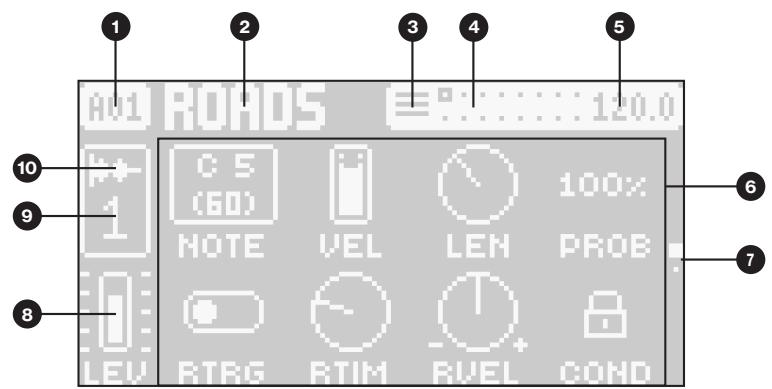

1. Bank and pattern. 

2. Pattern name. 

3. Trig mode. 

4. Sequencer page indicator. Squares shows the number of used pages (max 16 pages). An unfilled square shows the currently active page. 

5. The tempo. 

6. Track parameters. They show what the eight DATA ENTRY knobs control and their current parameter values. 

7. Parameter page indicator. Indicates the number of pages for the selected parameter section and which page is currently selected. 

8. The main level setting of the active track. Use the LEVEL/DATA knob to change the level setting. 

9. Active track. 

10.Track/Machine type. 

Tonverk features a screen saver that dims the screen after 5 minutes of inactivity and turns off the screen after 60 minutes. Press any key or move any controller to wake the screen. 

# 6.1 SETTING THE VOLUME

MAIN VOLUME sets the volume for the A/B outputs and the E/F (Headphones) outputs. 

# 6.2 SCREEN NAVIGATION

Use the [ARROW] keys [UP], [DOWN], [LEFT] or [RIGHT] to navigate menus or sub-menus. 

The LEVEL/DATA knob can be used to scroll through menus and lists quickly. 

[YES] is used to confirm, select, enter sub-menus/folders and tick/untick boxes. 

[NO] is used to cancel, deselect or go back one or more steps in menu and folder structures. 

# 6.3 PARAMETER EDITING

The [PARAMETER PAGE] keys open the corresponding parameter page group, where you can edit the tracks. 

The DATA ENTRY knobs are used to change the values of the track parameters. The positions of the parameters on the screen correspond to the physical locations of the knobs on the front panel. Press and turn a knob to adjust its parameter in larger increments. Use the [UP]/[DOWN] keys to cycle through the parameter group’s pages. You can also press a [PARAMETER PAGE] key repeatedly to cycle through the parameter pages in that group. Press and hold a [PARAMETER PAGE] key to see the values for all parameters on that page. For more information, please see “12. AUDIO TRACK PARAMETERS” on page 50, and “APPENDIX A: MACHINES” on page 79. 

• The parameters are adjusted in larger increments if you press down the DATA ENTRY knob while turning it. This makes it quicker to sweep through the whole parameter range. 

• Press DATA ENTRY knob $^ +$ [NO] to reset the parameter to the default value. 

• Press [PARAMETER PAGE] key $^ +$ [PLAY] to reset all the parameters in the selected parameter page to default values. 

• Press and hold a [PARAMETER PAGE] key to see the values for all parameters on that page. 

# 6.3.1 PARAMETER SNAP VALUES

Pressing [FUNC] while editing specific parameters will cause the parameter values to snap to suitable musical and performance related values. The NOTE parameter, for example, snaps to octave steps, and the PAN parameter snaps to full left, center, and full right. 

# 6.4 [FUNC] KEY PRESS COMBINATIONS

The standard way to use the [FUNC] key in combination with other keys is to press and hold [FUNC] and then press the second key in the combination. 

# 6.5 QUICK SCROLLING

Scroll through menus using the LEVEL/DATA knob. Quick scrolling is possible on many menus. Press [FUNC] $^ +$ the [UP/DOWN] keys to move the cursor one menu page. 

# 6.6 COPY, CLEAR, AND PASTE

Copy, clear, and paste commands are available in many contexts. Pressing [FUNC] $^ +$ [RECORD] to copy. Press [FUNC] $^ +$ [STOP] to paste. Press [FUNC] $^ +$ [PLAY] to clear. Please refer to the various sections in the manual for more information on when these commands are available. For more information, please see “19. KEY COMBINATIONS” on page 74. 

# 6.7 THE NAMING SCREEN

The naming method is identical for the various naming situations.. 

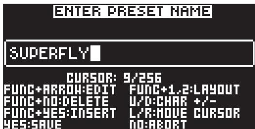

The [LEFT] and [RIGHT] arrow keys are used to navigate between the characters. Turning the LEVEL/ DATA knob or pressing the [UP] or [DOWN] arrow keys selects the characters. [FUNC] $^ +$ [NO] erases characters. [FUNC] $^ +$ [YES] inserts a space. Press [SETTINGS] to create a random name. Press and hold [FUNC] to access the Pop-up Naming menu. 

# 6.7.1 POP-UP NAMING

A convenient way of naming is to open a pop-up menu that shows all available letters, symbols, and digits. Press and hold the [FUNC] key when you are on the NAMING screen to access the Pop-up naming screen. 

Keep [FUNC] pressed and use the [ARROW] keys to highlight the character you want to insert. Once there, release [FUNC] to add the character. At the same time, pressing and holding [FUNC], press [TRIG 1 / TRIG 2] to switch between character layouts. 

Copy, paste, and clear commands are available on the NAMING screen. 

# 6.8 CLASS COMPLIANT DEVICE

Tonverk is a class-compliant device (also known as plug-and-play). It means it does not require any additional drivers to connect to your computer or other USB class-compliant hosts. 

Tonverk can, therefore, stream audio and MIDI directly over USB to and from supported computers, phones, and tablets. It opens up several exciting possibilities of what you can do with your device, for example, record audio from your device directly over USB in your DAW. 

# 6.9 BACKING UP TONVERK

It is always recommended to make regular backups of all your Tonverk data. To create backups and transfer files to and from your Elektron device to a computer, you should use the USB DISK MODE. 

# 6.9.1 BACKING UP TONVERK DATA TO A COMPUTER

1. Connect Tonverk to a computer using a USB cable attached to one of Tonverk’s USB 1 connector. 

2. On the device, navigate to SETTINGS $>$ USB DISK MODE, and then press [YES]. 

3. On the popup window, press [YES], but be aware that device playback will stop. 

4. Tonverk’s SD card should now show up in your computer as a USB device. Click the Tonverk USB device on the computer to access the SD card’s contents. 

5. Copy the files and folders you want to back up from Tonverk’s SD card to the computer. 

6. Once all data is copied, safely eject the Tonverk USB device from the computer. Please refer to your computer’s documentation on how to perform this procedure. 

7. On your device, press [NO] to exit USB disc mode. 

# 6.9.2 TRANSFERRING BACKED UP DATA TO TONVERK

1. Connect Tonverk to a computer using a USB cable attached to one of Tonverk’s USB 1 connector. 

2. On the device, navigate to SETTINGS $>$ USB DISK MODE, and then press [YES]. 

3. On the popup window, press [YES], but be aware that device playback will stop. 

4. Tonverk’s SD card should now show up in your computer as a USB device. Click the Tonverk USB device on the computer/device to access the SD card’s contents. 

5. Delete the backed-up files and folders from the SD card. (You don’t have to delete the files, but you can instead replace the files and folders; however, it will then ask you whether you want to keep or replace every file). 

DO NOT delete files and folders from the SD card unless you have a previously made backup of the Tonverk data available. 

7. Copy the all the previously backed up files from the computer to Tonverk’s SD card to restore all Tonverk data. 

8. Once all files are copied, safely eject the Tonverk USB device from the computer. Please refer to your computer’s documentation on how to perform this procedure. 

9. On Tonverk. Press [NO] to exit USB disk mode. 

• If you only want to back up the data you have created (projects, presets, instruments, and recordings), as well as the samples you have added. Then, you only need to back up the USER folder (unless you have manually selected to store user data outside of this folder) 

• You can also use a smartphone or tablet to store and retrieve Tonverk data. 

# 6.10 OS UPGRADE

If a new version of the Tonverk operating system is available, it is highly recommended that you download and install the OS to keep your device up to date with the latest functionality and fixes. You can download the OS file from the Elektron website’s Support section. 

# 6.10.1 UPGRADING THE OS.

1. Download the OS file from the Elektron website to your computer. 

2. Connect Tonverk to a computer using a USB cable attached to Tonverk’s USB 1 connector. 

3. On the device, navigate to SETTINGS $>$ USB DISK MODE, and then press [YES]. 

4. On the popup window, press [YES], but be aware that device playback will stop. 

5. Tonverk’s SD card should now show up in your computer as a USB device. Click the Tonverk USB device on your computer to access the contents of the SD card. 

6. Copy the downloaded OS file to Tonverk’s SD card and place the file at the root of the SD card’s file structure (not inside any folder). 

7. Safely eject the Tonverk USB device from the computer. Please refer to your computer’s documentation on how to perform this procedure. 

8. On your device. Press [NO] to exit USB disk mode. 

9. Navigate to SETTINGS $>$ SYSTEM $>$ OS UPGRADE, and then press [YES]. Tonverk will search through the SD card for the new OS file. Once the new OS file is detected, press [YES] to start the upgrade process. Tonverk will reboot once the upgrade is finished. Press [NO] if you wish to abort the upgrade and return to the SETTINGS menu. 

You can also use a smartphone or tablet to upload a new OS file to Tonverk’s SD card. 

# 6.11 SAMPLE BROWSER

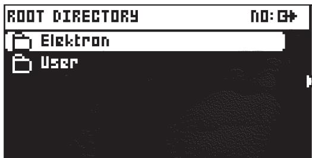

The Sample browser enables you to view and access samples and other content, stored on the SD card. Press [FUNC] $^ +$ [SAMPLING] to open the SD card browser. Use [UP]/[DOWN] or LEVEL/DATA to scroll through the items. Press [YES] or [FUNC] $^ +$ [RIGHT] to enter the highlighted directory. To exit a directory and back one step up in the directory structure, press [NO] or [FUNC] $^ +$ [LEFT]. Press and hold [NO] to exit a directory and retuen to the top of the directory structure. 

Press [RIGHT] to access the OPERATIONS menu. The available operations will affect the highlighted file or folder, depending on the type of the highlighted item. Press [YES] to apply the commands to the selected Sound. Press [NO] or the [LEFT] arrow key to exit the menu. 

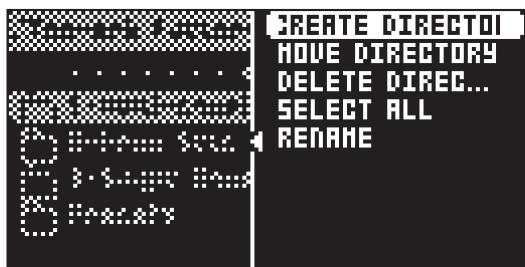

CREATE DIRECTORY creates a new directory/folder at the same level in the file structure. Use the NAM-ING screen to name the new directory. For more information, please see “6.7 THE NAMING SCREEN” on page 22. 

MOVE DIRECTORY moves the highlighted directory to a different location in the file structure. Press [YES] to select the highlighted item that you want to move, then press [YES] again to access the folder structure. Open the target folder where you want to move the item, and then select MOVE HERE and press [YES]. 

DELETE DIRECTORY deletes the selected directory and all its contents. 

SELECT ALL selects all files (but not the folders or files inside any folders in the current directory) in the current directory. 

RENAME opens a Naming screen where you can rename the selected item. 

MOVE FILE moves the highlighted file to a different location within the file structure. Press [YES] to select the highlighted directory that you want to move, then press [YES] again to access the folder structure. Open the target folder where you want to move the item, and then select MOVE HERE and press [YES]. 

DELETE FILE deletes the selected file. 

LOAD TO PROJ loads the selected sample to the active project. 

We recommended that you save and add content only to the USER folder on the SD card. This folder also contains the default destinations for saving projects, presets, samples, and instruments. 

• If you delete or move samples (or a folder containing samples) on the SD card, it will affect all projects that use the deleted or moved samples, and the samples will be missing from these projects. 

• The write-protect switch on the SD card must be set to OFF if you want to write to the card. 

# 7. QUICK START

This quick start will guide you through some of the basic operations to start using Tonverk right away. First, connect it as described in section $\mathfrak { s } . 3$ SETTING UP AND STARTING TONVERK” on page 16. 

# 7.1 SELECTING AND PLAYING THE PRESETS

There are a large number of presets in Tonverk that you can use in your music-making or as starting points for your own sound design. 

1. Press [PRESET] to open the LOAD PRESET menu. 

2. Use [UP]/[DOWN] or LEVEL/DATA to highlight a preset. 

3. Press [YES] to load the preset to the active track. 

# 7.2 PLAYING THE FACTORY PRESET PATTERNS

You can find a number of factory patterns in Tonverk. Follow the instructions below to get started exploring your new instrument. 

1. Press [PTN] and then use the [KEYBOARD C1] key to select bank A. Then press [TRIG 1] to select pattern A01. 

2. Press [PLAY] to listen to pattern A01. 

3. Press [PTN], and then press [TRIG 2] to cue pattern A02. It will start once pattern A01 has reached its end. Select pattern A03 by pressing [PTN], and then press [TRIG 3], and so on. 

4. Press [STOP] to stop playback. 

# 7.3 USING THE [KEYBOARD] KEYS

You can use the [KEYBOARD] keys to play an audio track chromatically. 

1. Select the track to play chromatically by pressing [TRK] $^ +$ one of the [TRIG 1–8] keys. 

2. Play the [KEYBOARD] keys. The preset will be pitched differently for each of the keys. Press [+]/[-] to transpose the virtual keyboard up or down one octave. 

For more information, please see $^ { * } 8 . 5$ THE [KEYBOARD]” on page 28. 

Using the [KEYBOARD] is an effective way to add musical variety to your tracks. The timbre, tonality and impact of playing a preset chromatically depends on the character of the source preset. 

# 7.4 USING MUTE MODE

You can mute any of the sequencer tracks in this mode and access all tracks simultaneously. 

1. Make sure a pattern is playing. 

2. Press [MUTE] to enter MUTE mode. 

3. Press any of the [TRIG] or [SUBTRACKS] keys to mute the corresponding track. Press again to unmute. The light of the [TRIG]/[SUBTRACKS] keys indicates the mute status. Unlit keys are muted tracks. Green lit keys are active tracks. 

For more information, please see ${ } ^ { * } 8 . 6$ MUTE MODE” on page 29. 

# 7.5 TEMPO AND METRONOME

7.5.1 TEMPO

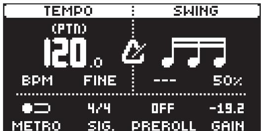

Press [TEMPO] to open the TEMPO menu, where you can adjust the BPM and SWING settings. Use DATA ENTRY knob A or LEVEL/DATA to change the tempo. Pressing the knob while turning it changes the tempo eight BPM at a time. Use [UP]/[DOWN] or DATA ENTRY knob B to change the tempo in decimal steps. To tap a tempo setting, hold [FUNC] and tap the [TEMPO] key in a steady rhythm. After four consecutive taps the average tempo of the taps will be calculated. By continuing to tap, the average tempo will keep updating. On the main interface screen, you can also press and hold the [ARROW] keys [LEFT] or [RIGHT] to temporarily nudge the tempo up or down by $10 \%$ . Release the key to revert to the original tempo. 

Nudging the tempo is very handy when manually syncing Tonverk to a turntable or an external sound source. Note that you do not need to be in the TEMPO menu to nudge the tempo. 

Use DATA ENTRY knob D to adjust the SWING setting of the pattern, to employ a propulsive, rhythmic groove. The swing ratio can be set to $5 0 \small { - } 8 0 \%$ . The default setting is equal spacing, $50 \%$ . 

Press [NO] to close the menu. 

# 7.5.2 METRONOME

The metronome settings control the internal metronome of Tonverk. Press [TEMPO] to open the TEMPO menu. Use the DATA ENTRY knobs E-H to change the settings. 

Press [NO] to close the menu. 

METRO activates/deactivates the metronome. You can also press [FUNC] $^ +$ [KEYBOARD F#1] to toggle the metronome on/off even if you are not in the METRONOME menu. 

SIG. sets the note and beat measure of the metronome time signature. 

PREROLL sets the number of bars the metronome will sound before the sequencer starts playing. This setting is only relevant when you are in LIVE RECORDING mode. 

GAIN sets the volume of the metronome’s click. 

# 7.6 EDITING PARAMETERS

Each track makes use of up to six parameter page groups, each containing a number of pages. Press [PARAMETER PAGE] keys TRIG, SRC, FLTR, AMP, FX, and MOD to access the different PARAMETER page groups. These parameters affect the sound and signal in various ways. 

1. Make sure a pattern is playing. 

2. Press [TRK] $^ +$ [TRIG 1–16] to select a track. Select track 1–8 to get more audible results from the parameter editing. 

3. To change, for example, the cutoff of the filter, press the [FLTR] key to open the FILTER page. The parameter labeled FREQ changes the cutoff of the filter. Turn DATA ENTRY knob E to change the parameter value, and hear how the sound is affected. 

Try out the remaining PARAMETER page parameters to explore a range of sound-shaping possibilities. 

# 8. TONVERK CONTROLS

# 8.1 TRIG KEYS

The [TRIG] keys have several uses, including, for example, triggering an audio/MIDI track from the active pattern. They can also be used for placing trigs in the RECORDING modes. When pressed in combination with the [PTN] and [SONG] keys, they select patterns and songs. The [TRIG] keys light up to indicate the position of placed trigs and to indicate the chosen bank and track. 

# 8.2 ROTARY ENCODERS

The MAIN VOLUME, LEVEL/DATA and DATA ENTRY knobs are relative encoders which may be spun any number of turns. Pressing and turning the DATA ENTRY knobs, will change their associated values at a greater speed. 

# 8.3 KEY BEHAVIOR

As a group, the track selection keys (the [TRIG] keys) have radio button functionality, i.e. when a new track is set to be active, the previous one is simultaneously deactivated. Only one track can be selected at a time. Likewise, the group consisting of the six [PARAMETER PAGE] keys also has radio button functionality. 

# 8.4 MIDI NOTES AND MESSAGES

Some functions can be triggered by sending MIDI note values from an external MIDI device (a MIDI keyboard or a computer, for example) connected to Tonverk via a MIDI or USB cable. 

The 128 notes in the standard MIDI range (0-127) all trigger the preset of the active track in its chromatic variations (as if played by the [KEYBOARD] keys (see section below), from lowest to highest pitch. 

MIDI program change messages 0–127 will select pattern 1–128 (A01–H16) on Tonverk. Additionally, MIDI CC and NRPN messages can be sent to control various aspects of Tonverk. For more information, please see “APPENDIX D: MIDI” on page 103. 

# 8.5 THE [KEYBOARD]

You can use the [KEYBOARD] keys to play the preset of the active audio track (or send MIDI notes if the active track has a MIDI SRC machine selected). Press [TRK] $^ +$ [TRIG 1–12] keys to select the track you want to play. 

Press the lit trig keys to play different notes. The whole note range you can trigger spans 7 octaves. You can transpose the keyboard up or down 3 octaves from the middle octave. Press $[ + ] / [ - ]$ to transpose the virtual keyboard up or down in octave steps. 

Notes triggered can be recorded on the sequencer in LIVE RECORDING mode. Find out how this is done in section “10.4 LIVE RECORDING MODE” on page 38. 

The [KEYBOARD] keys do not play the preset chromatically if a Subtracks SRC machine is selected for the active track. Instead, the [KEYBOARD C1, D1, E1, F1, G1, A1, B1, and C2] keys trigger the eight separate subtracks. 

# 8.5.1 CHORD/SCALE SETUP MENU

Press [CHORD] to open the CHORD/SCALE SETUP menu. Here you get a graphical view of which notes the [TRIG] keys play. These settings then affect how you add notes/chords using the [TRIG] keys to the sequencer in the LIVE RECORDING mode. Press $[ + ] / [ - ]$ or [UP]/[DOWN] to transpose the keyboard up or down an octave. In this menu, you can also set different musical scales, select the root note of the scale, and select the chord mode. Use the DATA ENTRY knobs to change the settings. Press [CHORD] or [NO] to exit the CHORD/SCALE SETUP menu. The settings are stored in the active pattern. 

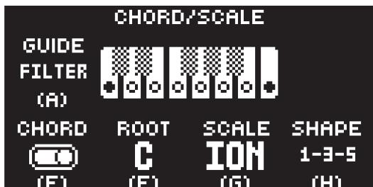

GUIDE (with CHORD set to OFF) decides which notes will play when you press the [KEYBOARD] keys. 

OFF In this mode, all the [KEYBOARD] keys play all notes chromatically and ignore the selected scale. 

LIGHT In this mode, all the [KEYBOARD] keys play all notes chromatically and ignore the selected scale, but the [KEYBOARD] keys within the selected SCALE will light up. 

SNAP In this mode, all the [KEYBOARD] keys play notes within the selected scale. The [KEY-BOARD] keys that are not within the scale will play the note that is closest within the scale. 

FILTER In this mode, only the [KEYBOARD] keys within the selected scale will play notes. 

GUIDE (with CHORD set to ON) decides which notes will play when you press the [KEYBOARD] keys. 

OFF In this mode, the [KEYBOARD] key you play will always sound, whether it is within the selected scale or not. However, the notes added by the chord mode, always play within the chosen scale and are based on the ROOT, SCALE, and SHAPE settings. If the key played is not within the scale, the added notes will derive from the nearest lower note within the scale. 

LIGHT In this mode, the [KEYBOARD] key you play will always sound, whether it is within the selected scale or not. However, the notes added by the chord mode, always play within the chosen scale and are based on the ROOT, SCALE, and SHAPE settings. If the key played is not within the scale, the added notes will derive from the nearest lower note within the scale. The [KEYBOARD] keys within the chosen SCALE will light up. 

SNAP In this mode all the [KEYBOARD] keys played will play notes within the selected scale. If you play a key that is not within the scale, it will play the note that is closest within the scale. The notes added based on the ROOT, SCALE, and SHAPE settings will also play within the selected scale. 

FILTER In this mode, only the [KEYBOARD] keys within the selected scale will play notes and trigger chords within the scale. 

CHORD switches CHORD MODE on/off. The keyboard now plays multiple notes with each key press. The notes added are based on the ROOT, SCALE, and SHAPE settings. 

• You can also press [FUNC] $^ +$ [CHORD] to toggle the CHORD MODE on/off. 

• If CHORD mode is set to ON, the [CHORD] key will light up cyan. 

ROOT sets the root note for the chosen scale. 

SCALE sets the scale. This setting governs which notes are playable on Tonverk’s [KEYBOARD] keys to allow only notes in the set scale (with FILTER set to LOCK) and which notes will sound when CHORD is set to ON. For a list of all selectable keyboard scales, please see ”APPENDIX E: KEY-BOARD SCALES” on page 119. 

TYPE/SHAPE With SCALE set to CHROMATIC, you have here a selection of different types of chords (for example, MAJ, MIN, MIN7, MAJ7, DIM) to choose from. With SCALE set to anything but CHRO-MATIC, diatonic chords in the scale are created, and SHAPE sets which notes in the chord are used. 

For example, with ROOT set to C and SCALE to ION (white key notes only), and SHAPE set to 1-3-5: 

Playing a C note, this will create the notes C, E, G (C major) 

Playing a D note, this will create the notes D, F, A (D minor) 

Playing a C note on 1-3-5-7 will create the notes C, E, G, B (C major 7th), etc 

# 8.6 MUTE MODE

You can use MUTE mode to mute sequencer tracks 1–16. In MUTE mode, you can access all tracks for muting. However, if you want to mute the subtracks on a track that uses the Subtracks SRC machine, this track needs to be active when you enter MUTE mode. Muting the parent track using the [TRIG] key mutes all the subtracks. 

Press [MUTE] to enter MUTE mode and then press [TRIG]/[SUBTRACKS] to mute the corresponding track. Press again to unmute. The light of the [TRIG]/[SUBTRACKS] keys indicates the mute status. Unlit keys are muted tracks. Green lit keys are active tracks. Press [MUTE] to exit MUTE mode. If you are not in MUTE mode, but have muted one or several tracks/subtracks, the [MUTE] key will be lit dimly green. In MUTE mode, on a track that uses a Subtracks machine, if you mute a subtrack, the track’s [TRIG] key will be lit dimly green. 

The MUTE mode settings are saved together with the project. 

You can also quick mute tracks by pressing [MUTE] $^ +$ [TRIG]/[SUBTRACKS]. 

# 8.7 TRIG MODES

The various TRIG modes affect the functionality of the [TRIG 1–16] keys. Press [FUNC] $^ +$ [DOWN] to access the TRIG MODE menu and then use [UP]/[DOWN] to select which TRIG mode should be active. The selected TRIG mode is active for all the tracks. All actions performed using the trig modes can be recorded in LIVE RECORDING mode. 

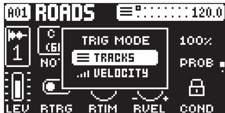

# TRACKS

This is the default TRIG mode. In this mode, the [TRIG 1–16] keys trigger/select the corresponding tracks. 

# VELOCITY

In this TRIG mode, the [TRIG 1–16] keys triggers the active track with different amounts of velocity. 

Trig $\uparrow =$ Velocity 8 

Trig $^ { 2 = }$ Velocity 16 

Trig ${ \boldsymbol { 3 } } =$ Velocity 24 

Trig $4 =$ Velocity 32 

Trig $5 =$ Velocity 40 

Trig $6 =$ Velocity 48 

Trig $7 =$ Velocity 56 

Trig $8 =$ Velocity 64 

Trig ${ \mathfrak { g } } =$ Velocity 72 

Trig 10 $=$ Velocity 80 

Trig 11 $=$ Velocity 88 

Trig ${ \uparrow } 2 =$ Velocity 96 

Trig 13 = Velocity 104 

Trig $1 4 =$ Velocity 112 

Trig $1 5 =$ Velocity 120 

Trig 16 $=$ Velocity 127 

# 9. PATTERNS, PRESETS, INSTRUMENTS AND SAMPLES

The patterns are the primary data container for Tonverk. Sixteen patterns are available for each of the eight banks, resulting in 128 patterns for each project. A pattern contains up to 16 presets (one for each track), as well as sequencer data such as trigs and parameter locks. It also includes the default settings on the TRIG page, as well as BPM, length, swing, and time signature settings. 

A preset that has been imported from the SD card to a pattern becomes part of the active pattern. Any changes made to a preset will therefore not affect the stored preset. It will only affect the preset in the active pattern. You can save a preset from the active pattern to the SD card. For more information, please see “9.1 THE FILE MENU” on page 31. 

A preset imported to a pattern becomes an independent copy of the preset on the SD card. It is not linked to the original preset on the SD card, and instead becomes a part of the pattern. 

# A pattern contains:

• All the presets used on the pattern’s tracks. 

• Routing settings. 

• Sequencer data, such as trigs and parameter locks, for the 16 tracks. 

• The settings on the TRIG page, BPM, length, swing, and time signature settings. 

# A preset contains:

A preset is a sample (for the Single Player machine), eight separate samples collected in an Instrument (for the Subtracks machine) or a multi-sample Instrument (for the Multi Player machine) plus all the track settings in the SRC, FLTR, AMP, FX (only the settings for the two insert effects), and MOD parameter pages. If you have selected the MIDI machine as a SRC machine, the preset will not contain any samples. For more information, please see “A.2 SRC MACHINES” on page 79. 

# An instrument is:

An instrument contains the samples and the sample mapping used to create a multi-sample that the Subtracks and Multi Player machines play. The instrument also includes information such as Sample level, Loop length, Tune, and Play Mode. 

# A sample is:

Tonverk can load and play WAV and AIFF audio files (samples) with 16/24/32-bit depth (floating and fixed point) and a sample rate of 48 kHz (mono and stereo interleaved). Files with other sample rates (44.1 kHz/ 88.2 kHz/ 96 kHz) can also be loaded, but they will gracefully degrade in quality when played back. For more information, please see “5.2.4 SAMPLES” on page 19. 

# 9.1 THE FILE MENU

Press [FUNC] $^ +$ [PRESET] to open the FILE menu. Here you manage projects, songs, patterns, and presets. Use the [ARROW] keys and LEVEL/DATA to navigate the menu. Press [YES] to select a menu item. Press [NO] to exit the menu. 

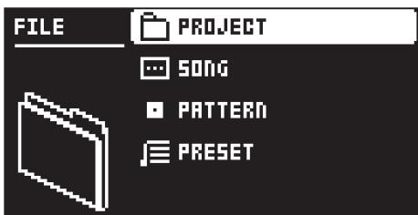

# 9.1.1 PROJECT

This is where you can load, create, and save projects. 

# LOAD

Use [UP]/[DOWN] to select the project you want to load, and then press [YES]. 

If you load a new project, it will replace the active project. Be sure to save your active project before you load another project. 

# PROJECT ACTIONS

Use [UP]/[DOWN] to select the project you want to interact with. Then press [RIGHT] to bring up a list of commands. Press [NO] or [LEFT] to exit the list. 

• LOAD Loads the selected project. This option is only available if the selected slot is not the same as the current project’s slot. 

• RELOAD Reloads the current project from its last saved state. This option is only available if the selected slot is the same as the current project’s slot. 

• SAVE Saves the current project to the selected project slot. This option is only available if the selected slot is the same as the current project’s slot. You can also press [FUNC] $^ +$ [SETTINGS] to directly save the current project to its own slot. 

• SAVE TO Saves the current project to the selected project slot. When selecting this option, you are asked if you want to overwrite the selected project or not. This option is only available if the selected slot is not the same as the current project’s slot. 

• RENAME Opens a NAMING screen where you can rename the project file. 

# SAVE

Saves the current project. You can also press [FUNC] $^ +$ [SETTINGS] to directly save the current project to its own slot. 

# SAVE AS

This option lets you save the current project under a new name and to a new slot. 

# NEW

Select this option to create a new project. If you have not saved the project you are currently working on, you will be prompted to save it.. 

If you create a new project, it will replace the active project. Be sure to save your active project before you load another project. 

# 9.1.2 SONG

Here you can rename and clear the currently selected song. These options are only available if you are in SONG mode and have selected a song. 

RENAME Opens a NAMING screen where you can rename the song. 

CLEAR Clears the song. 

# 9.1.3 PATTERN

Here you can rename and clear the currently selected pattern. 

RENAME Opens a NAMING screen where you can rename the pattern. 

CLEAR Clears the pattern. 

• WHOLE PATTERN Clears the active pattern’s sequencer data and kit data. A prompt appears when you select this option. Press [YES] to clear, or [NO] to cancel the operation. Note that no pattern information will be permanently lost until the pattern is saved to the same pattern slot from which it was loaded. 

• KIT DATA Clears the active pattern’s kit. All sequencer data will remain unchanged. A prompt appears when you select this option. Press [YES] to clear, or [NO] to cancel the operation. Note that no sequencer information is permanently lost until the pattern is saved to the same pattern slot from which it was loaded. 

• SEQUENCE DATA Clears the active pattern’s sequence data. All presets will remain unchanged. A prompt appears when you select this option. Press [YES] to clear, or [NO] to cancel the operation. Note that no sequencer information is permanently lost until the pattern is saved to the same pattern slot from which it was loaded. 

# 9.1.4 PRESET

Here you can load, save and manage presets. 

# LOAD

Use this option to load a preset to the active track. You can also press [PRESET] to access this menu item directly. 

1. Press [FUNC] $^ +$ [TRIG 1–8] to select the track you want to load the preset to. 

2. Use [LEFT/RIGHT] to highlight a preset category, and then use [UP/DOWN] or LEVEL/DATA to select preset. 

3. Press [YES] to load the preset to the active track. 

# SAVE

Use this option to save a previously loaded preset. Press [YES] to save the preset. 

If you use the SAVE option and attempt to save a preset that you have not previously saved, you will be prompted to provide a name for the preset and add tags before saving it. 

# SAVE AS

Use this option to save the active track’s sound as a preset and give it a name. 

1. Press [YES] to initiate the saving process and open a NAMING screen. 

2. On the NAMING screen, name your preset and then press [YES]. For more information, please see $^ { 6 } 6 . 7$ THE NAMING SCREEN” on page 22. 

3. On the TAG screen, you can add tags to the preset. The DRUMS and KEYS tags are main categories and are used in the LOAD PRESET menu. Press [YES] to apply or remove tags. Highlight <SAVE> and press [YES] to save. 

# MANAGE

Opens the Preset manager menu. Here presets can be saved, loaded, renamed, tagged et cetera. Opening this menu will show a list of all presets found on the SD card. 

The available operations will affect the highlighted preset. Use [UP]/[DOWN] keys or LEVEL/DATA to select preset. Press [RIGHT] to access the PRESET OPERATIONS menu. Use the [UP]/[DOWN] to navigate the menu. Press [YES] to apply the commands to the selected preset. Press [NO] to exit the menu. 

EDIT TAGS opens a menu where presets can be tagged. presets can have any number of tags. Press [YES] to apply or remove tags. Highlight <SAVE> and press [YES] to save. 

DELETE deletes the preset or selected presets. 

• Projects are saved on Tonverks SD card in the USER/PROJECTS folder. 

• Presets are saved on Tonverks SD card in the USER/PRESETS folder. 

# 9.2 PLAYING A PRESET

Press the [TRIG 1–8] keys to play the presets of the tracks in the active pattern. The [TRIG] keys will briefly light up when pressed. 

# 9.2.1 PLAYING A PRESET WITH AN EXTERNAL MIDI DEVICE

The presets can also be played chromatically using an external MIDI device connected to Tonverk. The MIDI channels dedicated to each of the tracks are the same as the track’s number. 

# 9.3 EDITING A PRESET

Select a track for editing by pressing [TRK] $^ +$ one of the [TRIG 1–8] keys. When editing the track settings, any changes made will be stored as part of the active pattern. 

Adjust the overall track level of the active audio track with the LEVEL/DATA knob. The TRACK LEVEL setting is saved as part of the pattern. 

Edit a preset by adjusting the parameters found on the PARAMETER pages. Access these pages by pressing a [PARAMETER PAGE] key. Use the DATA ENTRY knobs A-H to change the parameters. For more information, please see “12. AUDIO TRACK PARAMETERS” on page 50. 

The complete track preset, with all its parameter settings may be copied to another track (if the selected target track is in the same track type (Audio/MIDI tracks, Bus tracks, Send FX tracks). Press [TRK] $^ +$ [TRIG 1–16] $^ +$ [RECORD], and then press [TRK] $^ +$ [TRIG 1–16] $^ +$ [STOP] to paste the preset to the selected track. 

# 9.4 ARPEGGIATOR MENU

The ARPEGGIATOR menu contains the settings for the preset’s arpeggiator. These settings are part of the preset and are saved together with it. Press [ARP] to open the ARPEGGIATOR menu. Press [TRIG 1–16] to select the track whose arpeggiator you want to edit. Press [FUNC] $^ +$ [ARP] to toggle the ARPEGGIATOR on and off. The [ARP] key will be illuminated cyan when the arpeggiator is active for the selected track, while not in the ARPEGGIATOR menu. Press [ARP] or [NO] to exit the ARPEGGIATOR menu. 

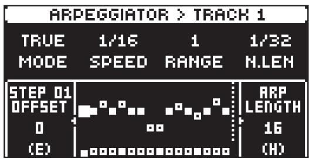

# 9.4.1 MODE

Activates the arpeggiator and controls how the arpeggiated notes are sorted. 

OFF deactivates the arpeggiator. 

TRUE plays the notes in the same order as they are inserted. 

UP plays the notes in ascending order, from the lowest note to the highest, on a per octave basis. 

DOWN plays the notes in descending order, from the highest note to the lowest, on a per octave basis. 

CYCLE plays the notes first in ascending order, then in descending order. 

# 9.4.2 SPEED

Speed sets the speed of the arpeggiator. It is synchronized to the BPM of the project. 

# 9.4.3 RANGE

Range sets the octave range of the arpeggiator. After each completed arpeggiator cycle, the arpeggiated notes are transposed one octave up. When the notes have reached the octave offset specified by the RANGE setting the notes are reset to their initial values. From there, the octave transpose is started all over again. 

# 9.4.4 N.LEN

Note Length controls the length of the arpeggiated notes. 

# 9.4.5 OFFSET

Offset selects the offset (note) value of the chosen arpeggiator step in semitones. The offset is from the original note trig. 

1. Press [LEFT] or [RIGHT] to select which arpeggiator step to offset. 

2. Use DATA ENTRY knob E to set the offset. 

3. Press [DOWN] to mute an arpeggiator step. Press [UP] to activate an arpeggiator step that has been deactivated. 

# 9.4.6 ARP LENGTH

Turn DATA ENTRY knob H to select the length of the arpeggio. The max length is 16 sequencer steps. 

# 10. THE SEQUENCER

Tonverk’s sequencer stores its information in patterns. A pattern controls the playback of the tracks and various pattern-specific aspects of the tracks. Patterns are stored in projects. A project contains eight banks (A to H), each with 16 patterns, resulting in 128 patterns available for each project. 

# A pattern contains:

• General trig settings on the TRIG page (default note pitch, velocity, etc.). 

• The settings on the PARAMETER pages. 

• The settings in the SETUP menu. 

• Quantization settings. 

• Note trigs and Lock trigs for all tracks. 

• Parameter locks. 

• Length and time signature for the tracks. 

# 10.1 PATTERN OPERATIONS

Tonverk can seamlessly switch between patterns. Together with the ability to chain patterns, this is a handy feature when improvising live. For more information, please see “10.1.3 CHAINS” on page 35. 

# 10.1.1 SELECTING BANK AND PATTERN

Press [PTN] and then use the [SUBTRACKS] keys to select a bank (if you want to choose a pattern from another bank than the current). Then press [TRIG 1–16] to select a pattern. 

If you just want to choose a pattern within the current bank, press [PTN] $^ +$ [TRIG 1–16]. 

Press [PTN] or [NO] to exit bank/pattern selection. 

White [TRIG] keys indicate pattern positions that contain data. A red [TRIG] key indicates the current active pattern. Empty patterns are unlit. 

When a pattern is playing, and a new pattern is selected, the new pattern number will be shown flashing in the upper left corner of the screen. Once the last step of the pattern has played, the new pattern will begin, and the pattern number will stop flashing. 

• Patterns can be changed while the sequencer is running. 

• Patterns can be changed and queued by sending program change messages. 

# 10.1.2 PATTERN CONTROL

Press [PLAY] to start the playback of a pattern. Press [STOP] to stop the playback of all tracks. The sound will be cut off, but effects like Delay will continue to be audible until the delay repeats have faded out. Quickly press [STOP] $^ +$ [STOP] to stop playback of all tracks and get just a short fade out of the send effects. 

When a pattern is playing, press [PLAY] to pause the playback. Press [PLAY] to resume the playback. 

If a pattern contains more than 16 sequencer steps, the small square boxes at the top of the screen will indicate this. When a pattern is playing, the active pattern page is shown with a blinking unfilled square. 

# 10.1.3 CHAINS

Chains are sequences that consist of more than one pattern. You can use chains to preselect and automate the order in which you want your patterns to play. 

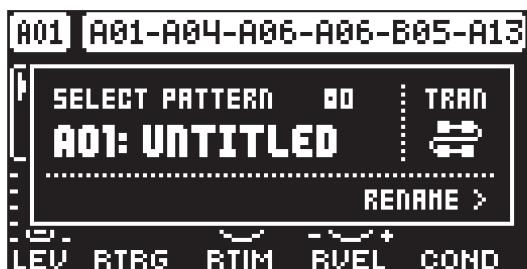

You can create one chain and use any pattern in bank A–H. The chain can consist of up to 64 patterns. 

1. Ensure you are in the SEQUENTIAL TRANSITION mode. You can only create chains in this mode. For more information, please see “10.1.4 TRANSITION MODE” on page 36. 

2. Press [PTN] to enter the pattern selection. 

3. Press and hold [TRIG 1–16] to select the first pattern in the chain. 

4. Press [TRIG 1–16] keys in the same order as you want the chained patterns to play. Keep the previously selected [TRIG] key pressed while you press the next one, the one after that, and so on. You can press the same [TRIG] key again if you wish to add the pattern multiple times in a row. If you want to add a pattern from another bank, use the [SUBTRACKS] keys to select bank and then press [TRIG 1–16] to select pattern. 

5. Press [PLAY] to start the sequencer and play the chain. The chain will loop when the final pattern of the chain has been played. 

To exit chain mode, select a pattern or song using the normal selection process. 

Please note that the chain will be lost when you create a new chain, select a new pattern, or song. You cannot save chains, and they will be lost when you switch Tonverk off. 

• Chains can be created while the sequencer is running. 

• TRANSITION mode must be set to SEQUENTIAL if you wish to create chains. 

# 10.1.4 TRANSITION MODE

When changing patterns, the different TRANSITION modes affect the way the active pattern changes to the next pattern. Press [FUNC] $^ +$ [PTN] to open theTRANSITION mode select menu. Either keep holding [FUNC] while pressing [PTN] to cycle through the modes, or use [UP]/[DOWN] and then press [YES] to select mode. 

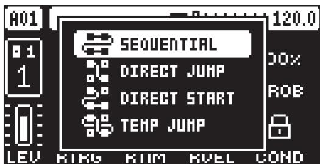

There are four TRANSITION modes. 

SEQUENTIAL changes patterns after the currently playing pattern reaches its end. This mode is the default mode. 

DIRECT JUMP immediately changes patterns. The new pattern will start playing from the position where the previous pattern left off. 

DIRECT START immediately changes patterns. The new pattern will start playing from the beginning. 

TEMP JUMP immediately changes patterns and the new pattern starts playing from the position where the previous pattern left off. It plays the new pattern once to the end and then returns to the pattern that was playing before the change. 

You can also use TEMP JUMP mode when you are in CHAIN mode, but then the pattern you change to instead replaces the current pattern in the chain. For example, say that you have a chain set up like this: $A 0 1 > A 0 3 > A 0 4 > A 0 2$ . When the chain is playing, and you are in TEMP JUMP mode, change pattern to A16 while pattern A03 is playing. The pattern will immediately change to A16, and once A16 has ended, then the chain will continue to play from pattern A04. 

# 10.2 EDITING A PATTERN

Tonverk offers several input modes when creating or editing a pattern. The modes are GRID RECORDING mode, LIVE RECORDING mode, and STEP EDIT mode. In these modes, you can enter two types of trigs: Note trigs and Lock trigs. 

# 10.2.1 TRIG TYPES

A trig is a sequencer event that you can place when you want the sequencer to perform an action on Tonverk. There are two types of trigs that you can use, note trigs and lock trigs. 

• NOTE TRIGS trigger preset notes or MIDI notes. 

• LOCK TRIGS trigger parameter locks (but do not trigger notes). For more information, please see “10.10.1 PARAMETER LOCKS” on page 40. 

Red [TRIG] keys indicate note trigs, and yellow [TRIG] keys indicate lock trigs. Unlit [TRIG] keys indicate steps that do not contain any trigs. Read more about parameter locks in section “10.10.1 PARAMETER LOCKS” on page 40. The method of adding trigs to the sequencer depends on the active record mode – GRID RECORDING or LIVE RECORDING. Note trigs can also be added using STEP EDIT. 

# 10.3 GRID RECORDING MODE

GRID RECORDING is a method of composing where you use the [TRIG] keys to add trigs. 

1. Press [RECORD] to enter GRID RECORDING mode. The [RECORD] key lights up red to indicate that GRID RECORDING mode is active. 

2. Select the track to which you want to add trigs by pressing and holding [TRACK] and then one of the [TRIG] keys. A white [TRIG] key indicates the active track. 

3. Place note trigs on the sequencer using the sixteen [TRIG] keys. To add a lock trig, press [FUNC] $^ +$ [TRIG]. Quickly pressing the [TRIG] key of any of the trigs entered will remove the trig. Pressing a [TRIG] key and holding it, prepares the trig for editing, rather than removing it. 

4. Select another track, and add note trigs. Repeat the procedure for all the tracks you want to use. 

5. Press [PLAY] to listen to the sequence. 

Add micro timing to a note trig by pressing and holding the [TRIG] key, and then pressing [LEFT]/[RIGHT]. For more information, please see “10.5 MICRO TIMING” on page 39. 

Set the retrig speed by pressing and holding the [TRIG] key while navigating to TRIG PAGE 1 and make the desired settings. For more information, please see “10.7 RETRIGS” on page 39, and “11.1 TRIG” on page 46. 

If the pattern contains more than 16 steps, select the pattern page you want to edit by pressing the [PAGE] key. A fully lit <PATTERN PAGE> LED shows the active pattern page. 

Press [RECORD] to exit the GRID RECORDING mode. 

• If you use an external MIDI controller to record to Tonverk’s MIDI tracks, the sequencer receives data on the Auto MIDI channel and records on the active track. For more information, please see “17.2.3 CHANNELS” on page 71. 

• All trigs placed on a track or subtrack can be shifted forward or backward on the sequencer. While in GRID RECORDING mode, press [FUNC] $^ +$ [LEFT]/[RIGHT] to move the trigs backward or forward. 

# 10.3.1 STEP EDIT

STEP EDIT is part of the GRID RECORDING mode and gives you a practical way to add and remove notes/trigs on specific sequencer steps using the [KEYBOARD]. 

1. In normal playback mode, press [STEP EDIT]. 

2. Press the [TRIG] key to where you want to add/remove notes. The [TRIG] key turns green. 

3. Use the [KEYBOARD] to add/remove notes to the selected trig. 

4. Press [STEP EDIT] again to exit STEP EDIT. 

• You can also access STEP EDIT when you are in GRID RECORDING mode. The procedure is the same, but you need to press and hold the selected [TRIG] key while you are adding/removing notes. Also, notes added this way replace any previously added notes on that trig. 

• You can also use an external MIDI keyboard to add notes using STEP EDIT. 

# 10.3.2 SEQUENCE LANE

To make it easier to edit a pattern, you can use the Sequence lane functionality to select which sequencer events you want to view and interact with using the [TRIG] keys. This is especially useful when you have recorded a sequence and want to edit it with more precision. In GRID RECORDING mode, the chosen sequence lane is displayed at the top of the screen, next to the to the sequencer pages. 

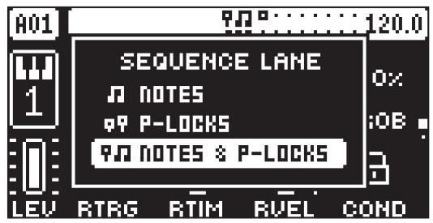

1. Press [FUNC] $^ +$ [UP] to open the SEQUENCE LANE menu. 

2. Use the [UP]/[DOWN] keys to select which sequence lane you want to view and interact with. 

NOTES lets you view and interact with Note trigs only. Trigs that contain Note trigs are shown with red [TRIG] keys. Trigs that contain Lock trigs are shown with faint yellow [TRIG] keys. Pressing an empty [TRIG] key (or a [TRIG] key that contains a Lock trig) adds a Note trig. Pressing a [TRIG] key that contains a Note trig, removes it. Pressing a [TRIG] key that contains both a Note trig and a Lock trig only removes the Note trig. 

P-LOCKS Lets you view and interact only with Lock trigs (with or without parameter locks). Trigs that contain Lock trigs are shown with blinking yellow [TRIG] keys. Trigs that contain Note trigs are shown with faint red [TRIG] keys. Trigs that contain both Note trigs and Lock trigs are shown with blinking red [TRIG] keys. Pressing an empty [TRIG] key adds a Lock trig. Pressing a [TRIG] key that contains a Lock trig, removes it. Pressing a [TRIG] key that contains both a Lock trig and a Note trig only removes the Lock trig. 

NOTES $^ +$ P-LOCKS This is the default option and it lets you view and interact with both Note trigs and Lock trigs (with or without parameter locks). Trigs that contain Note trigs are shown with red [TRIG] keys. Trigs that contain Lock trigs are shown with yellow [TRIG] keys. Trigs that contain both Note trigs and Lock trigs are shown with blinking red [TRIG] keys. Pressing an empty [TRIG] key adds a Note trig. [FUNC] $^ +$ [TRIG] adds a Lock trig. Pressing a [TRIG] key that contains a Note trig removes it. Pressing a [TRIG] key that contains a Lock trig converts it to a Note trig. Pressing a [TRIG] key that contains both a Lock trig and a Note trig removes both the Note trig and the Lock trig. 

3. Press [NO] to exit the SEQUENCE LANE menu. 

For more information, please see “10.2.1 TRIG TYPES” on page 36. 

# 10.4 LIVE RECORDING MODE

LIVE RECORDING mode is the second method of adding trigs to the tracks. In this recording mode, the [TRIG] keys are played in real-time to input trigs to the tracks. You can also use KEYBOARD mode to add note trigs chromatically. It is also possible to enter parameter locks in real time. Trigs input in LIVE RE-CORDING mode can be automatically quantized or not. Non-quantized trigs can be quantized after they are recorded by using the QUANTIZE menu that is accessed by pressing [FUNC] $^ +$ [TRIG]. For more information, please see “10.8 QUANTIZE MENU” on page 39. 

1. Press and hold [RECORD], then press [PLAY] to enter LIVE RECORDING mode. (Press [PLAY] twice while keeping the [RECORD] key pressed to activate/deactivate automatic quantization.) The sequencer starts to play, and the [RECORD] key starts to flash red. 

2. Press the [TRIG] keys to add trigs in real time. You can also use the [KEYBOARD] to play the active track chromatically. If the active track has a Subtracks SRC machine assigned, you can play all eight Subtracks by pressing the [SUBTRACKS] keys. Any changes to the PARAMETER page´s settings made using the DATA ENTRY knobs are recorded as parameter locks and add lock triggers where needed. 

3. Press [PLAY] to exit LIVE RECORDING mode while keeping the sequencer playing. If LIVE RECORD-ING mode is active and [RECORD] is pressed, GRID RECORDING mode will be activated. 

4. Press [STOP] to stop both recording and playback of the sequencer. 

You can use an external MIDI controller such as a keyboard to input NOTE, TRIG VELOCITY, and TRIG LENGTH data in LIVE RECORDING mode. Just play the notes on the external keyboard, and the sequencer will record them. The first note sets the TRIG VELOCITY value for all notes on the trig. The last note that is released sets the TRIG LENGTH for all notes on the trig. 

# 10.5 MICRO TIMING

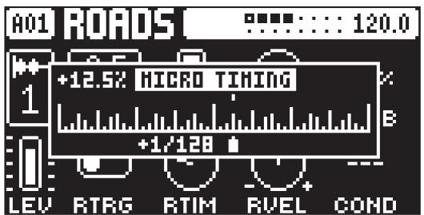

Here you can add micro timing to a note trig, moving it ahead or behind the beat. Micro timing can be customized on any of the sequencer steps on both audio and MIDI tracks. In GRID RECORDING mode, press and hold one or several [TRIG] keys and then press [LEFT]/[RIGHT] to access the pop-up MICRO TIM-ING menu that shows the time offset for the chosen sequencer step(s) on the active track. Press [LEFT]/ [RIGHT] to adjust the time offset in large increments. Press [UP]/[DOWN] to adjust the time offset in small increments. To exit the MICRO TIMING menu, release the [TRIG] key(s). The micro timing settings are stored in the active pattern. 

# 10.6 TRANSFORM MENU

Here you can affect certain aspects of the trigs already placed on a track. The Transform actions affect all the trigs on the selected track. Press [FUNC] $+ [ - ]$ to access the TRANSFORM menu. 

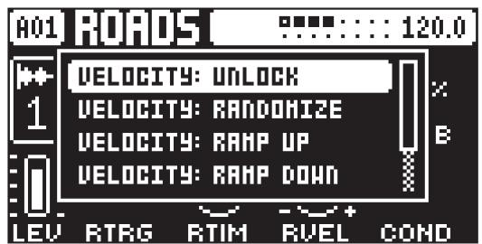

VELOCITY UNLOCK removes all parameter locks for the VEL parameter. 

VELOCITY RANDOMIZE randomizes the velocity of the trigs by placing parameter locks on the VEL parameter. 

VELOCITY RAMP UP sets the velocity of the trigs from low to high by placing parameter locks on the VEL parameter. 

VELOCITY RAMP DOWN sets the velocity of the trigs from high to low by placing parameter locks on the VEL parameter. 

PLACEMENT RANDOMIZE randomizes the placement of the trigs on the track. 

PLACEMENT REVERSE reverses the placement of the trigs on the track. 

# 10.7 RETRIGS

Retrigs can be customized on any of the sequencer steps on the audio tracks. In GRID RECORDING mode, press [TRIG PARAMETERS] to access the retrig parameters. Hold one or several [TRIG] keys and then set the desired retrig options for the trig(s). 

For more information about the parameters on this page, please see “12.2 TRIG PAGE 1” on page 50. 

# 10.8 QUANTIZE MENU

The quantization affects all micro-timed and off-grid trigs on the sequencer’s tracks. Press [FUNC] $^ +$ [KEY-BOARD G#] to access this menu. Change settings with DATA ENTRY knob E and F. 

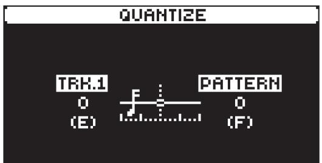

TRK affects all the trigs of the active track in real-time. The higher the quantize value, the more the trigs will be quantized. Press [TRIG 1–16] key to select the track to quantize. 

PATTERN affects all the trigs of all tracks in the pattern in real time. The higher the quantize value, the more the trigs will be quantized. 

Press [NO] to exit the menu. 

# 10.9 PAGE SETUP MENU

You can set the length and timing of the pattern and the tracks in this menu. The sequencer has up to 256 steps, spread across 16 pages with 16 steps per page. Press [FUNC] $^ +$ [PAGE] to access the PAGE SETUP menu. Use the DATA ENTRY knobs to adjust the settings. 

You can assign individual length and speed to the tracks of the pattern. Here you find two sections, TRACK and PATTERN. 

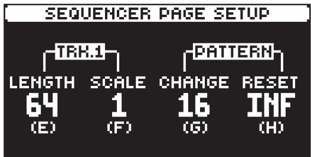

The TRACK column sets the step length and speed of the track playback. The settings only affect the active track. 

The PATTERN column sets the master change length and the master length of the pattern. 

LENGTH sets the number of steps on the current pattern page. The leftmost number displays the number of steps on the active pattern page. If you use 17 steps or more in a pattern and GRID RE-CORDING mode is active, the [PAGE] key is used to toggle between the different pattern pages. Press [FUNC] and then turn data entry knob $\boldsymbol { \varepsilon }$ to change length in even steps of 16. 

SCALE controls the speed of track playback in multiples of the current tempo. For a setting of 1/8 plays back the track at one-eighth of the set tempo. 3/4 plays the track back at three-quarters of the tempo; 3/2 plays back the track twice as fast as the 3/4 setting. 2 makes the track play at twice the speed of the BPM. 

The SCALE setting also affects the speed of all LFOs, the delays time settings, the arpeggiator and retrig speed. 

CHANGE (Pattern Change) controls for how long the active pattern plays before it changes to a cued or chained pattern. This setting is essential when, for example, you set RESET to INF. Then, if you do not make any CHANGE setting, the pattern plays infinitely, and the following cued pattern will never play. By default, a cued pattern change happens at the end of the pattern (CHANGE set to OFF). 

RESET (Pattern Reset) controls the number of steps the pattern plays before all tracks reset and restart from the first step on the first page. An INF setting makes the tracks of the pattern loop infinitely, without ever being restarted. Note that this setting also affects how long the active pattern plays before a chained pattern starts playing. The CHANGE parameter overrides this if its parameter value is less than the RESET value. 

A SCALE setting of 2 helps increase the base resolution of the step sequencer to 32nd notes. A SCALE setting of 3/4 is practical when Tonverk is playing alongside other instruments set to the same BPM, and you want Tonverk to play triplets. 

# 10.10 SEQUENCER FEATURES

# 10.10.1 PARAMETER LOCKS

Parameter locks make it possible to set every trig to have its unique parameter values. The note trigs of an audio track can, for example, have different pitch, amp, or filter settings. It is possible to parameter lock the parameters found on the PARAMETER pages, and you can apply parameter locks to all types of tracks. For a complete overview of all parameters on the PARAMETER pages, please see “12. AUDIO TRACK PARAMETERS” on page 50 and “APPENDIX A: MACHINES” on page 79. 

Adding parameter locks in GRID RECORDING mode. 

1. Press [RECORD] to enter GRID RECORDING mode. 

2. Press a [TRIG] key to add a Note trig, or [FUNC] $^ +$ [TRIG] key to add a Lock trig, to where you want to perform a parameter lock. 

3. Press and hold the [TRIG] key of a previously placed trig (note trig or a lock trig). 

4. Turn the DATA ENTRY knobs that control the parameter you want to lock, and set it to the desired value. The graphics become inverted for the locked parameter, and the locked parameter value is displayed. The [TRIG] key of the locked trig blinks red (for note trigs) or yellow (for lock trigs) to indicate the trig now contains a parameter lock. 

Remove a single parameter lock by holding [TRIG] $^ +$ pressing the DATA ENTRY knob of the locked parameter. You can erase all parameter locks from a trig if you remove the note trig and then enter it again. 

Adding parameter locks in LIVE RECORDING mode. 

1. Press and hold [RECORD], then press [PLAY] to enter LIVE RECORDING mode. 

2. Turn a DATA ENTRY knob, or play the [TRIG] keys in KEYBOARD mode, to add parameter locks to the active track. Note trigs are placed, and parameter locked accordingly, and it also places lock trigs that contain the parameter locks on the sequencer steps that do not already have any trigs. 

Press [NO] $^ +$ one (or several) of the [TRIG] keys to erase a sequence of recorded trigs on a specific track (or on several tracks) in time with the sequencer, i.e. all held trigs reached by the pattern’s playhead will be erased. 

You can also remove specific parameter locks on a track in real time. In LIVE RECORDING mode, press and hold [NO] and then press and hold the DATA ENTRY knob corresponding to the parameter that you want to remove. 

In GRID RECORDING mode, pressing and holding a [TRIG] key with parameter locks causes the [PARAMETER PAGE] key(s) containing the locked parameter to blink. 

# 10.10.2 TRIG CONDITIONS AND CONDITIONAL LOCKS

Trig conditions are a set of conditional rules that you can apply to any trig, using specific parameter locks called conditional locks. Each rule is a logical condition that determines whether a trig set on a track in the sequencer is triggered or not. If the specified condition is met, then the trig will play. If the condition is not met, the trig will not play. 

# ADDING A CONDITIONAL LOCK

1. In GRID RECORDING mode, place a note trig or lock trig on the sequencer step to where you want to apply a conditional lock. 

2. Press and hold the trig to access the COND (Trig Condition) parameter on TRIG PAGE 1. For more information, please see “12.2 TRIG PAGE 1” on page 50. 

3. Turn DATA ENTRY knob H to select one of the following trig conditions: 

FILL The trig plays when FILL mode is active. 

FILL The trig plays when FILL mode not active. 

PRE The trig plays only when the previously evaluated trig on the same track has been played. (PRE and PRE conditions are not evaluated and are ignored. The sequencer instead evaluates the last non-PRE or PRE trig.) 

PRE Trig doesn’t play if the previously evaluated trig has been played. (PRE and PRE conditions are not evaluated and are ignored. The sequencer instead evaluates the last non-PRE or PRE trig.) 

For example: 

Trig 1 Probability $= 5 0 \%$ (Trig 1 plays) 

Trig 2 Condition $=$ PRE (Trig 2 plays) 

Trig 3 Condition $=$ PRE (Trig 3 plays) 

Trig 4 Condition $=$ PRE (Trig 4 does not play) 

NEI The trig plays if the most recently evaluated trig condition on the neighbor track was true. (PRE and PRE conditions are not evaluated and are ignored. The sequencer instead evaluates the last non-PRE or PRE trig.) The neighbor track is the track before the active track. For example, track 3 is the neighbor track of track 4. NEI and NEI conditional trigs on track 4 therefore evaluate the conditional 

trigs placed on track 3. If no conditional trigs exist on the neighbor track the NEI condition is not met and will never play the trig. 

NEI The trig plays if the most recently evaluated trig condition on the neighbor track was not true. (PRE and PRE conditions are not evaluated and are ignored. The sequencer instead evaluates the last non-PRE or PRE trig.) 

1ST The trig only plays on the first loop of the pattern. 

1ST The trig does not play on the first loop of the pattern but on all consecutive loops. 

LST The trig plays the last time the pattern plays before changing to another pattern. 

LST The trig does not play the last time the pattern plays before changing to another pattern. 

A:B A sets how many times the pattern (or track, if the track length is shorter than the pattern length) plays before the trig condition is true. B sets how many times the pattern (or track, if the track length is shorter than the pattern length) plays before the count is reset and starts over again. This cycle then repeats until you stop the sequencer. 

For example: 

With the setting 1:2, the trig plays the first time the pattern is played and then the third, the fifth, and so on. 

With the setting 2:2, the trig plays the second time the pattern is played and then the fourth, the sixth, and so on. 

With the setting 2:4, the trig plays the second time the pattern is played and then the sixth, the tenth, and so on. 

With the setting 4:7 the trig plays the fourth time the pattern is played and then the eleventh, the eighteenth, and so on. 

A:B The trig with this condition plays when the set A:B condition of pattern plays are not met. 

For example: 

With the setting 2:4, the trig does not play the second time the pattern plays and then not on the sixth, the tenth, and so on. 

Conditional parameter locks are a great way to add variety to a pattern. To set up a grid of mutually exclusive or conclusive note trigs across any of the tracks, and adding some probability locks in there as well (perhaps, in turn, also sporting an array of logically conditioned trigs), is a neat way to make the most minimal of compositions come alive with randomness. 

The sequencer must be in FILL mode to activate the FILL and FILL conditional locks. For more information, please see “10.10.3 FILL MODE” on page 42. 

FILL trig conditions may also be used, for example, to have two different melodic or percussive sequences on the same track, one of which is activated only when FILL mode is active. 

# 10.10.3 FILL MODE

FILL mode can be used to create a temporary variation, such as a drum fill, in your pattern by activating the trigs that have a FILL conditional lock. For more information, please see “10.10.2 TRIG CONDITIONS AND CONDITIONAL LOCKS” on page 41. You set the FILL mode behavior in the FILL EDIT menu. 

Press [FUNC] $^ +$ [FILL] to open the FILL EDIT menu. Use [UP]/[DOWN] to select FILL mode option you want. Press [YES] to close the FILL EDIT menu. The two options are: 

MOMENTARY FILL mode is active for as long as you press and hold [FILL]. 

LATCHING Press [FILL] to toggle FILL mode on/off. 

# 10.10.4 COPY, PASTE, AND CLEAR OPERATIONS

Patterns, tracks, track pages, parameter pages, and trigs can be copied, pasted, and cleared. 

The active pattern can be copied to another location in the same bank or another bank. To perform a pattern copy operation, GRID RECORDING mode must be deactivated. Copy the pattern by pressing [FUNC] $^ +$ [RECORD]. Select another pattern, and then press [FUNC] $^ +$ [STOP] to paste the copied pattern to this location. Press [FUNC] $^ +$ [PLAY] and then [YES] in the confirmation pop-up window to clear all the trigs in the current pattern. 

Individual sequencer tracks can be copied, pasted, and cleared in the same way as patterns. To do so, GRID RECORDING mode must be active. Press [FUNC] $^ +$ [RECORD] to copy the track’s trigs. Select another track and then press [FUNC] $^ +$ [STOP] to paste the copied trigs to this location. Press [FUNC] 

$^ +$ [PLAY] to clear all the trigs in the current pattern. 

A single track page’s trigs can also be copied, pasted, and cleared. It is similar to copying, pasting, or clearing a track, but will only affect the active track page. In GRID RECORDING mode press the [PAGE] key to select the track page you wish to copy. Press [PAGE] $^ +$ [RECORD] to copy. Select a new track page and press [PAGE] $^ +$ [STOP] to paste. Press [PAGE] $^ +$ [PLAY] to clear the active track page. 

You can also copy, paste, and clear a track’s preset (the settings on the [PARAMETER PAGES]). Press [TRK] $^ +$ [RECORD] to copy. Select a new track and press [TRK] $^ +$ [STOP] to paste the preset. Press [TRK] $^ +$ [PLAY] to reset the preset’s parameters. 

A single parameter page with all its settings may also be copied, pasted, and cleared. Select the parameter page you wish to copy by pressing a [PARAMETER PAGE] key. Copy by pressing [PARAMETER PAGE] $^ +$ [RECORD]. Select a new track and then press the same [PARAMETER PAGE] page $^ +$ [STOP] to paste. Press [PARAMETER PAGE] $^ +$ [PLAY] to clear the parameter page and reset the parameters to their default settings. 

Trigs, complete with all parameter lock settings, can be copied, pasted, and cleared as well. GRID RECORDING mode needs to be active to access this functionality. Press and hold a trig and press [RECORD] to perform the copy operation. Paste by holding another [TRIG] key and press [STOP]. It is also possible to copy more than one trig. Press and hold the trigs you wish to copy, and then press [RE-CORD]. Press and hold the [TRIG] key to where you want to paste, and then press [STOP] to paste the copied sequence of trigs. When pasting, the copied trigs are placed in the same relation to each other as they had when they were copied. The destination trig acts as the starting point for the sequence of copied trigs. Press and hold one or more trigs, and then press [PLAY] to clear trig locks. 

# 10.10.5 TEMPORARY MEMORIZE AND RECALL PATTERN

Patterns can be instantly memorized in a temporary memory space and then recalled from this space. 

• Press [FUNC] $^ +$ [D1#] to temporarily memorize the active pattern. This is useful for creating a restore point when you are live tweaking, but without permanently saving your changes. 

• Press [FUNC] $^ +$ [C1#] to recall a pattern that was previously temporarily memorized. It will recall the pattern from when you last used the temporary memorize command. If you have not done any temporary memorization, then the pattern will be recalled from the permanently saved state. 

The TEMPORARY MEMORIZE PATTERN and TEMPORARY RECALL PATTERN commands are great when improvising live. Any changes made to the active pattern can immediately be undone. And at the same time, the memorizations and recalls will not affect the pattern permanently. 

The TEMPORARY MEMORIZE PATTERN command will not save the pattern permanently, and any changes will be lost if you load another project or switch off the device. 

# 10.10.6 TRACK TRANSPOSE

You can use this functionality to transpose all the note trigs on the active track. 

1. Press [FUNC] $+ [ + ]$ to initiate track transpose. 

2. Press the [KEYBOARD] keys to transpose the track’s note trigs. Use the $[ + ] / [ - ]$ keys to access other octaves on the [KEYBOARD]. 

3. Press [NO] to exit track transpose. 

• These transpositions are non-destructive and do not change the trig’s NOTE values. 

Pressing the [KEYBOARD] key used to select the transposition again resets the transposition to 0. 

# 10.11 SONG MODE

A song is an arrangement of patterns set up to play in sequence. Each row in the SONG mode arrangement can have separate settings for pattern, row repeat, row length, and tempo. A song can be up to 99 rows in length, and each project can contain up to 16 songs. 

# 10.11.1 THE SONG EDIT SCREEN

Press [SONG] and then press [TRIG 1–16] to select a song and enter SONG mode. Press [SONG] again and then press [RIGHT] to open the SONG EDIT screen. Use the [ARROW] keys to navigate the song rows and columns, highlighting the parameter you wish to edit, and then use LEVEL/DATA or any DATA ENTRY knob to edit the selected function. 

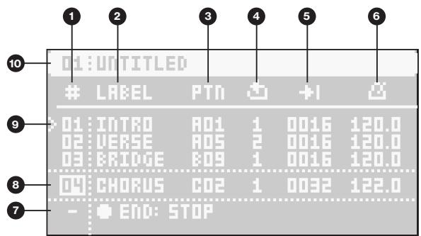

1. SONG ROW (Range 01–99) 

2. LABEL lets you select a keyword for the row. The keyword is related to song structure, such as Verse, Chorus, and Bridge. It can also be the name of the pattern. 

3. PTN allows you to select the pattern to be played on a row. Press [FUNC] while turning the knob to quickly change banks. 

4. ROW PLAY COUNT The number of times the row plays before the song advances to the next row. 

5. ROW LENGTH (measured in sequencer steps). This setting determines the number of steps the sequencer plays from the selected pattern. The default value is the same as the patterns CHANGE setting in the PAGE SETUP menu. (Range: 2–1024, the last 25 values are written as K00–K24) 

6. ROW TEMPO Here, you set the row’s BPM per row. By default, the row inherits the the song’s BPM set in the TEMPO menu. Selecting a tempo on any row overrides the previously set song tempo. 

7. END row. This row is always added at the end of a song and determines what will happen when the song has played the last song row. By default, it is set to LOOP the song from the beginning and play it again, but it can also be set to STOP the song. 

8. The currently selected row is highlighted between dotted lines. Use [UP] and [DOWN] to select row. 

9. PLAYHEAD position shows the row currently playing (or set to play if the sequencer is stopped). 10.SONG SLOT. 

# 10.11.2 CREATING AND EDITING A SONG

1. Press [SONG] and then press [TRIG 1–16] to select a song and enter SONG mode. 

2. Press [SONG], and then press [RIGHT] to open the SONG EDIT screen. 

3. If you selected an empty song slot, you are presented with a screen where you can choose: INSERT ROW Inserts the first row in the song. Press [FUNC] $^ +$ [DOWN] to insert a row. 

CREATE ROWS FROM CHAIN Creates a song based on a chain. Press [YES] and then select to create rows from a previously created chain or to create a new chain by selecting patterns using the [TRIG 1–16] keys. Use [LEFT]/[RIGHT] to change bank. Then press [YES] to create a song based on the chain and open the SONG EDIT screen. 

4. Press [FUNC] $^ +$ [DOWN] if you want to add a new row to the song arrangement. The new row is added below the currently selected row and is a copy of the selected row. Press [FUNC] $^ +$ [UP] to remove the selected row from the song arrangement. 

5. Use the [ARROW] keys to navigate the song rows and columns, highlighting the item you wish to edit. For more information about editing the functions in SONG mode, please see “10.11.1 THE SONG EDIT SCREEN” on page 43. 

6. Press [NO] to exit the SONG EDIT screen. 

• [FUNC] $^ +$ [RECORD] copies the selected row. 

[FUNC] $^ +$ [STOP] pastes a previously copied row to the selected row. 

[FUNC] $^ +$ [PLAY] resets the selected row to the pattern’s default BPM, length, and mute. 

[FUNC] $^ +$ [UP] deletes the selected row. 

[SONG] $^ +$ [LEFT] will cue the selected row and enable row-loop. 

[FUNC] $^ +$ [SONG] toggles the SONG mode on/off. 

• The TEMPO page will display the song’s BPM, unless the playing/cued row has a nonblank value, in which case it will display the row’s value. 

Please note that there is always a row called END at the song’s end. This row can be set to either STOP the song or LOOP it from the beginning and play it again. 

• On the SONG EDIT screen, you can select a song row number and then press YES to move the playhead to this row. You can also use the [TRIG 1–16] keys to preview and play the track presets from the pattern on the playhead row. 

# 10.11.3 PLAYING A SONG

1. Press [SONG] and then press [TRIG 1–16] to select a song and enter SONG mode. The song selected will be the one that was last played or edited. 

2. Press [PLAY] to play the selected song. At the top of the screen, you see the song number, the row currently playing, the total number of rows in the song, the row’s LABEL, and finally the patterns bank/ number. Here is also a progress bar to indicate how far the song pointer has progressed in the row. 

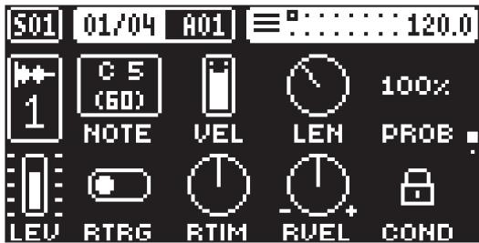

3. Press [STOP] to stop the playback. You can then press [PLAY] to continue to play the song from the current playhead position. Press [STOP] twice to move the playhead to the song’s beginning. 

4. To exit song mode, press [PTN] $^ +$ [TRIG 1–16] to return to pattern mode. 

• Press [SONG MODE] $^ +$ [LEFT] (when in SONG mode) to loop the currently playing row. Press [SONG MODE] $^ +$ [LEFT] again (when in SONG mode) to stop looping the row and return to normal song playback. 

Press [SONG MODE] $^ +$ [UP]/[DOWN] (when in SONG mode) to select a specific song row to jump to and to play next. 

Press [PTN] and the [TRIG 1–16] keys to select a pattern to exit SONG mode and return to regular pattern play. 

The songs are automatically saved as they are created and edited. However, you must save the project if you wish to keep the songs before switching to another project. 

# 10.12 PERFORM MODE

In PERFORM mode, any changes made to the preset parameters in the pattern are kept in a temporary memory location. It means you can keep your parameter tweaks as long as you are in PERFORM mode, but when you exit PERFORM mode, the pattern reloads to its previously saved state. You can only be in PER-FORM mode on one pattern at a time. If you are in PERFORM mode on one pattern and switch to another, the PERFORM mode will remain active on the first pattern when you return to it. However, if you enter PER-FORM mode on the second pattern, you lose the PERFORM mode tweaks made to the first pattern. 

Press [FUNC] $^ +$ [TRK] to toggle PERFORM mode on/off. The [TRK] key is lit green when PRFORM mode is active 

Actions done in PERFORM mode are not saved and will not remain when switching the device off. Saving the pattern will not save any changes done in PERFORM mode. 

# 11. THE TRACK SETUP MENU

The TRACK SETUP menu contains several setup pages related to the active track, its behavior, and setup. You can access specific TRACK SETUP menu pages (or page groups) by using [FUNC] $^ +$ [PARAMETER PAGE] keys. Depending on which PARAMETER key you selected, you open the setup pages related to the primary function of that parameter key. You can also navigate between the different pages within the TRACK SETUP menu using the [PARAMETER PAGE] keys. If a page group has more than one page, you use the group’s [PARAMETER PAGE] key to cycle through the pages. Use [UP] and [DOWN] to move between the options. Use [LEFT] and [RIGHT] to select settings or press [YES] to open sub-menus. Press [NO] to exit the menu. 

# 11.1 TRIG

Here you can set several note and trig-related parameters. Press [FUNC] $^ +$ [TRIG] to directly access this page. These settings are only available for audio tracks (Track 1–8). 

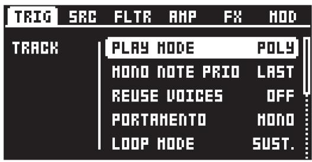

# 11.1.1 PLAY MODE

Here, you can set whether a preset is polyphonic or monophonic and whether the LFOs for each voice are synced or not. This setting is not availble for the Subtracks machine. 

POLY The Sound is polyphonic, and the LFOs for each voice are running independently of each other. 

POLY M.LFO In POLYPHONIC WITH MONO LFO mode, the preset is polyphonic, and the LFOs for each voice are synced together with the first voice LFO. The LFO of the first voice played determines the cycle of the LFOs, and the subsequently played voices’ LFOs are synced to this cycle. This makes the LFO behave like a single or monophonic LFO. This is useful, for example, if you want to use the LFO for a tremolo effect. 

MONO The preset is monophonic, and the envelope is always triggered by each note on, or key press. 

MONO LEG. In this mode, the preset is monophonic; however, the envelopes are not triggered by a subsequent note or key press if the first note is still held. 

# 11.1.2 MONO NOTE PRIO

Here, you can set the note priority, i.e., which note is played if more than one note is played simultaneously. This setting is only available if PLAY MODE is set to MONO or MONO LEG. This setting is not availble for the Subtracks machine. 

LAST gives priority to the last note played. 

LOW gives priority to the lowest note played. 

HIGH gives priority to the highest note played. 

# 11.1.3 REUSE VOICES

Sets if the same note played twice should reuse the same voice, or cycle to use another free voice. 

ON Reuses the same voice. Useful for staccato effects and drums. 

OFF Cycles to use another voice. Suitable for piano-like sounds and pads. 

# 11.1.4 PORTAMENTO

Sets the behavior of the portamento when enabled for the track. This setting is not available for the Subtracks machine and is only affecting the sound if PLAY MODE is set to MONO or MONO LEG. For more information, please see “12.3 TRIG PAGE 2” on page 51. 

MONO Portamento affects all notes played 

MONO LEG. Portamento only affects notes played legato. 

# 11.1.5 LOOP MODE

Sets the behavior Single Player machine’s loop mode when PLAY MODE is set to FORWARD LOOP or REVERSE LOOP. This setting is not availble for the Multi Player and Subtracks machines. 

SUST. Sustain makes the sample loop for as long as the envelope is in the sustain phase. Once in the release phase, the sample plays to the end and then stops. 

CONT. Continuous makes the sample loop through both the envelope’s sustain and release phases. 

# 11.1.6 OCTAVE

Sets the base octave of the preset. It also makes preset locking more practical since you can control the octave setting on the preset and minimize the need to transpose the sequencer notes to make two or more presets work together. This setting is not availble for the Subtracks machine. 

# 11.1.7 PITCH BEND DEPTH

Sets the amount of pitch bend data from external MIDI devices that affects Tonverk. 

# 11.1.8 PITCH BEND

Opens a menu where you can assign up to four parameters to the MIDI pitch bend command. Press [YES] to open the menu. You can select parameters from the SRC, FLTR, AMP, FX, and MOD PARAM-ETER pages. Turn the DATA ENTRY knobs A–D to select the track parameters that you wish to assign. Press [YES] to confirm the selection. Then use DATA ENTRY knobs E–H to set the modulation depth of the four track parameters. The depth is an offset of the original track parameter value. 

Turn LEVEL/DATA to test your settings. 

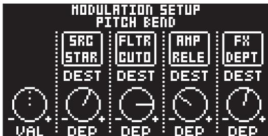

# 11.1.9 AFTERTOUCH

Opens a menu where you can assign up to four parameters to the MIDI aftertouch command. Press [YES] to open the menu. Selecting parameters and setting modulation depth work in the same way as for PITCH BEND. 

# 11.1.10 MODULATION WHEEL

Opens a menu where you can assign up to four parameters to the MIDI mod wheel command (CC #1). Press [YES] to open the menu. Selecting parameters and setting modulation depth work in the same way as for PITCH BEND. 

# 11.1.11 BREATH CONTROLLER

Opens a menu where you can assign up to four parameters to the MIDI breath controller command (CC #2). Press [YES] to open the menu. Selecting parameters and setting modulation depth work in the same way as for PITCH BEND. 

# 11.2 SRC

Here you can select the SRC machine. Use [UP]/[DOWN] to select machine, and then press [YES] to assign the selected machine to the track. From this page, you can also access and choose the two insert FX machines for the track. Use [LEFT]/[RIGHT] to navigate to the desired machine category. For more information, please see “A.2 SRC MACHINES” on page 79. Press [FUNC] $^ +$ [SRC] to directly access this page. There are no SRC machines available for SEND FX and MIX tracks. 

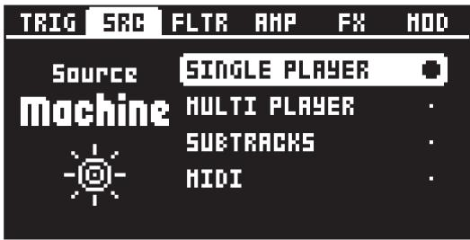

# 11.3 FLTR

Here, you can select the order in which the filters and overdrive are routed in the signal path. Use [LEFT]/ [RIGHT] to select the order you want. For more information, please see “4. TONVERK SOUND ARCHITEC-TURE” on page 17. Press [FUNC] $^ +$ [FLTR] to directly access this page. 

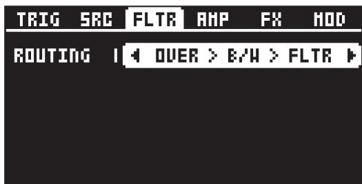

# 11.3.1 ROUTING

Let’s you select the order in which the Overdrive, Base-width filter, and Multimode filter should be arranged in the sound architecture. This setting is only available for audio tracks. For more information, please see $^ { * } 4 . 1$ AUDIO VOICES” on page 17. 

# 11.4 AMP

On this page, you find several settings related to the amplifier. These settings are only available for audio tracks. 

Press [FUNC] $^ +$ [AMP] to access this page. 

# 11.4.1 VELOCITY TO VOL

Selects how MIDI velocity affects volume when playing the preset from a MIDI keyboard. 

OFF means that velocity does not affect the volume of the sound. 

LOG applies a logarithmic velocity curve. The volume difference is greater between softer keyboard presses than between harder ones. 

LIN applies a linear velocity curve. The volume difference between keyboard presses corresponds linearly to the force applied. 

EXP applies an exponential velocity curve. The volume difference is greater between harder keyboard presses than between softer. 

# 11.4.2 ENVELOPE MODE

Envelope type sets if the amplitude envelope should be an AHD or ADSR envelope. 

# 11.4.3 ENVELOPE RESET

Envelope reset sets the amplitude envelope behavior: 

ON resets the envelope for each consecutive trig. 

OFF does not reset the envelope for each consecutive trig. 

# 11.5 FX

Here, you can select the two insert FX machines and set the level of the audio routed to the track’s effect(s). This parameter group has three subpages. Use the [FX] key to cycle through the two subpages for the effects and the level setup page. Use [UP]/[DOWN] to select the machine, and then press [YES] to assign the selected machine to the track. Use [LEFT]/[RIGHT] to set the input levels on FX page 3. For more information, please see “A.3 FX MACHINES” on page 85. Press [FUNC] $^ +$ [FX] to directly access this page. 

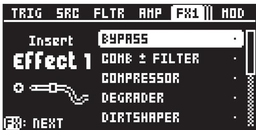

# 11.6 MOD

This page provides an overview of which PARAMETER pages parameters the different modulation sources can affect. The settings and routings are performed on the track’s MODULATION pages. Press [FUNC] + [MOD] to directly access this page. 

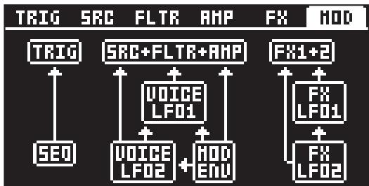

# 12. AUDIO TRACK PARAMETERS

The following is a description of all the parameters available on the audio tracks’ PARAMETER pages. An audio track is any of the tracks 1–8 that uses a non-MIDI SRC machine. The parameters on the TRIG pages are not saved together with the preset; instead, they are saved with the pattern. The track parameters can be locked to other settings at any step of the pattern by first pressing and holding the [TRIG] key, then adjusting the parameters’ settings with the DATA ENTRY knobs. For more information, please see “10.10.1 PARAMETER LOCKS” on page 40. 

Please note that tracks with a MIDI machine have a different set of parameters on the TRIG, SRC, FLTR, and AMP pages. For more information, please see “A.2 SRC MACHINES” on page 79. 

# 12.1 EDITING THE TRACK PARAMETERS

Press [TRK] $^ +$ [TRIG 1–8] to select the audio track you want to edit. Press [TRIG], [SRC], [FLTR], [AMP], [FX], and [MOD] keys to access the tracks PARAMETER page groups. Use the [UP]/[DOWN] keys to access the parameter group's pages. You can also press a [PARAMETER PAGE] key repeatedly to cycle through the parameter pages in that group. Press and hold a [PARAMETER PAGE] key to see the values for all parameters on that page. 

You can always reload a preset from its last saved state. Press [TRK] $^ +$ [TRIG 1–16] $^ +$ [NO] to reload the preset. 

You can also randomize the parameter settings on a specific PARAMETER page on an audio track. Press [PARAMETER PAGE] key $^ +$ [YES] to randomize the relevant parameters on that page. Every time you press this key combination, the parameters randomize in a new way. 

Press [PARAMETER PAGE] key $^ +$ [PLAY] to reset the parameter page’s parameters to their default parameter values. 

# 12.2 TRIG PAGE 1

Here you set the options for notes that are trigged. This is also where you select trig conditions. Press the [TRIG PARAMETERS] key to access the menu. Change settings using the DATA ENTRY knobs. These general settings affect note trigs placed on the sequencer. 

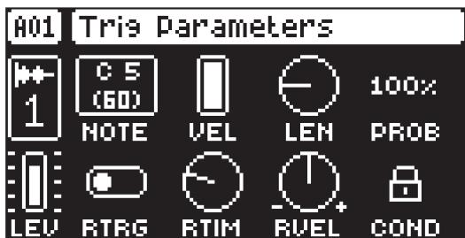

# NOTE

Trig Note sets the pitch of the note when trigged. When in LIVE RECORDING mode and using the [KEY-BOARD ] to enter notes, the pitch of the [TRIG] keys played will override this setting. The NOTE parameter is not available for tracks that have the Subtracks SRC machine assigned. 

# VEL

Trig Velocity sets the velocity of the sequencer’s note trigs. 

# LEN

Trig Length sets the length of the note trig. In LIVE RECORDING mode, the duration of pressing the [TRIG] keys overrides this general setting. 

# PROB

Trig Probability sets the probability that the trigs on the track play or not. The probability outcome is re-evaluated every time a trig is set to play. The default setting is $100 \%$ , meaning that all the trigs on the track will play every time. This parameter can be parameter locked, which lets you assign separate trigs their own probability. 

# RTRG

Retrig enables multiple trig repeats on placed trigs. Use DATA ENTRY knob A to turn retrig on/off. For more information, please see “10.7 RETRIGS” on page 39. 

# RTIM

Repeat Time sets the retrig rate. 1/16 is the nominal retrig rate, one trig per step. 1/32 corresponds to two trigs per step and so on. To do triplets, for example, set the retrig rate to 1/12 (or 1/24). 

# RVEL

Repeat velocity sets the velocity curve fade-out and fade-in of the retrig. -1 corresponds to a complete fade out during the set length, -0,5 fades out to half the velocity during the set length, 0 equals a flat velocity curve with no fade, 0.5 fades into half velocity during the set length, and 1 fades in completely to full velocity during the set length. Please note that the effects of the VFAD setting is also dependent on the VEL setting on TRIG PAGE 1. 

# COND

(Trig Condition) when you add a conditional lock, COND sets the Trig Condition with which a set of conditional rules can be applied to any trig, using a conditional parameter lock. For more information, please see “10.10.2 TRIG CONDITIONS AND CONDITIONAL LOCKS” on page 41. 

# 12.3 TRIG PAGE 2

On this page you access the portamento and set the portamento time. For more information, please see “11.1.4 PORTAMENTO” on page 46. 

# PTIM

Portamento Time sets the time for the portamento. 

# PORT

Portamento turns the portamento on/off. 

# 12.4 SRC PAGE

The parameters on the SOURCE page control the playback of the samples, and these parameters vary depending on what machine is selected. The SRC machines are sound engines that use a particular subset of the functionality of the sample playback engine. In this section, you also find the MIDI machine that lets you control external, MIDI-equipped gear. You can assign any SRC machine to any of the eight voice tracks. Press [FUNC] $^ +$ [SRC] to select SRC machine. For more information, please see “A.2 SRC MACHINES” on page 79. 

The screenshot shows the Single Player machine. 

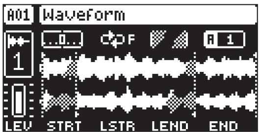

# 12.5 FLTR PAGE 1

On FILTER page 1, you will find all parameters that control the Multimode filter and its associated envelope. The Multimode filter lets you morph from a low-pass to band-pass to high-pass filter. 

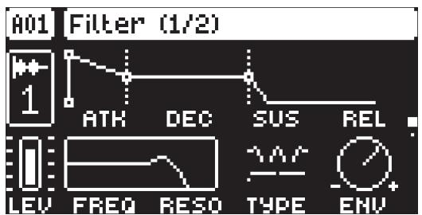

# ATK

Attack Time sets the length of the attack phase of the filter envelope. 

# DEC

Decay Time sets the length of the decay phase of the filter envelope. 

# SUS

Sustain Level sets the sustain level of the filter envelope. 

# REL

Release Time sets the length of the release phase of the filter envelope. 

# FREQ

Frequency sets the cutoff frequency of the Multimode filter and the center frequency of the EQ. 

# RESO

Resonance sets the resonance behavior of the filter. Resonance introduces a peak in the spectrum at the cutoff frequency. 

# TYPE

Type morphs the Multimode filter from low-pass to band-pass to high-pass. 

# ENV

Env. Depth determines the amount of modulation the filter envelope applies to the cutoff frequency. The knob is bipolar, offering both negative and positive modulation depths. 

# 12.6 FLTR PAGE 2

On FLTR page 2, you will find the parameters that control the Base-width filter and several parameters that affect the Multimode filter on FLTR page 1. 

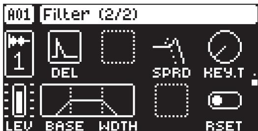

The Base-width filter is a high-pass filter and a low-pass filter connected in series. The filters BASE and WDTH parameters define the Base-width filter’s frequency range. 

Examples of how the BASE and WDTH parameters affect the filter frequency range: 

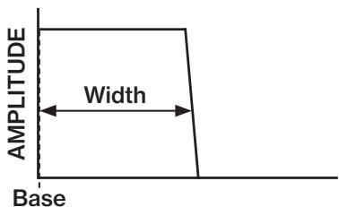

FREQUENCY

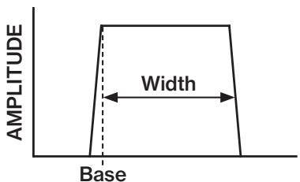

FREQUENCY

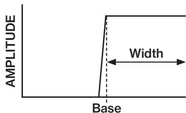

FREQUENCY

• With BASE set to 0, the filter functions as a low-pass filter with WDTH adjusting the frequency range. 

• With WDTH set to 127, the filter functions as a high-pass filter with BASE adjusting the frequency range. 

• With WDTH set to 0, the filter functions as a band-pass filter with BASE adjusting the frequency. 

• With BASE set to 0 and WDTH set to 127, the filter does not affect the sound. 

# DEL

Envelope delay sets the time before the attack phase of the filter envelope starts. This parameter is part of the filter envelope that controls the FLTR machine. You can also press and hold [FUNC] and then turn DATA ENTRY knob A to access this parameter from FLTR page 1 quickly. This parameter only affects the Multimode filter on FLTR page 1. 

# SPRD

Frequency Spread offsets the filter cutoff frequency in the left and right channels. 

# KEY.T

Keytrack sets how much the filter cutoff frequency is affected by what note is playing. The higher the KEY.T setting, the more the filter opens up at higher notes. This parameter is only available for the Single Player and Multi Player machines. 

# BASE

Sets the base frequency of the filter. 

# WIDTH

Sets the frequency width above the base frequency. 

# RSET

Envelope Reset sets the filter envelope behavior. This parameter only affects the Multimode filter on FLTR page 1. 

ON resets the envelope for each consecutive trig. The envelope’s attack phase is reset to zero. 

OFF does not reset the envelope for each consecutive trig (default). The envelope’s attack phase continues from where it was left off. 

# 12.7 AMP PAGE

The AMP page controls parameters for the amplitude envelope, panning, and volume. 

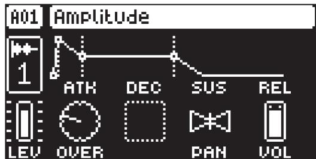

# ATK

Attack Time sets the length of the attack phase of the amp envelope. 

# HOLD

Hold Time sets the length of the hold phase of the amp envelope. Fixed Hold time values (0–126) specify the length of the hold phase, and the envelope ignores Note Off events such as Trig Length, releasing a [TRIG] key, or a key on an external controller. Setting HOLD to NOTE means the hold phase will be determined by Note On and Note Off events. This parameter is only available if ENVELOPE MODE in the TRACK SETUP menu is set to AHD. 

If you set HOLD to NOTE and use an external keyboard to trigger the envelope, the sound will be sustained (if DEC is set to a value less than 127) for as long as you press a key on the keyboard. 

# DEC

Decay Time sets the length of the decay phase of the amp envelope. When ENVELOPE MODE is set to AHD, DECAY works as the REL parameter, defining the time from end of HOLD to 0. 

# SUS

Sustain Level sets the sustain level of the amp envelope. This parameter is only available if ENVELOPE MODE in the TRACK SETUP menu is set to ADSR. 

# REL

Release Time sets the length of the release phase of the amp envelope. This parameter is only available if ENVELOPE MODE in the TRACK SETUP menu is set to ADSR. 

# OVER

Overdrive sets the amount of overdrive and clipping distortion of the signal entering the filter. 

# PAN

Pan positions the audio of each voice in the stereo field. The knob function is bipolar with 0 being the balanced midpoint, L64 sends all sound to the left channel and R63 sends all sound to the right. 

# VOL

Volume sets the volume amount of the amplifier. Unlike the track level (LEV), this parameter can be parameter locked and is saved with the preset. For the Subtracks machine, this parameter sets the amp level for every separate subtrack. 

Press [TRIG] $^ +$ [AMP] to access the TRACK SETUP menu and use the ENVELOP MODE setting to select if you want the AMP envelope to be in ADSR or AHD mode. 

# 12.8 FX PAGE 1 (TRACK ROUTING)

The FX parameter page 1 contains parameters that sets the routing of the track and the send levels from the track to the Send FX. 

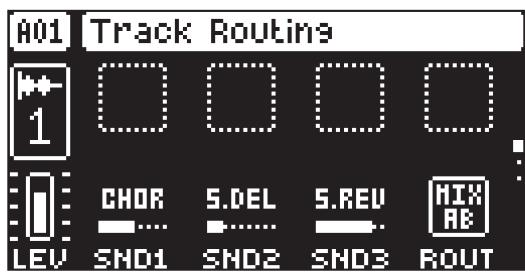

# SND1–3

Send 1–3 sets the amount of sound sent through to Send FX 1–3. For more information, please see “14. SEND FX TRACK PARAMETERS” on page 62. 

# ROUT

Routing selects where to route the audio of the selected track. This parameter mirrors the setting in the ROUTING menu. The routing switches for this parameter are shown with “A” in the sound architecture illustrations. For more information, please see “4. TONVERK SOUND ARCHITECTURE” on page 17, and “4.4 THE ROUTING MENU” on page 17. 

• MIX AB is the default setting and routes the audio to the MIXER and then through the Mix FX to the A/B outputs and the Headphoness. 

• OUT CD routes the audio directly to the C/D outputs. 

• OUT EF routes the audio directly to the E/F (HEADPHONES) outputs. 

• BUS 1–4 routes the audio to Bus 1–4. 

# 12.9 FX PAGE 2 (INSERT FX 1/2)

The parameters on the FX page 2 control the audio track’s selected first insert FX machine. Press [FUNC] $^ +$ [FX] to select FX machine. The parameters vary depending on which FX machine is assigned. For more information, please see “A.3 FX MACHINES” on page 85. 

# 12.10 FX PAGE 3 (INSERT FX 2/2)

The parameters on the FX page 3 control the audio track’s selected second insert FX machine. Press [FUNC] $^ +$ [FX] to select FX machine. The parameters vary depending on which FX machine is assigned. For more information, please see “A.3 FX MACHINES” on page 85. 

All the voices generated by the track’s SRC machine share the same insert effects. 

# 12.11 THE MODULATION PAGES

The MOD pages contain several modulators with their settings: two LFOs for the track parameters, an envelope for the track parameters, and two LFOs for the track’s insert FX parameters. 

# 12.12 MOD PAGE 1 (VOICE LFO 1)

The Voice Low-Frequency Oscillator 1 can be used to modulate the track parameters. Customize the low-frequency oscillator behavior, orientation, speed, and depth on this page. This page controls the behavior of VOICE LFO 1 

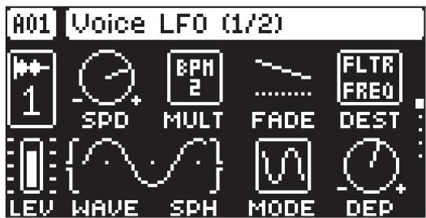

# SPD

Speed sets the speed of the LFO. Try settings of 8, 16 or 32 to sync the LFO to straight beats. The knob is bipolar. The LFO cycle can be played backward by using negative values. 

# MULT

Multiplier multiplies the SPD parameter by the set factor, either by adjusting the current tempo (BPM settings) or by applying a fixed tempo of 120 BPM. 

# FADE

Fade In/Out allows for fading in and out of the LFO modulation. The knob is bipolar. Positive values produce a fade-out, while negative values produce a fade-in. 0 gives no fade-in/fade-out. (-64–63) 

# DEST

Destination selects the modulation destination for the LFO. Preview how the LFO modulation will affect the sound by highlighting a destination. Press [YES] to confirm the selection. Press [NO] to cancel and revert to previous selection. For more information, please see “APPENDIX B: LFO/MOD ENVELOPE MODULATION DESTINATIONS” on page 98. 

# WAVE

Waveform sets the LFO waveform. The Triangle, Sine, Square, Sawtooth, and Random waveforms are bipolar. The Exponential and Ramp are unipolar. 

# SPH

Start Phase sets the point within the wave cycle where the LFO will start when it is trigged. 0 makes the LFO start at the beginning of a complete wave cycle, 64 makes it start at the center. A small square at the start of the waveform shows that the wave cycle begins at a zero-crossing. If WAV is set to RND then the SPH parameter changes to SLEW and adds slew to the transitions in the waveform. 

# MODE

Trig Mode determines how the LFO behaves when a note is triggered. 

• FREE is the default free-running mode. It makes the LFO run continuously, never restarting or stopping even if notes are trigged. 

• TRIG makes the LFO restart when a note is trigged. 

• HOLD makes the LFO run free in the background, but when a note is trigged, the LFO output level is latched and held still until the next note is trigged. 

• ONE The LFO starts when a note is trigged, then runs to the end of the waveform and then stops. This makes the LFO function similar to an envelope. 

• HALF The LFO starts when a note is trigged, then runs to the middle of the waveform and then stops. 

# DEP

Depth sets the depth and polarity of the LFO modulation. Both negative and positive modulation depths are possible. A center setting, 0.00, equals no modulation depth. 

# 12.13 MOD PAGE 2 (VOICE LFO 2)

MOD page 2 contains the same parameters as VOICE LFO page 1, but controls VOICE LFO 2. 

# 12.14 MOD PAGE 3 (MOD ENVELOPE)

The Mod Envelope can be used to modulate track parameters. It is similar to the envelopes on the AMP and FLTR pages but lets you route to a destination of your choice. 

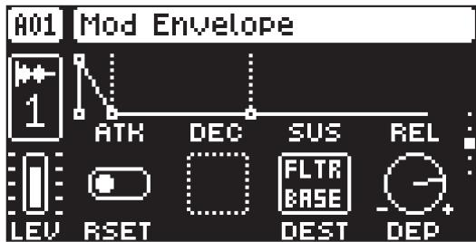

# ATK

Attack Time sets the length of the attack phase of the amp envelope. 

# DEC

Decay Time sets the length of the decay phase of the amp envelope. 

# SUS

Sustain Level sets the sustain level of the amp envelope. 

# REL

Release Time sets the length of the release phase of the amp envelope. 

# RSET

Mod Envelope Reset sets the Mod envelope behavior: 

ON resets the envelope for each consecutive trig. The envelope’s attack phase is reset to zero. 

OFF does not reset the envelopes for each consecutive trig (default). The envelope’s attack phase continues from where it was left off. 

# DEST

Destination selects the modulation destination for the Mod Envelope. Preview how the modulation will affect the sound by highlighting a destination. Press [YES] to confirm the selection. Press [NO] to cancel and revert to previous selection. For more information, please see “APPENDIX B: LFO/MOD ENVELOPE MODULATION DESTINATIONS” on page 98. 

# DEP

Depth sets the depth and polarity of the Mod Envelope modulation. Both negative and positive modulation depth is possible. A center setting, 0.00, equals no modulation depth. 

# 12.15 MOD PAGE 4 (FX LFO 1)

The FX Low-Frequency Oscillators can be used to modulate the parameters of the selected Insert FX 1 and 2. This page controls the behavior of FX LFO 1. 

# SPD

Speed sets the speed of the LFO. Try settings of 8, 16 or 32 to sync the LFO to straight beats. The knob is bipolar. The LFO cycle can be played backward by using negative values. 

# MULT

Multiplier multiplies the SPD parameter by the set factor, either by adjusting the current tempo (BPM settings) or by applying a fixed tempo of 120 BPM. 

# FADE

Fade In/Out allows for fading in and out of the LFO modulation. The knob is bipolar. Positive values produce a fade-out, while negative values produce a fade-in. 0 gives no fade-in/fade-out. 

# DEST

Destination selects the modulation destination for the LFO. Preview how the LFO modulation will affect the sound by highlighting a destination. Press [YES] to confirm the selection. Press [NO] to cancel and revert to previous selection. For more information, please see “APPENDIX B: LFO/MOD ENVELOPE MODULATION DESTINATIONS” on page 98. 

# WAVE

Waveform sets the LFO waveform. The Triangle, Sine, Square, Sawtooth, and Random waveforms are bipolar. The Exponential and Ramp are unipolar. 

# SPH

Start Phase sets the point within the wave cycle where the LFO will start when it is trigged. 0 makes the LFO start at the beginning of a complete wave cycle, 64 makes it start at the center. A small square at the start of the waveform shows that the wave cycle begins at a zero-crossing. If WAV is set to RND then the SPH parameter changes to SLEW and adds slew to the transitions in the waveform. 

# MODE

Trig Mode determines how the LFO behaves when a note is triggered. 

• FREE is the default free-running mode. It makes the LFO run continuously, never restarting or stopping even if notes are trigged. 

• TRIG makes the LFO restart when a note is trigged. 

• HOLD makes the LFO run free in the background, but when a note is trigged, the LFO output level is latched and held still until the next note is trigged. 

• ONE The LFO starts when a note is trigged, then runs to the end of the waveform and then stops. This makes the LFO function similar to an envelope. 

• HALF The LFO starts when a note is trigged, then runs to the middle of the waveform and then stops. 

# DEP

Depth sets the depth and polarity of the LFO modulation. Both negative and positive modulation depths are possible. A center setting, 0.00, equals no modulation depth. 

# 12.16 MOD PAGE 5 (FX LFO 2)

The FX LFO 2 page contains the same parameters as FX LFO page 1, but controls the behavior of FX LFO 2. 

LFO WAVEFORMS AND TRIGMODES

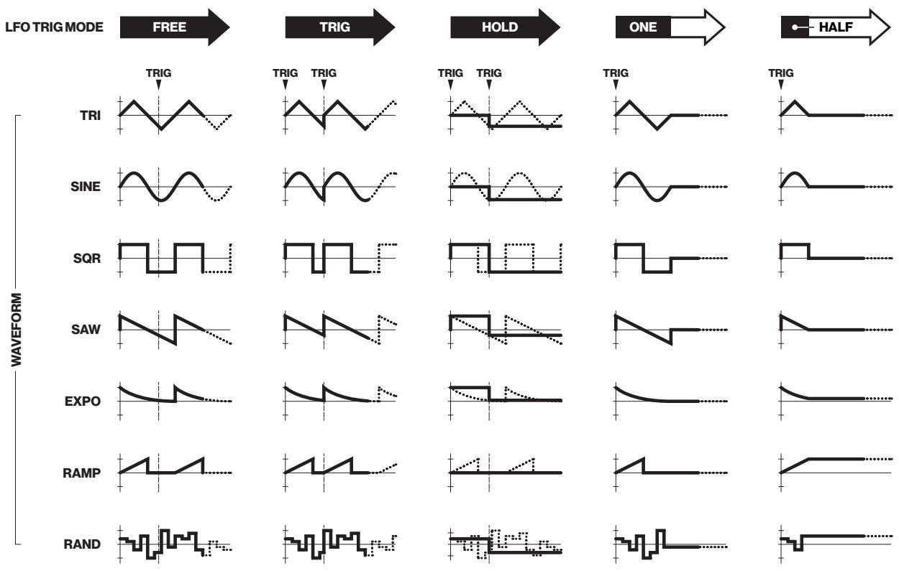

# LFO SPEED SETTINGS

The table below shows the LFO speed measured in sequencer steps using different combinations of SPD and MULT (set to a BPM value) settings. For example, a value of 8 in the table means that the LFO will do one complete cycle in the time it takes the sequencer to advance eight steps. 

<table><tr><td colspan="14">MULT</td></tr><tr><td rowspan="8">SPD</td><td>1</td><td>2</td><td>4</td><td>8</td><td>16</td><td>32</td><td>64</td><td>128</td><td>256</td><td>512</td><td>1K</td><td>2K</td><td></td></tr><tr><td>1</td><td>2048</td><td>1024</td><td>512</td><td>256</td><td>128</td><td>64</td><td>32</td><td>16</td><td>8</td><td>4</td><td>2</td><td>1</td></tr><tr><td>2</td><td>1024</td><td>512</td><td>256</td><td>128</td><td>64</td><td>32</td><td>16</td><td>8</td><td>4</td><td>2</td><td>1</td><td>1/2</td></tr><tr><td>4</td><td>512</td><td>256</td><td>128</td><td>64</td><td>32</td><td>16</td><td>8</td><td>4</td><td>2</td><td>1</td><td>1/2</td><td>1/4</td></tr><tr><td>8</td><td>256</td><td>128</td><td>64</td><td>32</td><td>16</td><td>8</td><td>4</td><td>2</td><td>1</td><td>1/2</td><td>1/4</td><td>1/8</td></tr><tr><td>16</td><td>128</td><td>64</td><td>32</td><td>16</td><td>8</td><td>4</td><td>2</td><td>1</td><td>1/2</td><td>1/4</td><td>1/8</td><td>1/16</td></tr><tr><td>32</td><td>64</td><td>32</td><td>16</td><td>8</td><td>4</td><td>2</td><td>1</td><td>1/2</td><td>1/4</td><td>1/8</td><td>1/16</td><td>1/32</td></tr><tr><td>64</td><td>32</td><td>16</td><td>8</td><td>4</td><td>2</td><td>1</td><td>1/2</td><td>1/4</td><td>1/8</td><td>1/16</td><td>1/32</td><td>1/64</td></tr></table>

# 13. BUS TRACK PARAMETERS

The parameters that are available on the Bus tracks are explained in this chapter. For more information about Bus tracks, please see”5.3.3 BUS TRACKS (TRACK 9–12)” on page 20. On the SRC, FLTR, and AMP PARAMETER pages, you will find parameters for when using the Bus track to control external MI-DI-controlled devices (if you have assigned a MIDI SRC machine to the track). For more information about these parameters, please see “A.2.4 MIDI” on page 82. On the FX parameter pages, you have parameters for selecting and editing the Bus track’s FX machines, setting the send levels from the track to the send FX, and also setting the track routing. On the MOD pages, you have two LFOs dedicated as modulation sources for the track’s selected FX machines. 

# 13.1 EDITING THE BUS TRACK PARAMETERS

Press [TRK] $^ +$ [TRIG 9–12] to select the Bus track you want to edit. There are six PARAMETER pages for the Bus tracks. Press [TRIG], [SRC], [FLTR], [AMP], [FX], and [MOD] to access the tracks PARAMETER page groups. Use the [UP]/[DOWN] keys to access the parameter group’s pages. You can also press a [PARAMETER PAGE] key repeatedly to cycle through that group’s parameter pages. Press and hold a [PA-RAMETER PAGE] key to see the values for all parameters on that page. 

The track parameters can be locked to other settings at any step of the pattern by first pressing and holding the [TRIG] key, then adjusting the parameter settings with the DATA ENTRY knobs.For more information, please see “10.10.1 PARAMETER LOCKS” on page 40. 

If you press [TRIG 9–12] to select a Bus track without first pressing and holding [TRK], you can still use the [KEYBOARD] to play the previously selected audio track. Selecting the same Bus track again toggles editing back to the audio track. 

# 13.2 TRIG PAGE

Here you set the options for notes that are trigged. This is also where you select trig conditions. Press the [TRIG PARAMETERS] key to access the menu. Change settings using the DATA ENTRY knobs. These general settings affect note trigs placed on the sequencer. 

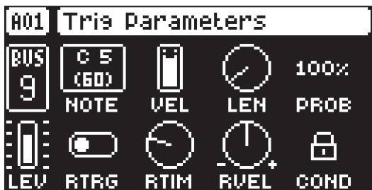

# NOTE

Trig Note sets the pitch of the note when trigged. When in LIVE RECORDING mode and using the [KEY-BOARD] to enter notes, the pitch of the [TRIG] keys played will override this setting. The NOTE parameter is not available for tracks that have the Subtracks SRC machine assigned. 

# VEL

Trig Velocity sets the velocity of the sequencer’s note trigs. 

# LEN

Trig Length sets the length of the note trig. In LIVE RECORDING mode, the duration of pressing the [TRIG] keys overrides this general setting. 

# PROB

Trig Probability sets the probability that the trigs on the track play or not. The probability outcome is re-evaluated every time a trig is set to play. The default setting is $1 0 0 \%$ , meaning that all the trigs on the track plays every time. This parameter can be parameter locked, which lets you give separate trigs their own probability. 

# RTRG

Retrig enables multiple trig repeats on placed trigs. Use DATA ENTRY knob A to turn retrig on/off. For information on setting retrig locks on specific trigs in the sequencer, please see “10.7 RETRIGS” on page 39. 

# RTIM

Repeat Time sets the retrig rate. 1/16 is the nominal retrig rate, one trig per step. 1/32 corresponds to two trigs per step and so on. To do triplets, for example, set the retrig rate to 1/12 (or 1/24). 

# RVEL

Repeat velocity sets the velocity curve fade-out and fade-in of the retrig. -1 corresponds to a complete fade out during the set length, -0,5 fades out to half the velocity during the set length, 0 equals a flat velocity curve with no fade, 0.5 fades into half velocity during the set length, and 1 fades in completely to full velocity during the set length. Please note that the effects of the VFAD setting is also dependent on the VEL setting on TRIG PAGE 1. 

# COND

(Trig Condition) when you add a conditional lock, COND sets the Trig Condition with which a set of conditional rules can be applied to any trig, using a conditional parameter lock. For more information, please see “10.10.2 TRIG CONDITIONS AND CONDITIONAL LOCKS” on page 41. 

# 13.3 SRC, FLTR, AMP PAGES

These pages are empty unless you have selected a MIDI SRC machine for the bus track. These pages will then contain the parameters specific to the MIDI machine.. For more information about these parameters, please see “A.2.4 MIDI” on page 82. 

# 13.4 FX PAGE 1 (TRACK ROUTING)

The FX parameter page 1 contains parameters that set the routing of the track and the send levels from the track to the Send FX. 

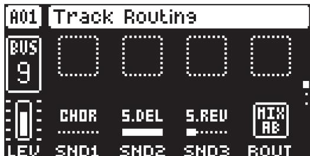

# SND1–3

Send 1–3 sets the amount of sound sent through to Send FX 1–3. For more information, please see “14. SEND FX TRACK PARAMETERS” on page 62. 

# ROUT

Routing selects where to route the audio from the selected track’s Bus. This parameter mirrors the setting in the ROUTING menu. The routing switches for this parameter are shown with “B” in the sound architecture illustrations For more information, please see “4. TONVERK SOUND ARCHITECTURE” on page 17 and “4.4 THE ROUTING MENU” on page 17. 

• MIX AB is the default setting and routes the audio to the MIXER and then through the Main FX to the A/B outputs and the Headphones. 

• OUT CD routes the audio directly to the C/D outputs. 

• OUT EF routes the audio directly to the E/F (HEADPHONES) outputs. 

# 13.5 FX PAGE 2 (INSERT FX 1/2)

The parameters on the FX page 2 control the audio track’s selected first insert FX machine. Press [FUNC] $^ +$ [FX] to select FX machine. The parameters vary depending on which insert FX machine is selected. For more information, please see “A.3 FX MACHINES” on page 85. 

# 13.6 FX PAGE 3 (INSERT FX 2/2)

The parameters on the FX page 3 control the audio track’s selected second insert FX machine. Press [FUNC] $^ +$ [FX] to select FX machine. The parameters vary depending on which insert FX machine is selected. For more information, please see “A.3 FX MACHINES” on page 85. 

# 13.7 MOD PAGE 1 (LFO 1)

The Low-Frequency Oscillator 1 is used to modulate the track’s parameters. Customize the LFO behavior, orientation, speed, and depth on this page. This page controls the behavior of LFO 1. The parameters on this page are the same as on the Audio track’s MOD PAGE 1. For more information, please see “12.12 MOD PAGE 1 (VOICE LFO 1)” on page 55. 

# 13.8 MOD PAGE 2 (LFO 2)

The Low-Frequency Oscillator 2 is used to modulate the track’s parameters. Customize the LFO behavior, orientation, speed, and depth on this page. This page controls the behavior of LFO 2. The parameters on this page are the same as on the Audio track’s MOD PAGE 1. For more information, please see “12.12 MOD PAGE 1 (VOICE LFO 1)” on page 55. 

# 14. SEND FX TRACK PARAMETERS

The parameters that are available on the Send FX tracks are explained in this chapter. For more information about Send FX tracks, please see ”5.3.4 SEND FX TRACKS (TRACK 13–15)” on page 20. On the FX parameter pages, you have parameters for selecting and editing the Send FX track’s FX machines. On the MOD pages, you have two LFOs dedicated as modulation sources for the track’s parameters. 

# 14.1 EDITING THE SEND FX TRACK PARAMETERS

Press [TRK] $^ +$ [TRIG 13–15] to select the Send FX track you want to edit. There are three PARAMETER pages for the SEND FX tracks. Press [TRIG], [FX], and [MOD] to access the tracks PARAMETER page groups. Use the [UP]/[DOWN] keys to access the parameter group’s pages. You can also press a [PARAM-ETER PAGE] key repeatedly to cycle through that group’s parameter pages. Press and hold a [PARAME-TER PAGE] key to see the values for all parameters on that page. 

The track parameters can be locked to other settings at any step of the pattern by first pressing and holding the [TRIG] key, then adjusting the parameter settings with the DATA ENTRY knobs. For more information, please see “10.10.1 PARAMETER LOCKS” on page 40. 

If you press [TRIG 13–15] to select a Send FX track without first pressing and holding [TRK], you can still use the [KEYBOARD] to play the previously selected audio track. 

# 14.2 TRIG PAGE

Here you set the options for notes that are trigged. This is also where you select trig conditions. Press the [TRIG PARAMETERS] key to access the menu. Change settings using the DATA ENTRY knobs. These general settings affect note trigs placed on the sequencer. 

# NOTE

Trig Note sets the pitch of the note when trigged. When in LIVE RECORDING mode and using the [KEY-BOARD] to enter notes, the pitch of the [TRIG] keys played will override this setting. The NOTE parameter is not available for tracks that have the Subtracks SRC machine assigned. 

# VEL

Trig Velocity sets the velocity of the sequencer’s note trigs. 

# LEN

Trig Length sets the length of the note trig. In LIVE RECORDING mode, the duration of pressing the [TRIG] keys overrides this general setting. 

# PROB

Trig Probability sets the probability that the trigs on the track play or not. The probability outcome is re-evaluated every time a trig is set to play. The default setting is $100 \%$ , meaning that all the trigs on the track play every time. This parameter can be parameter locked, which lets you give separate trigs their own probability. 

# RTRG

Retrig enables multiple trig repeats on placed trigs. Use DATA ENTRY knob A to turn retrig on or off. For information on setting retrig locks on specific trigs in the sequencer, please see “10.7 RETRIGS” on page 39. 

# RTIM

Repeat Time sets the retrig rate. 1/16 is the nominal retrig rate, one trig per step. 1/32 corresponds to two trigs per step and so on. To do triplets, for example, set the retrig rate to 1/12 (or 1/24). 

# RVEL

Repeat velocity sets the velocity curve fade-out and fade-in of the retrig. -1 corresponds to a complete fade out during the set length, -0,5 fades out to half the velocity during the set length, 0 equals a flat velocity curve with no fade, 0.5 fades into half velocity during the set length, and 1 fades in completely to full velocity during the set length. Please note that the effects of the VFAD setting are also dependent on the VEL setting on TRIG PAGE 1. 

# COND

(Trig Condition) when you add a conditional lock, COND sets the Trig Condition with which a set of conditional rules can be applied to any trig, using a conditional parameter lock. For more information, please see “10.10.2 TRIG CONDITIONS AND CONDITIONAL LOCKS” on page 41. 

# 14.3 SRC, FLTR, AMP PAGES

These parameter pages are empty. 

# 14.4 FX PAGE 1 (TRACK ROUTING)

The FX parameter page 1 contains parameters that sets the routing of the track and the amount . 

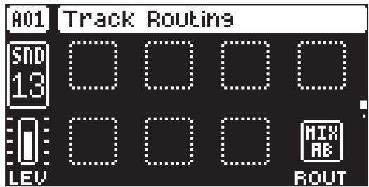

# ROUT

Routing selects where to route the audio from the selected track’s Bus. This parameter mirrors the setting in the ROUTING menu. The routing switches for this parameter are indicated by the letter “C” in the sound architecture illustrations. For more information, please see “4. TONVERK SOUND ARCHITEC-TURE” on page 17, and “4.4 THE ROUTING MENU” on page 17. 

• MIX AB is the default setting and routes the audio to the MIXER and then through the Main FX to the A/B outputs and the Headphones. 

• OUT CD routes the audio directly to the C/D outputs. 

• OUT EF routes the audio directly to the E/F (HEADPHONES) outputs. 

# 14.5 FX PAGE 2 (SEND FX)

The parameters on the FX page 2 control the track’s selected send FX machine. The FX machines selected on tracks 13–15 are the ones you send sound to from the Audio and Bus tracks using the SND1–3 parameters. Press [FUNC] $^ +$ [FX] to select the FX machine. The parameters vary depending on the selected insert FX machine. For more information, please see “A.3 FX MACHINES” on page 85. 

# 14.6 MOD PAGE 1 (LFO 1)

The Low-Frequency Oscillator 1 is used to modulate the track’s parameters. Customize the LFO behavior, orientation, speed, and depth on this page. This page controls the behavior of LFO 1. The parameters on this page are the same as on the Audio track’s MOD PAGE 1. For more information, please see “12.12 MOD PAGE 1 (VOICE LFO 1)” on page 55. 

# 14.7 MOD PAGE 2 (LFO 2)

The Low-Frequency Oscillator 2 is used to modulate the track’s parameters. Customize the LFO behavior, orientation, speed, and depth on this page. This page controls the behavior of LFO 2. The parameters on this page are the same as on the Audio track’s MOD PAGE 1. For more information, please see “12.12 MOD PAGE 1 (VOICE LFO 1)” on page 55. 

# 15. MIX TRACK PARAMETERS

The parameters that are available on the Mix track are explained in this chapter. For more information about Mix track, please see “5.3.5 MIX TRACK (TRACK 16)” on page 20. On the Mix track, you have several different settings related to external audio, track mixing, the main effect, and you also have two LFOs as dedicated modulation sources for a number of the track’s parameters. 

# 15.1 EDITING THE MIX TRACK PARAMETERS

Press [TRK] $^ +$ [TRIG 16] to select the Mix track. There are five PARAMETER pages for the Mix track. Press [TRIG], [SRC], [AMP], [FX], and [MOD] to access the tracks PARAMETER page groups. Use the [UP]/ [DOWN] keys to access the parameter group’s pages. You can also press a [PARAMETER PAGE] key repeatedly to cycle through that group’s parameter pages. Press and hold a [PARAMETER PAGE] key to see the values for all parameters on that page. 

The track parameters can be locked to other settings at any step of the pattern by first pressing and holding the [TRIG] key, then adjusting the parameter settings with the DATA ENTRY knobs. For more information, please see “10.10.1 PARAMETER LOCKS” on page 40. 

If you press [TRIG 16] to select the Mix track without first pressing and holding [TRK], you can still use the [KEYBOARD] to play the previously selected audio track. 

# 15.2 TRIG PAGE

Here you set the options for notes that are trigged. This is also where you select trig conditions. Press the [TRIG PARAMETERS] key to access the menu. Change settings using the DATA ENTRY knobs. These general settings affect note trigs placed on the sequencer. 

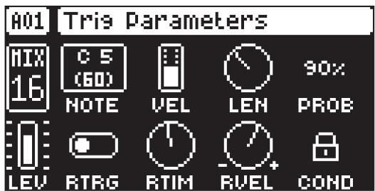

# NOTE

Trig Note sets the pitch of the note when trigged. When in LIVE RECORDING mode and using the [KEY-BOARD ] to enter notes, the pitch of the [TRIG] keys played will override this setting. The NOTE parameter is not available for tracks that have the Subtracks SRC machine assigned. 

# VEL

Trig Velocity sets the velocity of the sequencer’s note trigs. 

# LEN

Trig Length sets the length of the note trig. In LIVE RECORDING mode, the duration of pressing the [TRIG] keys overrides this general setting. 

# PROB

Trig Probability sets the probability that the trigs on the track play or not. The probability outcome is re-evaluated every time a trig is set to play. The default setting is $100 \%$ , meaning that all the trigs on the track plays every time. This parameter can be parameter locked which lets you give separate trigs their own probability. 

# RTRG

Retrig enables multiple trig repeats on placed trigs. Use DATA ENTRY knob A to turn retrig on/off. For information on setting retrig locks on specific trigs in the sequencer, please see “10.7 RETRIGS” on page 39. 

# RTIM

Repeat Time sets the retrig rate. 1/16 is the nominal retrig rate, one trig per step. 1/32 corresponds to two trigs per step and so on. To do triplets, for example, set the retrig rate to 1/12 (or 1/24). 

# RVEL

Repeat velocity sets the velocity curve fade-out and fade-in of the retrig. -1 corresponds to a complete fade out during the set length, -0,5 fades out to half the velocity during the set length, 0 equals a flat velocity curve with no fade, 0.5 fades into half velocity during the set length, and 1 fades in completely to full velocity during the set length. Please note that the effects of the VFAD setting is also dependent on the VEL setting on TRIG PAGE 1. 

# COND

(Trig Condition) when you add a conditional lock, COND sets the Trig Condition with which a set of conditional rules can be applied to any trig, using a conditional parameter lock. For more information, please see “10.10.2 TRIG CONDITIONS AND CONDITIONAL LOCKS” on page 41. 

# 15.3 SRC PAGE

On this page you control aspects related to the incoming audio from extrnal sources (USB and IN A/B). 

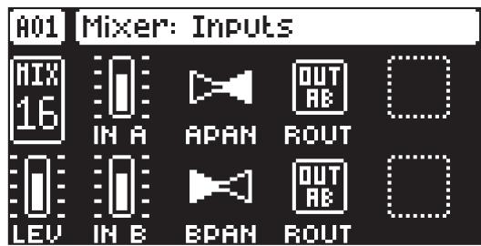

# IN A/IN B

The level parameters set the level of the incoming audio from the USB and IN A/B inputs. 

# APAN/BPAN

The pan parameters position the audio from USB and IN A/B in the stereo field. The knob function is bipolar with 0 being the balanced midpoint, L64 sends all sound to the left channel and R63 sends all sound to the right. 

# ROUT/ROUT

The routing parameters select where to route the audio from USB and IN A/B. This parameter’s routing switches are shown with “A” in the sound architecture illustrations. For more information, please see “4. TONVERK SOUND ARCHITECTURE” on page 17 and “4.4 THE ROUTING MENU” on page 17. 

• MIX AB is the default setting and routes the audio though the Main FX to the A/B outputs and the Headphones. 

• OUT AB routes the audio to the AB outputs and the Headphones without going through the Mixer and Main FX. 

• OUT CD routes the audio directly to the C/D outputs. 

• OUT EF routes the audio directly to the E/F (HEADPHONES) outputs. 

• BUS 1–4 routes the audio to Bus 1–4) 

• TRK 1–8 routes the audio to Track 1–8) 

# 15.4 FLTR PAGE

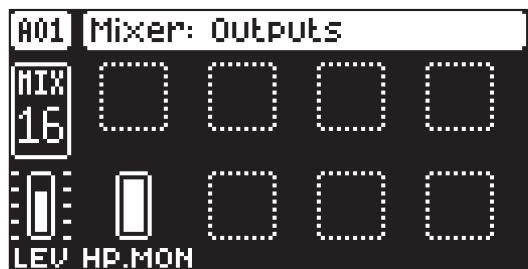

# HP.MON

Here you set the level of the audio sent from the mixer to the headphones (Output EF). You can find this parameter’s position in the signal flow, shown with an “E”, in the sound architecture illustrations. For more information, please see “4. TONVERK SOUND ARCHITECTURE” on page 17. 

# 15.5 AMP PAGE

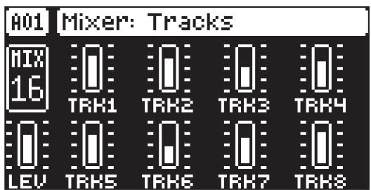

# TRK1–8

Sets the TRACK LEVEL parameter of track 1–8. 

# 15.6 FX PAGE

The parameters on the FX page control the track’s selected FX machine. Press [FUNC] $^ +$ [FX] to select FX machine. The parameters vary depending on which FX machine is selected. For more information, please see “A.3 FX MACHINES” on page 85. 

# 15.7 MOD PAGE 1 (LFO 1)

The Low-Frequency Oscillator 1 is used to modulate the track’s parameters. Customize the LFO behavior, orientation, speed, and depth on this page. This page controls the behavior of LFO 1. The parameters on this page are the same as on the Audio track’s MOD PAGE 1. For more information, please see “12.12 MOD PAGE 1 (VOICE LFO 1)” on page 55. 

# 15.8 MOD PAGE 2 (LFO 2)

The Low-Frequency Oscillator 2 is used to modulate the track’s parameters. Customize the LFO behavior, orientation, speed, and depth on this page. This page controls the behavior of LFO 2. The parameters on this page are the same as on the Audio track’s MOD PAGE 1. For more information, please see “12.12 MOD PAGE 1 (VOICE LFO 1)” on page 55. 

# 16. SAMPLING

Tonverk is a very competent and accessible sampler. It can sample audio from external sources via the external inputs, and it can also sample audio internally from Tonverk itself. There are two different sampling methods: you can use either the Recorder or the Auto Sampler. 

# 16.1 THE SAMPLING MENU

The SAMPLING menu within the Recorder provides settings that control various aspects of sampling. The maximum sampling time when using the SAMPLING menu is 6.06.06 minutes and this is always available even if a project’s RAM is fully utilized. 

Press [SAMPLING] to enter the SAMPLING SELECT screen, and then use [UP]/[DOWN] to select RE-CORDER, and then press [YES] to access the SAMPLING menu 

# 16.1.1 REC

Press [FUNC] $^ +$ [YES] to start sampling. Press [YES] to stop sampling. 

# 16.1.2 ARM

Press [YES] to arm the sampler. The sampler is now in arm mode, and it will start sampling when the incoming audio exceeds the threshold level. See THR below. Press [SAMPLING] + [NO] to cancel. 

# 16.1.3 RLEN

Record Length sets the length of the sampling. With a setting of 1/16–16/1, the sampling length is decided by the time it takes the sequencer to advance a set number of steps at the current BPM. For example, the settings 1/16, 1/8, 1/2, 1/1, and 16/1 correspond to sampling durations of 1 sequencer step, 2 steps, 8 steps, 16 steps, and 256 steps, respectively. With the MAX setting, sampling continues until the maximum sampling time is reached or until you press [YES] to stop sampling. 

# 16.1.4 THR

If you have selected to arm the sampler, the sampling begins when the incoming audio signal exceeds the threshold setting. Set the threshold high enough so that it is not triggered by background noise, but low enough that you capture all of the signal. 

# 16.1.5 SRC

Source selects between different incoming audio sources to sample from. 

• IN A+USB L sets the input source to INPUT A and USB in L. 

• IN B+USB R sets the input source to INPUT B and USB in R. 

• IN + USB sets the input source to INPUT $\mathsf { A } { + } \mathsf { B }$ and USB ${ \mathsf { L } } + { \mathsf { R } } { \mathsf { \Omega } }$ 

• MAIN sets the input source to Tonverk’s internal Mix track. the audio is sampled after the main FX. 

• TRK.1–8 sets the input source to one of Tonverk’s internal tracks 1–8. 

• BUS.1–4 sets the input source to one of Tonverk’s buses 1–4. 

# 16.1.6 MON

Selects the option to monitor and set the level of the incoming audio through Tonverk or not. 

# 16.2 SAMPLING AUDIO USING THE RECORDER

1. If you use an external audio source, connect it to Tonverk. 

2. Press [SAMPLING] to enter the SAMPLING SELECT screen, and then use [UP]/[DOWN] to select RECORDER, and then press [YES]. If you have previously in the session used the Auto sampler, press [LEFT] to enter the SAMPLING SELECT screen. 

3. Use DATA ENTRY knob G to set SOURCE to your preferred audio input source. 

4. Keep an eye on the audio input meter and play the audio source, ensuring the volume is as strong as possible without clipping or distortion. The notches at the right end of the meter indicate 0 dB. Set MON to YES to monitor the incoming audio through Tonverk. 

5. Again, with an eye on the audio input meter, use DATA ENTRY knob F to set THR just above the indicated background noise of the audio source (when it is not playing). 

6. Use RLEN to set the sampling length. 

7. Press [YES] to arm the sampler and then play the sound source. When the incoming audio signal exceeds the set threshold level, sampling will start. 

8. Press [YES] when you want to stop sampling, or with an RLEN setting, the sampling will stop automatically. The sampling also stops if it reaches the maximum sampling time. 

9. Use the DATA ENTRY knobs A and B to set the parameters START and END to trim the sample to the desired length. You can use the DATA ENTRY knob D to zoom in and out making it easier to see where to trim the sample. Use C to pan left and right if the sample is zoomed in. Press [FUNC] $^ +$ [YES] to preview the sample. (The preview is played back by the voice of the active track. Make sure to select track 1–8 as the active track). LOOP makes the previewed sample loop (when enabled). Press [LEFT] to toggle LOOP on/off. Press [UP] if you wish to normalize the sample to 0 dB. 

10.When you are happy with your settings, press [YES] to trim the sample. After you have trimmed the sample, you can press [NO] to untrim it if you are not satisfied with the result. 

11. On the NAMING page, name the sample and press [YES] again to confirm the save. The sample is saved on the Tonverk SD card in the folder USER/RECORDINGS 

12.Press [TRACK 1–8] if you want to select a track where you want to assign the sample. Press [NO] if you don’t want to assign the sample to a track. 

Press [NO] to exit the Recorder. 

You can only assign the sample to a track with a Single Player SRC machine selected. Only those tracks’ LEDS will light up and be selectable. 

# 16.3 THE AUTO SAMPLER

You can also use the Auto Sampler functionality to perform sampling and create instruments. The Auto Sampler helps you sample from other MIDI-equipped devices, such as synthesizers, by setting up a sample session where you can define the note range, the number of notes within the range, velocity layers, note duration, and release time. 

# 16.3.1 SAMPLING AUDIO USING THE AUTO SAMPLER

1. Connect a MIDI cable from the Tonverk MIDI Out connector to the MIDI input of the device you want to sample from. 

2. Connect audio cables from the device you want to sample to Tonverk’s IN A/B inputs, or connect an USB C cable from the sample source to Tonverk’s USB 1 input.. 

3. On the external device, select the sound you want to sample. 

4. On Tonverk, press [SAMPLING] to enter the SAMPLING SELECT screen, and then use [UP]/ [DOWN] to select AUTO SAMPLER, and then press [YES]. If you have previously in the session used the Recorder, press [LEFT] to enter the SAMPLING SELECT screen. 

5. Select the sampling source (SRC) and then select the MIDI channel to which the external device is listening (MIDI CHAN). 

6. Press [YES] to play a test note. The Autosampler will measure the latency and correct for it. It will also measure the release time of the sound you want to sample and set a release time that accounts for the full release of the sound. 

7. Use LTNCY to manually adjust the latency if you want to adjust the latency compensation set by the test note in step 6. 

8. Use RELEASE TIME to manually set a release time if you want to adjust the release time set by the test note in step 6. 

9. Press [RIGHT] to navigate to the next setting page and then set the following parameters: 

START, END sets the note range you want to sample. 

SAMPLE EVERY sets the interval between the actual notes to be sampled within the selected note range. For example, if the note range is one octave and STEP is set to 1, every semitone within the range is sampled. With STEP set to 3, every third semitone within the range will be sampled, and so on. The first note sampled is always the lowest note selected by the START parameter. 

VELOCITY LAYERS sets how many separate velocities each note are sampled with. 

10.Press [RIGHT] and then use NOTE DURATION to set the time for which each sampled note should be held. 

11. Press [YES] to start the sampling process. 

Press [NO] to exit the Auto Sampler. 

When the auto-sampling process is complete, the instrument/sample is assigned a name and saved to the folder USER/MULTI-SAMPLED INSTRUMENTS on the SD card. The auto sampling process generates a number of files: one instrument (.elmulti) for use in the Multi Player machine and one single sample (.wav) containing all the sampled notes, one after another, for use in the Single player machine. 

When sampling with multiple velocity layers, set the VELOCITY TO VOL parameter to LOG or LIN for best results. For more information, please see “11.4.1 VELOCITY TO VOL” on page 48. 

# 16.4 TRANSFERRING SAMPLES FROM A COMPUTER TO TONVERK

Tonverk can load and play WAV and AIFF audio files of any bit depth and sample rate. It will play them back at a maximum of 32-bit float, $4 8 \mathsf { k H z }$ . Samples are stored on the SD card, and the size and number of those samples are limited only by the available free space on the SD card 

1. Connect Tonverk to a computer using a USB cable attached to one of Tonverk’s USB connectors. 

2. On the device, navigate to SETTINGS $>$ USB DISK MODE, and then press [YES]. 

3. In the popup window, press [YES], but note that device playback will stop. 

4. Tonverk’s SD card should now show up in your computer as a USB device. Click the Tonverk USB device on your computer to access the contents of the SD card. 

5. On the SD card, navigate to the User/Samples folder and copy your sample files there. You can also create subfolders within the Samples folder and copy the files there. 

6. Once all files are copied, safely eject the Tonverk USB device from the computer. Please refer to your computer’s documentation on how to perform this procedure. 

7. On your device. Press [NO] to exit USB disk mode. 

We recommended that you save and add content only to the USER folder on the SD card. This folder also contains the default destinations for saving projects, presets, samples, and instruments. 

• If you delete or move samples (or a folder containing samples) on the SD card, it will affect all projects that use the deleted or moved samples, and the samples will be missing from these projects. 

• The write-protect switch on the SD card must be set to OFF if you want to write to the card. 

You can also use a smartphone or tablet to upload samples to Tonverks SD card. 

# 17. SETTINGS MENU

The SETTINGS menu offers settings that affect Tonverk and can also be used to manage Projects. 

Press [SETTINGS] to access the SETTINGS menu. Scroll the list by using [UP]/[DOWN] or the LEVEL/ DATA knob. Open a highlighted menu by pressing [YES]. 

# 17.1 USB DISK MODE

This option allows you to access Tonverk’s SD card from a computer, enabling the transfer of files between the device and the computer. This is useful for transferring samples and OS updates. 

# 17.1.1 USING USB DISK MODE

1. Connect Tonverk to a computer/phone/tablet using a USB cable attached to Tonverk’s USB 1 connector. 

2. Select USB DISK MODE and then press [YES]. 

3. In the pop-up window, press [YES], but note that device playback will stop. 

4. Tonverk should now show up on your computer as a USB device. Click the Tonverk USB device on your computer to access the contents of the SD card. 

5. To exit the USB disk mode, you must first safely eject the Tonverk USB device. Please refer to your computer’s documentation on how to perform this procedure. 

6. On your device. Press [NO] to exit USB disk mode. 

If you delete or move samples (or a folder containing samples) on the SD card, it will affect all projects that use the deleted or moved samples, and the samples will be missing from these projects. 

# 17.2 MIDI CONFIG

In this menu, various sub-menus dealing with the MIDI functionality of Tonverk are found. 

# 17.2.1 SYNC

Controls how Tonverk receives and sends MIDI clock and transport commands. Change settings by using the [LEFT]/[RIGHT] arrow keys or the [YES] key. 

CLOCK RECEIVE determines whether Tonverk responds to MIDI clock sent from external devices or not. 

CLOCK SEND determines whether Tonverk transmits MIDI clock or not. 

TRANSPORT RECEIVE determines whether Tonverk responds to MIDI transport messages sent from external devices or not. 

TRANSPORT SEND determines whether Tonverk transmits MIDI transport messages or not. 

PROG CH RECEIVE will, when active, make Tonverk respond to incoming program change messages, which is useful when wanting to select patterns externally. The MIDI channel that will listen to incoming program change messages is set in the MIDI CHANNELS menu. For more information, please see “17.2.3 CHANNELS” on page 71. 

PROG CH SEND will, when active, send program change messages when patterns are changed. The MIDI channel that will send program change messages is set in the MIDI CHANNELS menu. For more information, please see “17.2.3 CHANNELS” on page 71. 

# 17.2.2 PORT CONFIG

Here you find the MIDI port-related settings. Change settings by using the [LEFT]/[RIGHT] arrow keys. 

RECEIVE NOTES will, when active, enable playing Tonverk using an external MIDI keyboard. 

RECEIVE CC will, when active, make it possible to control Tonverk’s parameters from an external MIDI device sending CC data. 

INPUT FROM selects the source from which Tonverk will receive MIDI data. 

• DISABLED will make Tonverk disregard any incoming MIDI data. 

• MIDI will make Tonverk listen only to MIDI data sent to the MIDI IN port. 

• USB will make Tonverk listen only to MIDI data sent to the USB port. 

• MIDI+USB will make Tonverk listen to MIDI data sent to both the MIDI IN and USB ports. 

OUTPUT TO selects the destination to which Tonverk will send MIDI data. 

• DISABLED will stop Tonverk from sending out any MIDI data. 

• MIDI will make Tonverk send MIDI data to the MIDI OUT port only. 

• USB will make Tonverk send MIDI data to the USB port only. 

• MIDI+USB will make Tonverk send MIDI data to both the MIDI OUT and USB ports. 

# 17.2.3 CHANNELS

This menu handles the MIDI channel configuration. 

AUTO CHANNEL selects the MIDI channel that will give access to the currently active track. If an external MIDI keyboard connected to Tonverk sends MIDI data on this channel, the keyboard will control the active track. This is particularly useful, for example, when quickly switching between active audio tracks to play different presets. Tonverk also utilizes the AUTO channel to record MIDI tracks from external MIDI controllers. 

PROGRAM CHG IN CH selects the MIDI channel that will listen for incoming program change messages. An AUTO setting will use the AUTO channel. Enable Tonverk to respond to program change messages in the MIDI SYNC menu. For more information, please see “17.2.1 SYNC” on page 70. 

PROGRAM CHG OUT CH selects the MIDI channel that will send program change messages when changing patterns. An AUTO setting will use the AUTO channel. Enable Tonverk to send program change messages in the MIDI SYNC. For more information, please see “17.2.1 SYNC” on page 70. 

TRACKS 1–16 have their own dedicated MIDI channel, which is used to receive or send (by turning the knobs) parameter data to or from a specific audio track. The MIDI channel number corresponds to the track number. 

• The sequencer data is always sent on the MIDI channel specified by the CHAN parameter on the SRC PARAMETER page for the MIDI SCR machine. 

The selected MIDI channel for the Auto channel is only used for the Auto channel, and the track that uses the same channel does not listen to any MIDI data. 

# 17.3 PERSONALIZE

Here you can customize a number of settings to fit you personal preferences. 

# 17.3.1 LED BACKLIGHT

Switches the key LEDs’ backlight on and off. 

# 17.3.2 LED INTENSITY

Sets the brightness of the key LEDs and screen. Use the [LEFT]/[RIGHT] keys to change the setting (MIN, MID, MAX). 

# 17.4 SYSTEM

The System menu contains a number of system related settings. 

# 17.4.1 OS UPGRADE

Use this menu option to upgrade the Tonverk OS. If there is a new version of the Tonverk operating system, you are highly recommended to download and install the OS to keep your device up to date with the latest functionality and fixes. You can download the OS file from the Elektron website’s Support section. For more information about how to upgrade the Tonverk OS, please see “6.10 OS UPGRADE” on page 23. 

# 17.4.2 SAVE DIAGNOSTICS

This option creates a diagnostics file of the machine state. The file can be used in case the device is not functioning correctly to gather information that helps to pinpoint the problem. The file is saved in the DIAGNOSTICS folder of the SD card, and is called “system-xxxxxxxxxx.log”. 

# 17.4.3 DEVICE INFO

Here you can see the device’s serial number, current OS version, and current UI firmware version. 

# 18. RESCUE MODE

In this meny you find tools that can help you recover your device to a working state if you have problems with your Tonverk. To access this menu, hold down the [FUNC] key while powering up Tonverk. To choose the different alternatives, press the corresponding [TRIG] key. 

# 18.1 RESET ACTIVE PROJ.

This option makes a backup of the active project and loads a new empty project. 

To reset the active project, press [TRIG 1]. 

# 18.2 OS UPGRADE

This option lets you load a previously prepared recovery OS and replace the currently loaded OS. You can use any Tonverk OS version as the recovery OS. 

1. Prepare the OS file you want to use as a recovery OS and name the file OS.swu 

2. Connect Tonverk to a computer using a USB cable attached to one of Tonverk’s USB connectors. 

3. On the device, navigate to SETTINGS $>$ USB DISK MODE, and then press [YES]. 

4. On the popup window, press [YES], but be aware that device playback will stop. 

5. Tonverk’s SD card should now show up in your computer as a USB device. Click the Tonverk USB device on your computer to access the contents of the SD card. 

6. Copy the recovery OS file to Tonverk’s SD card and place the file at the root of the SD card’s file structure (not inside any folder). 

7. Safely eject the Tonverk USB device from the computer. Please refer to your computer’s documentation on how to perform this procedure. 

8. On your device. Press [NO] to exit USB disk mode. 

9. In the RESCUE MODE menu, press [TRIG 2] to load the revocery OS. 

10.When the recovery OS is loaded, press [YES] to return to the RESCUE MODE menu. 

11. Press [TRIG 4] to exit the RESCUE MODE menu and reboot the device using the recovery OS. 

Use the OS UPGRADE option in the SETTINGS $>$ SYSTEM menu if you wish to upgrade the device to a standard OS. 

# 18.3 SAVE DIAGNOSTICS

This option creates a diagnostics file of the machine state. The file can be used in case the device is not functioning correctly to gather information that helps to pinpoint the problem. The file is saved in the DIAG-NOSTICS folder of the SD card, and is called “systemlog-rescue.log”. 

To create and save a diagnostics file, press [TRIG 3]. After the diagnostics script has run, press [YES] to return to the RESCUE MODE menu. 

# 18.4 EXIT (REBOOT)

Press [TRIG 4] to exit the RESCUE MODE menu and reboot the device. 

# 19. KEY COMBINATIONS

Use the key combinations below to perform specific tasks quickly. 

# COPY/PASTE/CLEAR

# TRACK SEQUENCE (ALL TRIGS ON THE TRACK)

When in GRID RECORDING mode. 

[FUNC] $^ +$ [RECORD] to copy the active track’s sequence. 

[FUNC] $^ +$ [STOP] to paste the copied track’s sequence to the active track. 

[FUNC] $^ +$ [PLAY] to clear the active track’s sequence. 

# TRIG

When in GRID RECORDING and LIVE RECORDING mode 

[TRIG] $^ +$ [RECORD] to copy the trig with its parameter locks. 

[TRIG] $^ +$ [STOP] to paste the copied trig. 

[TRIG] $^ +$ [PLAY] to clear all parameter locks on the trig. 

# PATTERN

[FUNC] $^ +$ [RECORD] to copy the active pattern. 

[FUNC] $^ +$ [STOP] to paste the copied pattern to the active pattern. 

[FUNC] $^ +$ [PLAY] to clear the active pattern. 

# PRESET

[TRK] $^ +$ [RECORD] to copy the selected track’s preset. 

[TRK] $^ +$ [STOP] to paste the copied preset to the selected track. 

[TRK] $^ +$ [PLAY] to clear the selected track’s preset. 

# SEQUENCER PAGE

When in GRID RECORDING mode 

[PAGE] $^ +$ [RECORD] to copy the active page. 

[PAGE] $^ +$ [STOP] to paste the copied page to the active page. 

[PAGE] $^ +$ [PLAY] to clear the active page. 

# TRACK/SUBTRACK/PATTERN/BANK SELECT

[TRK] $^ +$ [TRIG 1-16] keys to select a track. 

[TRK] $^ +$ [SUBTRACKS] or just [SUBTRACKS] to select a subtrack (on a track with a Subtracks SRC machine assigned to it.) 

[PTN] and [KEYBOARD] (bottom row), and [TRIG 1-16] keys to select a bank/pattern. 

# NAMING

[FUNC] $^ +$ [ARROW] (on the NAMING screen) to choose a letter. 

[FUNC] $^ +$ [NO] (on the NAMING screen) to erase a letter. 

[FUNC] $^ +$ [YES] (on the NAMING screen) to add a blank space. 

# SAVING AND RELOADING

[FUNC] $^ +$ [SETTINGS] saves the active project. 

[FUNC] $^ +$ [KEYBOARD D#] to recall (reload) the active pattern from its temporarily saved state. 

[FUNC] $^ +$ [KEYBOARD C#] to temporarily memorize (save) the active pattern. 

# MENU ACCESS

[FUNC] $^ +$ [TRIG PARAMETERS] opens the trig-related section of the SETUP menu. 

[FUNC] $^ +$ [SRC] opens the SRC machine selection section of the SETUP menu. 

[FUNC] $^ +$ [FLTR] opens the filter-related section of the SETUP menu. 

[FUNC] $^ +$ [AMP] opens the amp-related section of the SETUP menu. 

[FUNC] $^ +$ [FX] opens the FX machine selection and FX settings section of the SETUP menu. 

[FUNC] $^ +$ [MOD] opens the mod destination settings section of the SETUP menu. 

[FUNC] $^ +$ [PAGE] opens the pattern/track PAGE SETUP menu. 

[ARP] opens the ARPEGGIATOR SETUP menu. 

[CHORD] opens the CHORD/SCALE SETUP menu. 

[SONG] opens the SONG SELECT screen. 

[FUNC] + [-] opens the TRANSFORM menu. 

# SEQUENCER SETTINGS

[FUNC] $^ +$ [TEMPO] to tap tempo. 

[LEFT/RIGHT] to nudge tempo (when the sequencer is playing). 

[FUNC] $^ +$ [LEFT/RIGHT] moves all trigs a whole step, left or right (when in GRID RECORDING mode). 

[TRIG] key (hold) $^ +$ [LEFT/RIGHT], opens the MICRO TIMING menu and sets the micro timing for the trig (when in GRID RECORDING mode). 

[FUNC] $^ +$ [KEYBOARD F#1] to toggle the metronome on/off 

# SEQUENCER RECORDING

[RECORD] $^ +$ [PLAY] starts LIVE RECORDING. 

[RECORD] $^ +$ double-press [PLAY] activates/deactivates QUANTIZE LIVE RECORDING. 

Hold [PAGE] and press [LEFT]/[RIGHT] to change sequencer page, or hold [PAGE] and press one of the lit [TRIGS] to jump to that page (when in GRID RECORDING mode). 

# MUTES

[MUTE] $^ +$ [TRIG] keys mute/unmute one or several tracks. 

[MUTE] enters MUTE mode. 

# PARAMETER EDITING

[PARAMETER PAGE] key $^ +$ [PLAY] to reset all the parameters in the selected parameter page to default values. 

[PARAMETER PAGE] key $^ +$ [YES] randomizes parameters on that parameter page. 

# SAMPLE PREVIEW

[FUNC] $^ +$ [YES] (In the Sample browser) previews the selected sample. 

# SONG MODE

[FUNC] $^ +$ [SONG] to toggle SONG mode on/off. 

[SONG] $^ +$ [TRIG 1–16] to select song and enter SONG mode. 

[SONG] $^ +$ [RIGHT] (in SONG mode) to open the SONG EDIT screen. 

[SONG] $^ +$ [LEFT] (when in SONG mode) to loop the currently playing row. Press [SONG] $^ +$ [LEFT] again to stop looping the row and return to normal song playback. 

[SONG] $^ +$ [UP] (when in SONG EDIT screen) to move the song pointer up one row. 

[SONG] $^ +$ [DOWN] (when in SONG EDIT screen) to move the song pointer down one row. 

[FUNC] $^ +$ [RECORD] (when in the SONG EDIT screen) copies the selected row. 

[FUNC] $^ +$ [STOP] (when in the SONG EDIT screen) pastes a previously copied row to the selected row. 

[FUNC] $^ +$ [PLAY] (when in the SONG EDIT screen) resets the selected row’s settings. 

[FUNC] $^ +$ [DOWN] (when in the SONG EDIT screen) adds a new row. 

[FUNC] $^ +$ [UP] (when in the SONG EDIT screen) deletes the selected row. 

# TRANSPOSE

$[ + ] / [ - ]$ to transpose the [KEYBOARD] up/down in octaves. 

[FUNC] $^ + [ + ]$ and then use the [KEYBOARD] keys to transpose the current track up/down to the selected key. 

# ARPEGGIATOR

[FUNC] $^ +$ [ARP] to toggle the current track’s arpeggiator on/off. 

# 20. TECHNICAL INFORMATION

# ELECTRICAL SPECIFICATIONS

Impedance-balanced audio outputs 

Main outputs level: $+ 2 0 . 8$ dBu peak 

Output impedance: 650 Ω unbalanced 

Headphones output 

Headphones out level: $+ 2 0 . 3$ dBu peak 

Output impedance: 40 Ω 

Balanced audio inputs 

Input level: $+ 2 0 . 3$ dBu peak 

Audio input impedance: 28 kΩ 

Power 

Unit power consumption: 20W typical 

Unit power consumption in off mode: ≤0.3W 

Recommended power supply: GPE045K (Elektron 

PSU-5) USB C PD, 15V, 3.0A, 45W 

# HARDWARE

$1 2 8 \times 6 4$ pixel OLED screen 

MIDI In/Out/Thru 

$4 \times 1 / 4 "$ impedance balanced audio out jacks 

$2 \times 1 / 4 ^ { \prime \prime }$ balanced audio in jacks 

$1 \times 1 / 4 "$ stereo headphone jack 

48 kHz, 24-bit D/A and A/D converters 

$^ { 2 \times }$ High-speed USB 2.0, Type-C ports, dual data 

role, dual power role 

# PHYSICAL SPECIFICATIONS

Sturdy steel casing 

Dimensions: W $2 8 5 \times \mathsf { D } 1 8 1 \times \mathsf { H } 6 3 \mathsf { m m }$ 

$( 1 1 . 2 ^ { " } \times 7 . 1 ^ { " } \times 2 . 5 ^ { " } )$ (including knobs and feet) 

Weight: approximately $1 . 9 \mathsf { k g }$ (4.2 lbs) 

$1 0 0 \times 1 0 0 ~ \mathrm { m m }$ VESA mounting holes. Use M4 screws 

with a max length of 7 mm. 

Maximum recommended ambient operating 

temperature: $+ 4 0 ^ { \circ } \mathsf { C }$ $( + 1 0 4 ^ { \circ } \mathsf { F } )$ 

# 21. CREDITS AND CONTACT INFORMATION

# CREDITS

ELEKTRON CREW 

Lennart Ahlstedt 

Johannes Algelind 

Magnus Almberg 

Christian Alsing 

Hans Alvarsson 

Nikolaj Andersson 

Madeleine Antonsson 

Anyere Bendrien 

Andreas Brykt 

Chloe Corley 

Johan Damerau 

Oscar Dragén 

Isak Folenius 

Magnus Forsell 

Jennifer Giöbel 

Birgitta Hedström 

Alexander Hellström 

Mario Adriane Hernandez 

Tomas Hjalmarsson 

Thomas Jansson 

Patrik Johansson 

Christian Karlsson 

George Kaplan 

Ã…sa Larsson 

Erik Liakhovets 

Christer Lindström 

Nathalie Linhem 

Edvard Lisander 

Joel Lundberg 

Johannes Mai 

Enrique Martinez 

Jimmy Myhrman 

Viktor Nilsson 

Salvador Orona 

Jean Michel Pepin 

Mattias Rickardsson 

Patrik Rinvall 

Viktor Sandström 

Matthias Tellen 

David Smallbone Tizard 

Che Thomas 

Jake Widgeon 

Vladislav Zhukov 

Erik Ã…ngman 

# FACTORY LIBRARY CONTENT

Aho Ssan 

BlankForms 

Dialect 

Dissonant Witchcraft 

Eli Gejer 

Elin Piel 

Goldbaby 

Jogging House 

Johann Niegl 

Keinseier 

KMRU 

Legowelt 

Samples From Mars 

Sound-Dust 

The Phono Loop 

The Elektron Crew 

# BETA TESTING

To our amazing beta testers—you know who you are; this product is better because of you! 

# CONTACT INFORMATION

# ELEKTRON WEBSITE

https://www.elektron.se 

# OFFICE ADDRESS

Elektron Music Machines MAV AB 

Banehagsliden 5 

SE-414 51 Gothenburg 

Sweden 

# APPENDIX A: MACHINES

A machine is a module within Tonverk that has specific functionality. A machine can be replaced with another machine of the same category. For example different synthesis engines or effects. Every machine has a particular set of parameters tailored to give you the most relevant and useful sound-shaping possibilities for that particular machine. For more information, please see “5.3.2 AUDIO TRACKS (TRACK 1–8)” on page 20. 

Use the [UP]/[DOWN] keys to select the parameter group's pages. You can also press a [PARAMETER PAGE] key repeatedly to cycle through the parameter pages in that group. Press and hold a [PARAMETER PAGE] key to see the values for all parameters on that page. 

# A.1 ASSIGNING MACHINES TO THE ACTIVE TRACK

1. Press [TRK] $^ +$ [1–16] to select the active track. 

2. Press [FUNC] $^ +$ [SRC] or [FUNC] $^ +$ [FX] to open the MACHINE setup menus with the relevant machine category selected. 

3. Use [UP]/[DOWN] to select the machine, and then press [YES] to assign the selected machine to the track. 

The rest of this appendix lists the machine-specific parameters on the SRC and FX pages. The selected machine determines the parameters available. 

# A.2 SRC MACHINES

The SRC machines are sound engines that use a particular subset of the functionality of the sample playback engine. In this section, you also find the MIDI machine that lets you control external, MIDI-equipped gear. For more information, please see “5.3.6 MIDI TRACKS (TRACK 1–12)” on page 20. You can assign any SRC machine to any of the Audio/MIDI tracks (Track 1–8). Additionally, you can also assign MIDI machines to the Bus tracks (Track 9–12). Press [SRC] to access these parameter pages. 

# A.2.1 SINGLE PLAYER

The Single Player machine plays a selected sample (mono or stereo) linearly (forward, reversed, or looped). This machine is eight voice polyphonic. When you select this machine you should use the SAM-PLE SLOT parameter to assign a sample to the machine. Press [SRC] to access this parameter page. 

# TUNE

Tune (DATA ENTRY knob A) sets the pitch of the sample. The knob works in a bipolar fashion, and a value of 0 leaves the pitch unchanged. The range is $+ / .$ - 5 octaves. Press and hold [FUNC], and then turn the DATA ENTRY knob to snap parameter values to full octaves. Press and turn the DATA ENTRY knob to snap parameter values to semitones. 

# PLAY MODE

Play Mode (DATA ENTRY knob B) sets the play mode of the sample. It controls how the sample will be played back when it is trigged. 

The different modes are: 

• REVERSE The sample will be played back in reverse once every time it is trigged. 

• REVERSE LOOP The sample will loop continuously in reverse between Loop Position and Length. The duration for which it will loop is set with the LEN parameter on the TRIG page. This time is also constrained by the AMP page envelope’s HLD and DEC parameters. 

• FORWARD LOOP The sample starts at the STRT position and loops continuously between the Loop Position and Length. The duration for which it will loop is set with the LEN parameter on the TRIG page. This time is also constrained by the AMP page envelope’s HLD and DEC parameters. 

• FORWARD The sample will be played back once every time it is triggered. 

# LOOP CROSSFADE

Loop Crossfade (DATA ENTRY knob C) sets the amount of the crossfade of the audio at the samples loop points. It crossfades the audio before the LSTR loop point with the audio before the LEND loop point. This parameter is only relevant if you set PLAY to REVERSE LOOP or FORWARD LOOP. 

# SAMPLE SLOT

Sample Slot (DATA ENTRY knob D), allows you to browse and assign samples to the Single Player machine. You can load up to 1023 samples for each project. The first position in Bank A, “OFF”, plays no sample. You must first load a sample from the SD card to the project before assigning it to a track. 

1. Turn DATA ENTRY knob D and then select an empty slot to where you want to load the sample. 

2. Press [YES] to open the Sample browser and view the SD card’s contents. 

3. Use the [ARROW] keys to navigate to the sample you want to load. [UP]/[DOWN]scrolls the list of folders and files. [YES] or [FUNC] $^ +$ [RIGHT] opens the highlighted folder. [NO] or [FUNC] $^ +$ [LEFT] navigates one level back up in the folder structure. 

4. Press [YES] to load the selected sample to the track. 

To load a previously added sample, turn DATA ENTRY knob D or use [UP]/[DOWN] to navigate to the sample you want to select, and then press [YES]. 

You can apply parameter locks to the SAMPLE SLOT parameter and change the sample on any step of the sequencer, so-called Sample locks. For more information, please see “10.8.1 PARAMETER LOCKS” on page 47. 

# STRT

Start Position sets the starting position for playing the sample. In REVERSE and REVERSE LOOP modes, it sets the end position. STRT and END together define the portion of the sample that is played. 

# LSTR

Loop Start sets the position in the sample to where playback will return to after reaching the LEND position of the sample if PLAY MODE is set to FORWARD LOOP. The sample is then looped between LSTR and LEND. If PLAY MODE is set to REVERSE LOOP, the sample loop will start at LEND, then move backwards to LSTR, and then loop between LEND and LSTR. 

# LEND

Loop End sets the loop’s end position, playback of the sample from where it then returns to the LSTR position. 

# END

End Position sets the end position of the sample playback. In REVERSE and REVERSE LOOP modes, it sets the start position. STRT and END effectively define the portion of the sample that is played. 

FORWARD LOOP play modes.

REVERSE LOOP play mode.

# A.2.2 MULTI PLAYER

The Multi Player machine plays polyphonic multi-sampled instruments using mono or stereo samples. This machine is eight voice polyphonic. 

When you select this machine you are prompted to select an instrument. Use [UP]/[DOWN] to browse the instruments and then press [YES] to load the higtlighted item. You can use the [KEYBOARD] to preview the highlighted instrument before loading it. If you want to change instrument later, press [FUNC] $^ +$ [SRC], select the Multi Player machine again, and then select another instrument from the list. 

# TUNE

Tune sets the pitch of the sample. The knob works in a bipolar fashion, and a value of 0 leaves the pitch unchanged. The range is +/- 5 octaves. Press and hold [FUNC], and then turn the DATA ENTRY knob to snap parameter values to full octaves. Press and turn the DATA ENTRY knob to snap parameter values to semitones. 

# VIBR

Vibrato depth sets the amount of vibrato applied to the instrument. 

# SPD

Vibrato Speed sets the speed of the vibrato. 

# FADE

Vibrato Fade sets the time it takes for the vibrato to fade in or fade out. 

# A.2.3 SUBTRACKS

The Subtracks machine allows you to load eight samples (mono or stereo) into a pre-prepared instrument. Every sample is then loaded onto a separate subtrack on the sequencer and can be sequenced separately, with its own settings on the SRC, FLTR, AMP, and MOD pages. Use the eight [SUBTRACKS] keys to select a subtrack and to play the sample. Use [TRK] $^ +$ [SUBTRACKS] to select a subtrack without triggering the sample. This machine is eight-voice polyphonic, one voice per subtrack. 

The subtracks mostly have their own set of parameters they control, but there are some parameters that impact the sound of all subtracks. For this reason, the Subtracks machine has an additional sequencer track called the supertrack that is used to mainly handle parameter locks for these shared parameters. The supertrack controls the parameters on the FX pages and the two FX LFOs on the MOD pages. In addition, the supertrack has its own TRIG PARAMETERS page. This page is used to control the trig-sensitive parameters on the supertracks FX and MOD pages, such as the MODE parameter for the Track FX LFO. 

Press [TRK] $^ +$ [TRIG 1–8] twice to access the supertrack. Once to select the track that contains the Subtracks machine and then again to select the supertrack for that machine. When the supertrack is selected, this is shown on the screen with three white rectangles above the track number. Press [TRK] $^ +$ [SUBTRACKS] to exit the supertrack and select a subtrack. 

When you select this machine, you are prompted to choose an instrument. Use [UP]/[DOWN] to browse the instruments and then press [YES] to load the highlighted item. You can use the [KEYBOARD] to preview the highlighted instrument before loading it. If you want to change the instrument later, press [FUNC] $^ +$ [SRC], select the Subtracks machine again, and then select another instrument from the list. 

To select and load a sample for a specific subtrack, press [FUNC] $^ +$ [SUBTRACKS] to open the Sample browser and then navigate to the desired sample, and press [YES]. For more information, please see “6.11 SAMPLE BROWSER” on page 24. 

# TUNE

Tune (DATA ENTRY knob A) sets the pitch of the sample. The knob works in a bipolar fashion, and a value of 0 leaves the pitch unchanged. The range is +/- 5 octaves. Press and hold [FUNC], and then turn the DATA ENTRY knob to snap parameter values to full octaves. Press and turn the DATA ENTRY knob to snap parameter values to semitones. 

# PLAY MODE

Play Mode (DATA ENTRY knob B) sets the play mode of the sample. It controls how the sample will be played back when it is trigged. 

• REVERSE The sample will be played back in reverse once every time it is trigged. 

• REVERSE LOOP The sample will loop continuously in reverse between Loop Position and Length. The duration for which it will loop is set with the LEN parameter on the TRIG page This time is also constrained by the AMP page envelope’s HLD and DEC parameters. 

• FORWARD LOOP The sample starts at the STRT position and will loop continuously between Loop Position and Length. How long it will loop for is set with the LEN parameter on the TRIG page. This time is also constrained by the AMP page envelope’s HLD and DEC parameters. 

• FORWARD The sample will be played back once every time it is triggered. 

# STRT

Start Position sets the starting position for playing the sample. 

# LEN

Length sets the duration of the sample playback. Start $^ +$ Length effectively defines the end point of the portion of the sample that is played. 

# L.ST

Loop Start sets the position in the sample to where playback will return to after reaching the Length Position (defined by STRT $^ +$ LEN) of the sample if PLAY MODE is set to FORWARD LOOP (FWD.L). The sample is then looped between the end of LEN and L.ST. If PLAY MODE is set to REVERSE LOOP (REV.L), the sample will start at LEN, then move backwards to L.ST, and then loop between LEN and L.ST. 

# A.2.4 MIDI

The parameters for the MIDI machine are divided across the TRIG, SRC, FLTR, and AMP PARAMETER pages. The MOD pages are the same as for audio tracks, but there are two LFOs available for MIDI tracks. 

The tracks with a MIDI machine selected still have a TRACK LEVEL parameter, as you can route audio to any track, regardless of the machine selected for that track. 

# TRIG PAGE 1

Set the actions for when a note is trigged. Change settings using the DATA ENTRY knobs. These general settings affect note trigs placed in the sequencer. 

# NOTE

Trig Note sets the pitch of the note when trigged. When in LIVE RECORDING mode and using the [KEYBOARD ] to enter notes, the pitch of the [TRIG] keys played will override this setting. The NOTE parameter is not available for tracks that have the Subtracks SRC machine assigned. 

# VEL

Trig Velocity sets the velocity of the sequencer’s note trigs. 

# LEN

Trig Length sets the length of the note trig. In LIVE RECORDING mode, the duration of pressing the [TRIG] keys overrides this general setting. 

# PROB

Trig Probability sets the probability that the trigs on the track play or not. The probability outcome is re-evaluated every time a trig is set to play. The default setting is $100 \%$ , meaning that all the trigs on the track will play every time. This parameter can be parameter locked, which lets you assign separate trigs their own probability. 

# RTRG

Retrig enables multiple trig repeats on placed trigs. Use DATA ENTRY knob A to turn retrig on/off. For more information, please see “10.7 RETRIGS” on page 39. 

# RTIM

Repeat Time sets the retrig rate. 1/16 is the nominal retrig rate, one trig per step. 1/32 corresponds to two trigs per step and so on. To do triplets, for example, set the retrig rate to 1/12 (or 1/24). 

# RVEL

Repeat velocity sets the velocity curve fade-out and fade-in of the retrig. -1 corresponds to a complete fade out during the set length, -0,5 fades out to half the velocity during the set length, 0 equals a flat velocity curve with no fade, 0.5 fades into half velocity during the set length, and 1 fades in completely to full velocity during the set length. Please note that the effects of the VFAD setting is also dependent on the VEL setting on TRIG PAGE 1. 

# COND

(Trig Condition) when you add a conditional lock, COND sets the Trig Condition with which a set of conditional rules can be applied to any trig, using a conditional parameter lock. For more information, please see “10.10.2 TRIG CONDITIONS AND CONDITIONAL LOCKS” on page 41. 

# TRIG PAGE 2

On this page you access the portamento and set the portamento time. For more information, please see “11.1.4 PORTAMENTO” on page 46. 

# PTIM

Portamento Time sets the time for the portamento. 

# PORT

Portamento turns the portamento on/off. 

# SRC PAGE

Here you can set the MIDI channel that the MIDI machine should use to send data. Bank and program change values are also set here, together with a few standard CC parameters. The default value of the parameters on this page is OFF, meaning they are disabled and do not send out any data. Press and hold [FUNC] and then press the DATA ENTRY knobs to enable them. You can then use the DATA ENTRY knobs to set the parameter values as usual. Disable the parameters again by repeating the activation procedure. 

CHAN (Channel) sets the MIDI channel to which the track sends MIDI data. If you set this parameter to OFF, the MIDI track is turned off. This parameter cannot be parameter locked. (OFF, 1–16) 

BANK (Bank) sends a bank change message on CC 0 MSB. 

SBNK (Sub Bank) sends a bank change message on CC 32 LSB. 

PROG (Program Change) sends a Program Change message. 

PB (Pitch Bend) controls the pitch bend data sent on the MIDI track. 

AT (Aftertouch) controls the aftertouch data sent on the MIDI track. 

MW (Mod Wheel) controls the modulation wheel data sent on the MIDI track. 

BC (Breath Controller) controls the breath control data sent on the MIDI track. 

# FLTR PAGE 1

Here you can set the values of the first eight assignable CC commands. The default value of the parameters on this page is OFF, meaning they are disabled and do not send out any data. Press and hold [FUNC] and then press the DATA ENTRY knobs to enable them. You can then use the DATA ENTRY knobs to set the parameter values as usual. Disable the parameters again by repeating the enabling procedure. 

VAL1-VAL8 (CC 1–8 Value) controls the values that the CC commands send. You specify the CC commands themselves on FLTR page 2. The default value of these parameters is OFF. Press [FUNC] + DATA ENTRY knobs to activate the parameters and then turn the DATA ENTRY knobs to set a value. 

Here you can also name the parameter whose value you control. Press and hold [FUNC] and then press and hold any DATA ENTRY knob to access the naming screen. For more information, please see “6.7 THE NAMING SCREEN” on page 22. 

# FLTR PAGE 2

Here you select the first eight CC commands whose values you set with the parameters on the FLTR page 1. Press the corresponding knob or [YES] to activate the CC command change. 

SEL1-SEL8 (CC 1–8 Select) specifies the CC commands whose values you control by the parameters on the AMP PAGE 1 (CC VALUE) page. The selectable commands are the standard MIDI Control Change Messages. 

# AMP PAGE 1

Here you can set the values for eight additional assignable CC commands. 

VAL9-VAL16 (CC 9–16 Value) controls the values that the CC commands send. You specify the CC commands themselves on AMP page 2. The default value of these parameters is OFF. Press 

[FUNC] $^ +$ DATA ENTRY knobs to activate the parameters and then turn the DATA ENTRY knobs to set a value. 

# AMP PAGE 2

Here you select the eight additional CC commands whose values you set with the parameters on AMP page 1. Press the corresponding knob or [YES] to activate the parameter change. 

SEL9-SEL16 (CC 9–16 Select) specifies the CC commands whose values you control by the parameters on the AMP page 1 (CC VALUE) page. The selectable commands are the standard MIDI Control Change Messages. 

# A.3 FX MACHINES

The FX machines can be added at several locations in the signal path. However, not all FX machines can be used in every location. The following is a description of the machines that can be added to each track type. 

INSERT EFFECTS (Two FX slots per track. Track 1–8) 

• Bypass (“A.3.1 BYPASS” on page 86) 

• Chrono Pitch (“A.3.2 CHRONO PITCH” on page 86) 

• Comb ± Filter (“A.3.3 COMB $\pm$ FILTER” on page 87) 

• Compressor (“A.3.4 COMPRESSOR” on page 87) 

• Degrader (“A.3.6 DEGRADER” on page 89) 

• Dirtshaper (“A.3.7 DIRTSHAPER” on page 90) 

• Filterbank (“A.3.8 FILTERBANK” on page 90) 

• Infinite Flanger (“A.3.10 INFINITE FLANGER” on page 92) 

• Low-pass Filter (“A.3.11 LOW-PASS FILTER” on page 92) 

• Panoramic Chorus (“A.3.13 PANORAMIC CHORUS” on page 93) 

• Phase 98 (“A.3.14 PHASE 98” on page 94) 

• Saturator Delay (“A.3.16 SATURATOR DELAY” on page 95) 

BUS EFFECTS (Two FX slots per track. Track 9–12) 

• Bypass (“A.3.1 BYPASS” on page 86) 

• Chrono Pitch (“A.3.2 CHRONO PITCH” on page 86) 

• Comb ± Filter (“A.3.3 COMB $\pm$ FILTER” on page 87) 

• Compressor (“A.3.4 COMPRESSOR” on page 87) 

• Degrader (“A.3.6 DEGRADER” on page 89) 

• Dirtshaper (“A.3.7 DIRTSHAPER” on page 90) 

• Filterbank (“A.3.8 FILTERBANK” on page 90) 

• Frequency Warper (“A.3.9 FREQUENCY WARPER” on page 91) 

• Infinite Flanger (“A.3.10 INFINITE FLANGER” on page 92) 

• Low-pass Filter (“A.3.11 LOW-PASS FILTER” on page 92) 

• Panoramic Chorus (“A.3.13 PANORAMIC CHORUS” on page 93) 

• Phase 98 (“A.3.14 PHASE 98” on page 94) 

• Saturator Delay (“A.3.16 SATURATOR DELAY” on page 95) 

• Supervoid Reverb (“A.3.17 SUPERVOID REVERB” on page 96) 

• Warble (“A.3.18 WARBLE” on page 97) 

SEND EFFECTS (One FX slot per track. Track 13–15) 

• Bypass (“A.3.1 BYPASS” on page 86) 

• Compressor (“A.3.4 COMPRESSOR” on page 87) 

• Daisy Delay (“A.3.5 DAISY DELAY” on page 88) 

• Panoramic Chorus (“A.3.13 PANORAMIC CHORUS” on page 93) 

• Rumsklang Reverb (“A.3.15 RUMSKLANG REVERB” on page 94) 

• Saturator Delay (“A.3.16 SATURATOR DELAY” on page 95) 

• Supervoid Reverb (“A.3.17 SUPERVOID REVERB” on page 96) 

# MIX EFFECTS (One FX slot. Track 16)

• Bypass (“A.3.1 BYPASS” on page 86) 

• Chrono Pitch (“A.3.2 CHRONO PITCH” on page 86) 

• Comb ± Filter (“A.3.3 COMB $\pm$ FILTER” on page 87) 

• Compressor (“A.3.4 COMPRESSOR” on page 87) 

• Degrader (“A.3.6 DEGRADER” on page 89) 

• Dirtshaper (“A.3.7 DIRTSHAPER” on page 90) 

• Filterbank (“A.3.8 FILTERBANK” on page 90) 

• Frequency Warper (“A.3.9 FREQUENCY WARPER” on page 91) 

• Infinite Flanger (“A.3.10 INFINITE FLANGER” on page 92) 

• Low-pass Filter (“A.3.11 LOW-PASS FILTER” on page 92) 

• Multimode Filter (“A.3.12 MULTIMODE FILTER” on page 93) 

• Panoramic Chorus (“A.3.13 PANORAMIC CHORUS” on page 93) 

• Phase 98 (“A.3.14 PHASE 98” on page 94) 

• Saturator Delay (“A.3.16 SATURATOR DELAY” on page 95) 

• Supervoid Reverb (“A.3.17 SUPERVOID REVERB” on page 96) 

• Warble (“A.3.18 WARBLE” on page 97) 

# A.3.1 BYPASS

This machine lets the signal bypass the selected machine slot. 

# A.3.2 CHRONO PITCH

A granular pitch shifter with modulation and feedback. 

# TUNE

Adjusts the pitch (measured in semitones). 

# WIN

Window controls the window (grain) size. 

# FDBK

Feedback introduces feedback. 

# DEP

LFO Depth controls the amount of pitch modulation applied from the built-in LFO. 

# HPF

High-Pass Filter applies a high-pass filter to the wet signal. 

# LPF

Low-Pass Filter applies a low-pass filter to the wet signal. 

# SPD

LFO Speed changes the speed of the built-in LFO.. 

# MIX

Dry/Wet sets the mix between the dry signal and the affected signal. 

# A.3.3 COMB ± FILTER

This stereo comb filter with built-in modulation introduces metallic-sounding, pitch-tuned, resonant overtones. 

# SPD

Modulation Speed controls the frequency of a built-in triangle LFO. It is tempo-synced and the values are measured in sequencer steps. 

# DEP

Modulation Depth controls the amount of frequency modulation applied from the LFO to the comb filter. 

# SPH

LFO Start Phase controls the triggering behavior of the LFO. The parameter value OFF indicates that it will run free. Other values will cause the LFO to retrigger from that phase position every time a note is played on the track. 

# DTUN

Detune offsets the frequency of the comb filter in the left and right channels. 

# FREQ

Frequency sets the resonant frequencies of the comb filter. It can be set to both positive and negative values. 

# FDBK

Feedback sets the gain of the feedback signal. Please be aware that setting FDBK to a high value can create a very loud sound. 

# LPF

Low-pass Filter sets the cutoff frequency of the low-pass filter in the feedback signal. 

# MIX

Dry/Wet sets the mix between the dry signal and the affected signal. 

# A.3.4 COMPRESSOR

The compressor effect compresses the dynamic range of the signal by reducing the volume of loud sounds relative to the quiet sounds. 

# THR

Threshold sets the threshold of the compressor. A lower threshold means a larger portion of the signal is subject to compression. 

# ATK

Attack Time sets the time of the compressor attack phase, i.e., how quickly the compressor responds to loud peaks. 

# REL

Release Time sets the duration of the compressor’s release phase, i.e., how long it takes for the compression to recover during quieter moments 

# MUP

Makeup Gain sets the makeup gain of the compressor output to compensate for the reduced signal levels caused by compression. The Makeup Gain parameter value is displayed in dB. 

# RAT

Compression Ratio. There are eight different compression ratios: 1.50, 2.00, 3.00, 4.00, 6.00, 8.00, 16.00, and 20.00. Higher ratios result in greater signal compression. 

# SCS

Sidechain Source decides what audio source the compressor analyzes when it performs sidechaining. Sidechaining is the process when the compressor uses the output of an audio source to control the overall action of the compressor. For example, if you set SCS to TRK1 where you have a kick drum, every time the kick drum plays, the compressor lowers the overall sound of the mix. This paramater is only available when the compressor is used on the Mix track. 

MAIN sets the sidechain source to be the audio sent to the Main (L/R) outputs. 

TRK1–8 sets the sidechain source to be the audio sent from one of the separate audio tracks. 

IN L sets the sidechain source to be the audio coming from INPUT L. 

IN R sets the sidechain source to be the audio coming from INPUT R. 

# SCF

Sidechain Filter filters the signal from the sidechain source before the compressor analyzes it. The parameter ranges from a low-pass filter to a high-pass filter. Negative parameter values set a low-pass filter. Positive parameter values set a high-pass filter. 

When set as a low-pass filter, the compressor reacts mostly to bass frequencies. Use this setting for a characteristic pumping compressor sound. When set as a high-pass filter, the compressor reacts less to bass frequencies. Use this setting to avoid pumping. 

# MIX

Mix sets the mix of the uncompressed signal and the compressor output signal. A setting of 0 results in a completely uncompressed signal. A setting of 127 lets only the compressed signal pass through. All values in between mix the uncompressed signal with the compressed signal, which is known as parallel compression. 

# A.3.5 DAISY DELAY

A delay effect with more control over the stereo image and evolution over time. 

# DRV

Drive controls the amount of saturation applied to the delay’s input. 

# TIME

Delay Time Division controls the base repeat time. 

# FDBK

Feedback adjusts the amount of delay output fed back into its input. 

# WIDH

Width adjusts the panning of the input and feedback signals before being mixed. 

# MOD

Modulation applies an internal modulator to the delay time. 

# SKEW

Skew scales the relative delay times in the left and right channels so that they interact rhythmically. 

# FILT

Applies a tilt filter to the delayed signal - to the left, it low-passes the signal, and to the right, it high-passes. 

# A.3.6 DEGRADER

A collection of lo-fi effects. 

# BR

Bit Reduction sets the bit rate. The parameter range is from 16 bits to 1 bit. 

# OVER

Overdrive sets the gain amount into an overdrive. 

# SRR

Sample Rate Redux sets the amount of sample rate reduction. 

# DROP

Drop-outs introduce randomly placed drop-outs into the audio signal. Higher values increase the frequency and the duration of the drop-outs. 

# RATE

Modulation Rate sets the frequency of a modulation sine oscillator. 

# DEP

Modulation Depth introduces ring modulation with the modulator oscillator, increasing in intensity. 

# FREZ

Freeze introduces randomly-placed stutters into the signal. 

# F.TIM

Freeze Time sets the length of the stutters introduced by the FREZ parameter. The value RAND causes a random length to be picked each time. The other values are measured in sequencer steps. 

# A.3.7 DIRTSHAPER

Adds distortion and grit. 

# DRV

Drive adds overdrive distortion. 

# RECT

Rectify blends between the driven signal and a full-wave rectified version of it. 

# HPF

High-pass filter is a bipolar control that controls two different high-pass filters. To the left, the input is high-pass filtered before the distortion. To the right, it is high-pass filtered after the rectifier. 

# LPF

Low-pass filter applies a low-pass filter to the output. 

# NOIS

Noise introduces a noise signal ring-modulated with the distorted input. 

# N.FRQ

Noise Frequency applies a low-pass filter to the noise signal. 

# N.RES

Noise Resonance adjusts the resonance of the noise filter. 

# MIX

Dry/Wet sets the mix between the dry signal and the affected signal. 

# A.3.8 FILTERBANK

An eight-band fixed filter bank. 

Gain A sets the gain of a low-pass filter at 90 Hz. 

# B

Gain B sets the gain of a band-pass filter at 121.9 Hz. 

# C

Gain C sets the gain of a band-pass filter at 224.8 Hz. 

# D

Gain D sets the gain of a band-pass filter at 418.0 Hz. 

# E

Gain E sets the gain of a band-pass filter at 777.4 Hz. 

# F

Gain F sets the gain of a band-pass filter at 1445.8 Hz. 

# G

Gain G sets the gain of a band-pass filter at 2688.6 Hz. 

# H

Gain H sets the gain of a high-pass filter at 4 kHz. 

# A.3.9 FREQUENCY WARPER

A frequency-shifting effect in the style of vintage analog effects. 

# SPD

LFO Speed sets the speed of the built-in LFO. 

# DEP

LFO Depth controls the amount of frequency modulation applied from the LFO to the shifter. 

# SPH

LFO Start Phase controls the triggering behavior of the LFO. The value “OFF” indicates that it will run free. Other values will cause the LFO to retrigger from that phase position every time a note is played on the track. 

# LAG

LFO Phase Offset offsets the LFO’s phase position in the left and right channels. 

# SHFT

Shift Amount controls the shift distance. 

# SPRD

Stereo Spread offsets the shift distance in the left and right channels. 

# SBND

Sideband blends between the frequency shifter’s output and an alternate output signal with different characteristics. 

# MIX

Dry/Wet sets the mix between the dry signal and the affected signal.. 

# A.3.10 INFINITE FLANGER

This is a flanger with barber-pole motion, meaning it sounds like it rises or falls continuously without ever reversing. 

# SPD

Speed sets the speed of the pitch motion. A parameter value of 0 gives a constant pitch, negative values result in increasingly quick downward motions, and positive values result in increasingly quick upward motions. 

# DEP

Depth sets the intensity of the flanging effect. 

# TUNE

Downtune adjusts the tuning of the delay line progressively downward, from true flanging to sounds that resemble comb filtering, and finally to audible delay. 

# FDBK

Feedback sets the amount of output signal fed back into the delay line. 

# LPF

Feedback Filter Cutoff sets the cutoff frequency of a low-pass filter placed in the feedback loop. 

# A.3.11 LOW-PASS FILTER

This is a 4-pole, 24 dB/octave slope low-pass filter with internal modulation and stereo width controls. 

# SPD

LFO Speed sets the speed of the built-in LFO. It is tempo-synced, and the values are measured in sequencer steps. 

# DEP

LFO Depth sets the amount of frequency modulation applied from the LFO to the filter. 

# SPH

LFO Start Phase sets the triggering behavior of the LFO. The parameter value OFF indicates that it will run free. Other values will cause the LFO to retrigger from that phase position every time a note is played on the track. 

# LAG

LFO Phase Offset offsets the LFO’s phase in the right and left channels. 

# FREQ

Cutoff Frequency sets the cutoff frequency of the filter. 

# RESO

Resonance sets the resonance behavior of the filter. Resonance introduces a peak in the spectrum at the cutoff frequency. 

# SPRD

Stereo Spread offsets the filter cutoff frequency in the left and right channels. 

# A.3.12 MULTIMODE FILTER

This filter lets you morph from a Low-pass to a Band-pass to a High-pass filter. 

# ATK

Attack Time sets the length of the attack phase of the filter envelope. 

# DEC

Decay Time sets the length of the decay phase of the filter envelope. 

# SUS

Sustain Level sets the sustain level of the filter envelope. 

# REL

Release Time sets the length of the release phase of the filter envelope. 

# FREQ

Frequency sets the cutoff frequency of the Multimode filter. 

# RESO

Resonance sets the resonance behavior of the filter. Resonance introduces a peak in the spectrum at the cutoff frequency. 

# TYPE

Type morphs the Multimode filter from low-pass to band-pass to high-pass. 

# ENV

Env. Depth sets the amount of cutoff frequency modulation from the filter envelope. The knob is bipolar, both negative and positive modulation depths are available. 

# A.3.13 PANORAMIC CHORUS

The chorus are used to widen the sound, enhance the stereo image, or add subtle movement to sounds. 

# DEP

Depth sets the depth of the LFO modulation of the chorus. 

# SPD

Speed sets the speed of the LFO modulation of the chorus. 

# HPF

High-pass sets the high-pass filtering of the input signal. 

# WDTH

Width sets the stereo width of the chorus. 

# MIX

Dry/Wet sets the mix between the dry signal and the affected signal. This parameter is only available if the effect is used on an Audio track, a Bus track, or the Mix track. 

# A.3.14 PHASE 98

A phaser that can blend between four- and six-stage versions. 

# SPD

LFO Speed sets the speed of the built-in LFO. 

# DEP

LFO Depth sets the amount of frequency modulation applied from the LFO to the phaser. 

# SHP

LFO Shape sets the wave shape of the LFO. It smoothly transitions from a descending ramp to a triangle and then to an ascending ramp. 

# LAG

LFO Phase Offset adjusts the phase of the built-in LFO in the right and left channels. 

# FREQ

Cutoff Frequency sets the center frequency of the phaser. 

# FDBK

Phaser Feedback sets the feedback (resonance) of the phaser. 

# STG

Stage Mix blends between the four-stage and six-stage phaser outputs. 

# MIX

Dry/Wet sets the mix between the dry signal and the affected signal. 

# A.3.15 RUMSKLANG REVERB

The Rumsklang Reverb effect controls the persistence, and ambient characteristics, of the sound reverberations. It focuses mainly on simulating large spaces. 

# PRE

Pre-delay sets the pre-delay time of the reverb. 

# EARLY

Early Reflections sets the amount of early room reflections in the reverb. 

# DAMP

Damping determines how quickly the high-end frequencies of the reverb tail fade out, influencing the overall brightness or darkness of the reverb sound. 

# SIZE

Size sets the length of the decay phase of the reverberated signal, essentially setting the size of the simulated acoustic space. 

# LOWC

Lowcut sets the cutoff frequency of the reverbs low-pass filter. 

# HIGHC

HPF sets the cutoff frequency of the reverbs high-pass filter. 

# A.3.16 SATURATOR DELAY

The Saturator Delay effect takes the input signal, delays it in time and then rejoins it with the original signal. 

# TIME

Delay Time sets the delay time. It is relative to the current BPM and is measured in 128th notes. 

<table><tr><td>TIME setting</td><td>Divide ratio</td></tr><tr><td>1</td><td>1/128</td></tr><tr><td>2</td><td>1/64</td></tr><tr><td>2.67</td><td>1/48 (1/32T)</td></tr><tr><td>3</td><td>1/64.</td></tr><tr><td>4</td><td>1/32</td></tr><tr><td>5.33</td><td>1/24 (1/16T)</td></tr><tr><td>6</td><td>1/32.</td></tr><tr><td>8</td><td>1/16</td></tr><tr><td>10.67</td><td>1/12 (1/8T)</td></tr><tr><td>12</td><td>1/16.</td></tr><tr><td>16</td><td>1/8</td></tr><tr><td>21.33</td><td>1/6 (1/4T)</td></tr><tr><td>24</td><td>1/8.</td></tr><tr><td>32</td><td>1/4</td></tr><tr><td>42.67</td><td>1/3 (1/2T)</td></tr><tr><td>48</td><td>1/4.</td></tr><tr><td>64</td><td>1/2</td></tr><tr><td>96</td><td>1/2.</td></tr><tr><td>128</td><td>1</td></tr></table>

# X

Ping Pong sets the delay signal to alternate across the stereo field. There are two settings: 

• OFF lets you manually set the position of the delay signal in the stereo field. Use the WID parameter to change the stereo field position. 

• ON makes the delay signal alternate between left and right pan positions. The WID parameter controls the amount of panning. 

# WID

Stereo Width sets the delay signal pan width across the stereo field. The knob is bipolar. 

# FDBK

Feedback Gain sets the amount of delay output signal to feed back into the input of the delay. With higher parameter settings, infinite and/or swelling delays are possible. Please be aware that high feedback can lead to a very loud signal. 

# HPF

High-pass Filter sets the cutoff frequency of the delay high-pass filter. 

# LPF

Low-pass Filter sets the cutoff frequency of the delay low-pass filter. 

# MIX

Dry/Wet sets the mix between the dry signal and the affected signal. This parameter is only available if the effect is used on an Audio track, a Bus track, or the Mix track. 

# A.3.17 SUPERVOID REVERB

The Supervoid Reverb effect controls the persistence, and ambient characteristics, of the sound reverberations. It can simulate many different sonic locations, from huge spaces to small rooms. 

# PRE

Pre-delay sets the pre-delay time of the reverb. 

# DEC

Decay Time sets the length of the decay phase of the reverberated signal, essentially setting the size of the simulated acoustic space. 

# FREQ

FB Shelving Freq sets the shelving filter frequency. Together with the GAIN parameter, it can be used to dampen the reverberated signal above a chosen frequency, making the reverberation sound more prominent or more muffled. 

# GAIN

FB Shelving Gain affects the damping of the reverberated signal above the shelving frequency set by the FREQ parameter. At max value the treble is included in the reverberations; lowering the value gradually dampens it. 

# HPF

HPF sets the cutoff frequency of the reverb high-pass filter that affects the audio going into the reverb. 

# LPF

LPF sets the cutoff frequency of the reverb low-pass filter that affects the audio going into the reverb. 

# MIX

Dry/Wet sets the mix between the dry signal and the affected signal. This parameter is only available if the effect is used on a Bus track or the Mix track. 

# A.3.18 WARBLE

The Warble effect helps you recreate a sound similar to that of an old tape recorder by adding a pitch warble effect, along with audio and noise filtering. 

# SPEED

Sets the speed of the warble effect: A setting of 0 makes the speed random. 

# DEPTH

Sets the depth of the warble effect. 

# BASE

Sets the base frequency of the filter. 

# WIDTH

Sets the frequency width above the base frequency. 

# N.LEV

Noise Level sets the amount of noise that is added to the effect. Please note that the noise level is not affected by the MIX setting. 

# N.HPF

High-pass filter sets the frequency for the high-pass filtering of the noise. 

# STEREO

Stereo Width sets the amount of the warble effect in the stereo field. 

# MIX

Dry/Wet sets the mix between the dry signal and the affected signal. 

# APPENDIX B: LFO/MOD ENVELOPE MODULATION DESTINATIONS

The following are the modulation destinations for Tonverk’s LFOs and Modulation envelope. The Voice LFOs and Modulation envelope modulate parameters on all parameter pages except the FX pages..The FX LFOs only modulate parameters on the track’s FX parameter pages. 

# AUDIO TRACKS

META: None 

LFO1: Speed (available for LFO2/Mod Env) 

LFO1: Multiplier (available for LFO2/Mod Env) 

LFO1: Fade In/Out (available for LFO2/Mod Env) 

LFO1: Waveform (available for LFO2/Mod Env) 

LFO1: Start Phase (available for LFO2/Mod Env) 

LFO1: Trig Mode (available for LFO2/Mod Env) 

LFO1: Depth (available for LFO2/Mod Env) 

LFO2: Speed (available for Mod Env) 

LFO2: Multiplier (available for Mod Env) 

LFO2: Fade In/Out (available for Mod Env) 

LFO2: Waveform (available for Mod Env) 

LFO2: Start Phase (available for Mod Env) 

LFO2: Trig Mode (available for Mod Env) 

LFO2: Depth (available for Mod Env) 

SRC: Data entry knob A (machine dependent.) 

SRC: Data entry knob B (machine dependent) 

SRC: Data entry knob C (machine dependent) 

SRC: Data entry knob D (machine dependent) 

SRC: Data entry knob E (machine dependent) 

SRC: Data entry knob F (machine dependent) 

SRC: Data entry knob G (machine dependent) 

SRC: Data entry knob H (machine dependent) 

FILTER: Type 

FILTER: Frequency 

FILTER: Resonance 

FILTER: Stereo Spread 

FILTER: Envelope Depth 

FILTER: Env. Delay 

FILTER: Attack Time 

FILTER: Decay Time 

FILTER: Sustain Level 

FILTER: Release Time 

FILTER: Base 

FILTER: Width 

AMP: Attack Time 

AMP: Hold Time 

AMP: Decay Time 

AMP: Sustain Level 

AMP: Release Time 

AMP: Overdrive 

AMP: Pan 

AMP: Volume 

FX LFO1: Speed (available for FX LFO2) 

FX LFO1: Multiplier (available for FX LFO2) 

FX LFO1: Fade In/Out (available for FX LFO2) 

FX LFO1: Waveform (available for FX LFO2) 

FX LFO1: Start Phase (available for FX LFO2) 

FX LFO1: Trig Mode (available for FX LFO2) 

FX LFO1: Depth (available for FX LFO2) 

FX1: Data entry knob A (machine dependent, available for FX LFO 1/2) 

FX1: Data entry knob B (machine dependent, available for FX LFO 1/2) 

FX1: Data entry knob C (machine dependent, available for FX LFO 1/2) 

FX1: Data entry knob D (machine dependent, available for FX LFO 1/2) 

FX1: Data entry knob E (machine dependent, available for FX LFO 1/2) 

FX1: Data entry knob F (machine dependent, available for FX LFO 1/2) 

FX1: Data entry knob G (machine dependent, available for FX LFO 1/2) 

FX1: Data entry knob H (machine dependent,available for FX LFO 1/2) 

FX2: Data entry knob A ((machine dependent, available for FX LFO 1/2) 

FX2: Data entry knob B (machine dependent, available for FX LFO 1/2) 

FX2: Data entry knob C (machine dependent, available for FX LFO 1/2) 

FX2: Data entry knob D (machine dependent, available for FX LFO 1/2) 

FX2: Data entry knob E (machine dependent, available for FX LFO 1/2) 

FX2: Data entry knob F (machine dependent, available for FX LFO 1/2) 

FX2: Data entry knob G (machine dependent, available for FX LFO 1/2) 

FX2: Data entry knob H (machine dependent, available for FX LFO 1/2) 

Routing: Output (available for FX LFO 1/2) 

Routing: Send 1 Amount (available for FX LFO 1/2) 

Routing: Send 2 Amount (available for FX LFO 1/2) 

Routing: Send 3 Amount (available for FX LFO 1/2) 

# MIDI TRACKS

META: None 

Routing: Output 

Routing: Send 1 Amount 

Routing: Send 2 Amount 

Routing: Send 3 Amount 

SRC: Pitch Bend 

SRC: Aftertouch 

SRC: Mod Wheel 

SRC: Breath Controller 

FX LFO1: Speed (available for FX LFO2) 

FX LFO1: Multiplier (available for FX LFO2) 

FX LFO1: Fade In/Out (available for FX LFO2) 

FX LFO1: Waveform (available for FX LFO2) 

FX LFO1: Start Phase (available for FX LFO2) 

FX LFO1: Trig Mode (available for FX LFO2) 

FX LFO1: Depth (available for FX LFO2) 

FLTR/AMP: CC1–16 Values 

# BUS TRACKS

META: None 

LFO1: Speed (available for LFO2) 

LFO1: Multiplier (available for LFO2) 

LFO1: Fade In/Out (available for LFO2) 

LFO1: Waveform (available for LFO2) 

LFO1: Start Phase (available for LFO2) 

LFO1: Trig Mode (available for LFO2) 

LFO1: Depth (available for LFO2) 

FX1: Data entry knob A (machine dependent, available for LFO 1/2) 

FX1: Data entry knob B (machine dependent, available for LFO 1/2) 

FX1: Data entry knob C (machine dependent, available for LFO 1/2) 

FX1: Data entry knob D (machine dependent, available for LFO 1/2) 

FX1: Data entry knob E (machine dependent, available for LFO 1/2) 

FX1: Data entry knob F (machine dependent, available for LFO 1/2) 

FX1: Data entry knob G (machine dependent, available for LFO 1/2) 

FX1: Data entry knob H (machine dependent, available for LFO 1/2) 

FX2: Data entry knob A (machine dependent, available for LFO 1/2) 

FX2: Data entry knob B (machine dependent, available for LFO 1/2) 

FX2: Data entry knob C (machine dependent, available for LFO 1/2) 

FX2: Data entry knob D (machine dependent, available for LFO 1/2) 

FX2: Data entry knob E (machine dependent, available for LFO 1/2) 

FX2: Data entry knob F (machine dependent, available for LFO 1/2) 

FX2: Data entry knob G (machine dependent, available for LFO 1/2) 

FX2: Data entry knob H (machine dependent, available for LFO 1/2) 

Routing: Output (available for LFO 1/2) 

Routing: Send 1 Amount (available for LFO 1/2) 

Routing: Send 2 Amount (available for LFO 1/2) 

Routing: Send 3 Amount (available for LFO 1/2) 

# SEND FX TRACKS

META: None 

LFO1: Speed (available for LFO2) 

LFO1: Multiplier (available for LFO2) 

LFO1: Fade In/Out (available for LFO2) 

LFO1: Waveform (available for LFO2) 

LFO1: Start Phase (available for LFO2) 

LFO1: Trig Mode (available for LFO2) 

LFO1: Depth (available for LFO2) 

FX1: Data entry knob A (machine dependent, available for LFO 1/2) 

FX1: Data entry knob B (machine dependent, available for LFO 1/2) 

FX1: Data entry knob C (machine dependent, available for LFO 1/2) 

FX1: Data entry knob D (machine dependent, available for LFO 1/2) 

FX1: Data entry knob E (machine dependent, available for LFO 1/2) 

FX1: Data entry knob F (machine dependent, available for LFO 1/2) 

FX1: Data entry knob G (machine dependent, available for LFO 1/2) 

FX1: Data entry knob H (machine dependent, available for LFO 1/2) 

Routing: Output (available for LFO 1/2) 

Routing: Send 1 Amount (available for LFO 1/2) 

Routing: Send 2 Amount (available for LFO 1/2) 

Routing: Send 3 Amount (available for LFO 1/2) 

# MIX TRACK

META: None 

LFO1: Speed (available for LFO2) 

LFO1: Multiplier (available for LFO2) 

LFO1: Fade In/Out (available for LFO2) 

LFO1: Waveform (available for LFO2) 

LFO1: Start Phase (available for LFO2) 

LFO1: Trig Mode (available for LFO2) 

LFO1: Depth (available for LFO2) 

FX: Channel 

FX: Data entry knob A (machine dependent, available for LFO 1/2) 

FX: Data entry knob B (machine dependent, available for LFO 1/2) 

FX: Data entry knob C (machine dependent, available for LFO 1/2) 

FX: Data entry knob D (machine dependent, available for LFO 1/2) 

FX: Data entry knob E (machine dependent, available for LFO 1/2) 

FX: Data entry knob F (machine dependent, available for LFO 1/2) 

FX: Data entry knob G (machine dependent, available for LFO 1/2) 

FX: Data entry knob H (machine dependent, available for LFO 1/2) 

Routing: Output (available for LFO 1/2) 

# APPENDIX C: KEYBOARD SCALES

The following are the selectable scales for the KEYBOARD mode. For more information, please see: “8.5 THE [KEYBOARD]” on page 28, 

• CHROMATIC 

• HIRAJOSHI 

• IONIAN (MAJOR) 

• PELOG 

• DORIAN 

• PHRYGIAN DOMINANT 

• PHRYGIAN 

• WHOLE-HALF DIMINISHED 

• LYDIAN 

• HALF-WHOLE DIMINISHED 

• MIXOLYDIAN 

• SPANISH 

• AEOLIAN (MINOR) 

• MAJOR LOCRIAN 

• LOCRIAN 

• SUPER LOCRIAN 

• PENTATONIC MINOR 

• DORIAN b2 

• PENTATONIC MAJOR 

• LYDIAN AUGMENTED 

• MELODIC MINOR 

• LYDIAN DOMINANT 

• HARMONIC MINOR 

• DOUBLE HARMONIC MAJOR 

• WHOLE TONE 

• LYDIAN #2 #6 

• BLUES 

• ULTRAPHRYGIAN 

• COMBO MINOR 

• HUNGARIAN MINOR 

• PERSIAN 

• ORIENTAL 

• IWATO 

• IONIAN #2 #5 

• IN-SEN 

• LOCRIAN bb3 bb7 

# APPENDIX D: MIDI

This appendix lists the CC and NRPN specification for Tonverk. 

$^ { \star } =$ Several of the Subtracks SRC machines’ parameters are controlled using NPRN values. 

D.1 CC VALUES AND PARAMETERS

<table><tr><td colspan="5">CC MSB</td></tr><tr><td>CC</td><td>Audio tracks*</td><td>Bus tracks</td><td>FX send tracks</td><td>Mix track</td></tr><tr><td>3</td><td>TRIG note</td><td>TRIG note</td><td>TRIG note</td><td>TRIG note</td></tr><tr><td>4</td><td>TRIG velocity</td><td>TRIG velocity</td><td>TRIG velocity</td><td>TRIG velocity</td></tr><tr><td>5</td><td>TRIG note length</td><td>TRIG note length</td><td>TRIG note length</td><td>TRIG note length</td></tr><tr><td>9</td><td>Portamento time</td><td></td><td></td><td></td></tr><tr><td>10</td><td>AMP pan</td><td></td><td></td><td></td></tr><tr><td>16</td><td>SRC Data entry knob A (machine dependent)</td><td></td><td></td><td>In A level</td></tr><tr><td>17</td><td>SRC Data entry knob B (machine dependent)</td><td></td><td></td><td>In A Pan</td></tr><tr><td>18</td><td>SRC Data entry knob C (machine dependent)</td><td></td><td></td><td>In A routing destiantion</td></tr><tr><td>19</td><td>SRC Data entry knob D (machine dependent)</td><td></td><td></td><td></td></tr><tr><td>20</td><td>SRC Data entry knob E (machine dependent)</td><td></td><td></td><td>In B level</td></tr><tr><td>21</td><td>SRC Data entry knob F (machine dependent)</td><td></td><td></td><td>In B Pan</td></tr><tr><td>22</td><td>SRC Data entry knob G (machine dependent)</td><td></td><td></td><td>In B routing destiantion</td></tr><tr><td>23</td><td>SRC Data entry knob H (machine dependent)</td><td></td><td></td><td></td></tr><tr><td>44</td><td>FX send amount 1</td><td>FX send amount 1</td><td></td><td></td></tr><tr><td>45</td><td>FX send amount 2</td><td>FX send amount 2</td><td></td><td></td></tr><tr><td>46</td><td>FX send amount 3</td><td>FX send amount 3</td><td></td><td></td></tr><tr><td>47</td><td>FX routing destination</td><td>FX routing destination</td><td>FX routing destination</td><td></td></tr><tr><td>48</td><td>FX 1 Data entry knob A (machine dependent)</td><td>FX 1 Data entry knob A (machine dependent)</td><td>FX 1 Data entry knob A (machine dependent)</td><td>FX 1 Data entry knob A (machine dependent)</td></tr><tr><td>49</td><td>FX 1 Data entry knob B (machine dependent)</td><td>FX 1 Data entry knob B (machine dependent)</td><td>FX 1 Data entry knob B (machine dependent)</td><td>FX 1 Data entry knob B (machine dependent)</td></tr><tr><td>50</td><td>FX 1 Data entry knob C (machine dependent)</td><td>FX 1 Data entry knob C (machine dependent)</td><td>FX 1 Data entry knob C (machine dependent)</td><td>FX 1 Data entry knob C (machine dependent)</td></tr><tr><td>51</td><td>FX 1 Data entry knob D (machine dependent)</td><td>FX 1 Data entry knob D (machine dependent)</td><td>FX 1 Data entry knob D (machine dependent)</td><td>FX 1 Data entry knob D (machine dependent)</td></tr><tr><td>52</td><td>FX 1 Data entry knob E (machine dependent)</td><td>FX 1 Data entry knob E (machine dependent)</td><td>FX 1 Data entry knob E (machine dependent)</td><td>FX 1 Data entry knob E (machine dependent)</td></tr><tr><td>53</td><td>FX 1 Data entry knob F (machine dependent)</td><td>FX 1 Data entry knob F (machine dependent)</td><td>FX 1 Data entry knob F (machine dependent)</td><td>FX 1 Data entry knob F (machine dependent)</td></tr><tr><td>54</td><td>FX 1 Data entry knob G (machine dependent)</td><td>FX 1 Data entry knob G (machine dependent)</td><td>FX 1 Data entry knob G (machine dependent)</td><td>FX 1 Data entry knob G (machine dependent)</td></tr><tr><td>55</td><td>FX 1 Data entry knob H (machine dependent)</td><td>FX 1 Data entry knob H (machine dependent)</td><td>FX 1 Data entry knob H (machine dependent)</td><td>FX 1 Data entry knob H (machine dependent)</td></tr><tr><td>56</td><td>FX 2 Data entry knob A (machine dependent)</td><td>FX 2 Data entry knob A (machine dependent)</td><td></td><td></td></tr><tr><td>57</td><td>FX 2 Data entry knob B (machine dependent)</td><td>FX 2 Data entry knob B (machine dependent)</td><td></td><td></td></tr><tr><td>58</td><td>FX 2 Data entry knob C (machine dependent)</td><td>FX 2 Data entry knob C (machine dependent)</td><td></td><td></td></tr><tr><td>59</td><td>FX 2 Data entry knob D (machine dependent)</td><td>FX 2 Data entry knob D (machine dependent)</td><td></td><td></td></tr><tr><td>60</td><td>FX 2 Data entry knob E (machine dependent)</td><td>FX 2 Data entry knob E (machine dependent)</td><td></td><td></td></tr><tr><td>61</td><td>FX 2 Data entry knob F (machine dependent)</td><td>FX 2 Data entry knob F (machine dependent)</td><td></td><td></td></tr><tr><td>62</td><td>FX 2 Data entry knob G (machine dependent)</td><td>FX 2 Data entry knob G (machine dependent)</td><td></td><td></td></tr><tr><td>63</td><td>FX 2 Data entry knob H (machine dependent)</td><td>FX 2 Data entry knob H (machine dependent)</td><td></td><td></td></tr><tr><td>65</td><td>Portamento on/off</td><td></td><td></td><td></td></tr><tr><td>70</td><td>FLTR attack</td><td></td><td></td><td>Track 1 level</td></tr><tr><td>71</td><td>FLTR decay</td><td></td><td></td><td>Track 2 level</td></tr><tr><td>72</td><td>FLTR sustain</td><td></td><td></td><td>Track 3 level</td></tr><tr><td>73</td><td>FLTR release</td><td></td><td></td><td>Track 4 level</td></tr><tr><td>74</td><td>FLTR frequency</td><td></td><td></td><td>Track 5 level</td></tr><tr><td>75</td><td>FLTR resonance</td><td></td><td></td><td>Track 6 level</td></tr><tr><td>76</td><td>FLTR type</td><td></td><td></td><td>Track 7 level</td></tr><tr><td>77</td><td>FLTR env depth</td><td></td><td></td><td>Track 8 level</td></tr><tr><td>78</td><td>FLTR base</td><td></td><td></td><td>Bus 1 level</td></tr><tr><td>79</td><td>FLTR width</td><td></td><td></td><td>Bus 2 level</td></tr><tr><td>80</td><td>FLTR frequency spread</td><td></td><td></td><td>Bus 3 level</td></tr><tr><td>81</td><td></td><td></td><td></td><td>Bus 4 level</td></tr><tr><td>82</td><td></td><td></td><td></td><td>Send 1 level</td></tr><tr><td>83</td><td>AMP attack</td><td></td><td></td><td>Send 2 level</td></tr><tr><td>84</td><td>AMP hold</td><td></td><td></td><td>Send 3 level</td></tr><tr><td>85</td><td>AMP decay</td><td></td><td></td><td></td></tr><tr><td>86</td><td>AMP sustain</td><td></td><td></td><td></td></tr><tr><td>87</td><td>AMP release</td><td></td><td></td><td></td></tr><tr><td>88</td><td>AMP overdrive</td><td></td><td></td><td></td></tr><tr><td>89</td><td>AMP volume</td><td></td><td></td><td></td></tr><tr><td>95</td><td>Track level</td><td>Track level</td><td>Track level</td><td>Track level</td></tr><tr><td>102</td><td>VOICE LFO1 speed</td><td></td><td></td><td></td></tr><tr><td>103</td><td>VOICE LFO1 multiplier</td><td></td><td></td><td></td></tr><tr><td>104</td><td>VOICE LFO1 depth</td><td></td><td></td><td></td></tr><tr><td>105</td><td>VOICE LFO2 speed</td><td></td><td></td><td></td></tr><tr><td>106</td><td>VOICE LFO2 multiplier</td><td></td><td></td><td></td></tr><tr><td>107</td><td>VOICE LFO2 depth</td><td></td><td></td><td></td></tr><tr><td>110</td><td>MOD ENV depth</td><td></td><td></td><td></td></tr><tr><td>111</td><td>FX LFO1 speed</td><td>FX LFO1 speed</td><td>FX LFO1 speed</td><td>FX LFO1 speed</td></tr><tr><td>112</td><td>FX LFO1 multiplier</td><td>FX LFO1 multiplier</td><td>FX LFO1 multiplier</td><td>FX LFO1 multiplier</td></tr><tr><td>113</td><td>FX LFO1 depth</td><td>FX LFO1 depth</td><td>FX LFO1 depth</td><td>FX LFO1 depth</td></tr><tr><td>114</td><td>FX LFO2 speed</td><td>FX LFO2 speed</td><td>FX LFO2 speed</td><td>FX LFO2 speed</td></tr><tr><td>115</td><td>FX LFO2 multiplier</td><td>FX LFO2 multiplier</td><td>FX LFO2 multiplier</td><td>FX LFO2 multiplier</td></tr><tr><td>116</td><td>FX LFO2 depth</td><td>FX LFO2 depth</td><td>FX LFO2 depth</td><td>FX LFO2 depth</td></tr></table>

D.2 NRPN VALUES AND PARAMETERS FOR AUDIOTRACKS

<table><tr><td colspan="3">NRPN</td></tr><tr><td>NRPN MSB</td><td>NRPN LSB</td><td>Audio tracks*</td></tr><tr><td>0</td><td>1</td><td>VOICE LFO1 speed</td></tr><tr><td>0</td><td>2</td><td>VOICE LFO1 multiplier</td></tr><tr><td>0</td><td>3</td><td>VOICE LFO1 fade</td></tr><tr><td>0</td><td>5</td><td>VOICE LFO1 waveform</td></tr><tr><td>0</td><td>6</td><td>VOICE LFO1 start phase / VOICE LFO1 slew</td></tr><tr><td>0</td><td>7</td><td>VOICE LFO1 trig mode</td></tr><tr><td>0</td><td>8</td><td>VOICE LFO1 depth</td></tr><tr><td>0</td><td>9</td><td>VOICE LFO2 speed</td></tr><tr><td>0</td><td>10</td><td>VOICE LFO2 multiplier</td></tr><tr><td>0</td><td>11</td><td>VOICE LFO2 fade</td></tr><tr><td>0</td><td>13</td><td>VOICE LFO2 waveform</td></tr><tr><td>0</td><td>14</td><td>VOICE LFO2 start phase / VOICE LFO2 slew</td></tr><tr><td>0</td><td>15</td><td>VOICE LFO2 trig mode</td></tr><tr><td>0</td><td>16</td><td>VOICE LFO2 depth</td></tr><tr><td>0</td><td>17</td><td>MOD ENV attack</td></tr><tr><td>0</td><td>18</td><td>MOD ENV decay</td></tr><tr><td>0</td><td>19</td><td>MOD ENV sustain</td></tr><tr><td>0</td><td>20</td><td>MOD ENV release</td></tr><tr><td>0</td><td>21</td><td>MOD ENV reset</td></tr><tr><td>0</td><td>22</td><td>MOD ENV delay</td></tr><tr><td>0</td><td>24</td><td>MOD ENV depth</td></tr><tr><td>0</td><td>26</td><td>FX LFO1 speed</td></tr><tr><td>0</td><td>27</td><td>FX LFO1 multiplier</td></tr><tr><td>0</td><td>28</td><td>FX LFO1 fade</td></tr><tr><td>0</td><td>30</td><td>FX LFO1 waveform</td></tr><tr><td>0</td><td>31</td><td>FX LFO1 start phase FX LFO1 slew</td></tr><tr><td>0</td><td>32</td><td>FX LFO1 trig mode</td></tr><tr><td>0</td><td>33</td><td>FX LFO1 depth</td></tr><tr><td>0</td><td>34</td><td>FX LFO2 speed</td></tr><tr><td>0</td><td>35</td><td>FX LFO2 multiplier</td></tr><tr><td>0</td><td>36</td><td>FX LFO2 fade</td></tr><tr><td>0</td><td>38</td><td>FX LFO2 waveform</td></tr><tr><td>0</td><td>39</td><td>FX LFO2 start phase / FX LFO2 slew</td></tr><tr><td>0</td><td>40</td><td>FX LFO2 trig mode</td></tr><tr><td>0</td><td>41</td><td>FX LFO2 depth</td></tr><tr><td>0</td><td>42</td><td>Retrig on/off</td></tr><tr><td>0</td><td>43</td><td>Retrig time</td></tr><tr><td>0</td><td>44</td><td>Retrig velocity</td></tr><tr><td>0</td><td>45</td><td>FLTR env reset</td></tr><tr><td>0</td><td>46</td><td>FLTR env delay</td></tr><tr><td>0</td><td>47</td><td>FLTR key tracking</td></tr><tr><td>0</td><td>48</td><td>AMP mode</td></tr><tr><td>0</td><td>49</td><td>AMP reset</td></tr></table>

# D.3 NRPN VALUES AND PARAMETERS FOR THE SUBTRACKS SRC MACHINE

NRPN MSB $\not { q } - 8 =$ values control parameters for the eight separate subtracks (1–8). 

<table><tr><td colspan="3">NRPN</td></tr><tr><td>NRPN MSB</td><td>NRPN LSB</td><td>Audio tracks using the Subtracks SRC machine</td></tr><tr><td>1-8</td><td>10</td><td>AMP pan</td></tr><tr><td>1-8</td><td>16</td><td>SRC tune</td></tr><tr><td>1-8</td><td>17</td><td>SRC play mode</td></tr><tr><td>1-8</td><td>20</td><td>SRC start</td></tr><tr><td>1-8</td><td>21</td><td>SRC length</td></tr><tr><td>1-8</td><td>22</td><td>SRC loop point</td></tr><tr><td>1-8</td><td>45</td><td>FLTR env reset</td></tr><tr><td>1-8</td><td>46</td><td>FLTR env delay</td></tr><tr><td>1-8</td><td>48</td><td>AMP mode</td></tr><tr><td>1-8</td><td>49</td><td>AMP env reset</td></tr><tr><td>1-8</td><td>70</td><td>FLTR attack</td></tr><tr><td>1-8</td><td>71</td><td>FLTR decay</td></tr><tr><td>1-8</td><td>72</td><td>FLTR sustain</td></tr><tr><td>1-8</td><td>73</td><td>FLTR release</td></tr><tr><td>1-8</td><td>74</td><td>FLTR frequency</td></tr><tr><td>1-8</td><td>75</td><td>FLTR resonance</td></tr><tr><td>1-8</td><td>76</td><td>FLTR type</td></tr><tr><td>1-8</td><td>77</td><td>FLTR env depth</td></tr><tr><td>1-8</td><td>78</td><td>FLTR base</td></tr><tr><td>1-8</td><td>79</td><td>FLTR width</td></tr><tr><td>1-8</td><td>80</td><td>FLTR frequency spread</td></tr><tr><td>1-8</td><td>83</td><td>AMP attack</td></tr><tr><td>1-8</td><td>84</td><td>AMP hold</td></tr><tr><td>1-8</td><td>85</td><td>AMP decay</td></tr><tr><td>1-8</td><td>86</td><td>AMP sustain</td></tr><tr><td>1-8</td><td>87</td><td>AMP release</td></tr><tr><td>1-8</td><td>88</td><td>AMP overdrive</td></tr><tr><td>1-8</td><td>89</td><td>AMP volume</td></tr><tr><td>1-8</td><td>102</td><td>VOICE LFO1 speed</td></tr><tr><td>1-8</td><td>103</td><td>VOICE LFO1 multiplier</td></tr><tr><td>1-8</td><td>104</td><td>VOICE LFO1 fade</td></tr><tr><td>1-8</td><td>106</td><td>VOICE LFO1 waveform</td></tr><tr><td>1-8</td><td>107</td><td>VOICE LFO1 start phase / VOICE LFO1 slew</td></tr><tr><td>1-8</td><td>108</td><td>VOICE LFO1 trig mode</td></tr><tr><td>1-8</td><td>109</td><td>VOICE LFO1 depth</td></tr><tr><td>1-8</td><td>110</td><td>VOICE LFO2 speed</td></tr><tr><td>1-8</td><td>111</td><td>VOICE LFO2 multiplier</td></tr><tr><td>1-8</td><td>112</td><td>VOICE LFO2 fade</td></tr><tr><td>1-8</td><td>114</td><td>VOICE LFO2 waveform</td></tr><tr><td>1-8</td><td>115</td><td>VOICE LFO2 start phase VOICE LFO2 slew</td></tr><tr><td>1-8</td><td>116</td><td>VOICE LFO2 trig mode</td></tr><tr><td>1-8</td><td>117</td><td>VOICE LFO2 depth</td></tr><tr><td>1-8</td><td>118</td><td>MOD ENV attack</td></tr><tr><td>1-8</td><td>119</td><td>MOD ENV decay</td></tr><tr><td>1-8</td><td>120</td><td>MOD ENV sustain</td></tr><tr><td>1-8</td><td>121</td><td>MOD ENV release</td></tr><tr><td>1-8</td><td>122</td><td>MOD ENV reset</td></tr><tr><td>1-8</td><td>123</td><td>MOD ENV delay</td></tr><tr><td>1-8</td><td>125</td><td>MOD ENV depth</td></tr></table>

# APPENDIX E: SFZ SUPPORT

The primary and best-supported method of specifying multi-sampled instruments for the Multi player machine and the sample sets for the Subtracks machine on Tonverk is the native mapping format, which is found in the .eldrum and .elmulti files included in the factory library. 

However, a subset of the SFZ format can be loaded by Tonverk. This document describes the capabilities and limitations of that subset. 

# E.1 HEADERS

Tonverk supports the following headers. Note that all headers besides <region> are optional. 

• <control> 

• <global> 

• <master> 

• <group> 

• <region> 

All of the above, aside from <control>, support the same opcodes but have different scope and override semantics (see https://sfzformat.com/headers for more information on headers). 

# E.1.1 OTHER HEADERS

• <curve> headers are allowed to be present, but are ignored. 

• <effect>, <midi>, and <sample> headers are not supported, and files containing them will fail to load. 

# E.2 CONTROL OPCODES

Under the <control> header, the following opcodes are supported: 

• default_path sets the path where files are loaded relative to. Please note that the behavior of some players, which allows file-name prefixes in addition to distinct pathelements, is not supported. 

• note_offset transposes all regions by a number of semitones. 

• octave_offset transposes all regions by a number of octaves. 

For more information about opcodes, please see https://sfzformat.com/opcodes/ 

# E.2.1 IGNORED CONTROL OPCODES

For convenience, the following opcodes are ignored and will not cause an error if they are present: 

• hint_load_method 

• label_cc_* 

• set_cc_* 

Any other opcodes provided under the <control> header will result in an error. 

# E.3 REGION OPCODES

Headers <global>, <master>, <group>, and <region> all support the same set of opcodes. 

Pitch values can be specified as numeric MIDI key values or in IPN, where MIDI note 0 is called “C-1” (and consequently, middle C is C4). 

# E.3.1 REQUIRED OPCODES

A region (or a group, master, or global header preceding it) must minimally specify a sample (sample=...) and a pitch (via either key=... or pitch_keycenter=...). Regions that fail to meet this criterion will be ignored. 

The sample opcode is a file path, relative to the location of the SFZ file. Use UNIX-style paths (with forward slashes) for best results. 

Special rules for file names. 

• Space (blank) characters are allowed. 

• Equals $\left( = \right)$ and balanced angle brackets (e.g. My<Sample>.wav) are not allowed. 

• Comment-opening tokens (// or /*) are forbidden. 

• Any trailing blank characters are ignored. 

The “root note” of the sample can be specified via pitch_keycenter (note that the special value pitch_keycenter=sample is not supported). If it is not provided, then the key opcode is required. 

All other opcodes are optional. 

# E.3.2 ZONES

• lokey and hikey are processed and checked for overlap, but are not used internally. Instead, incoming notes are played using the key zone with the nearest root note. 

• lovel and hivel define velocity layers. Up to 128 velocity layers are supported in each key zone. 

• lorand and hirand enable random selection of samples within a velocity layer. 

Special considerations: 

• All regions within the same velocity layer must either specify lorand and hirand, or not.’ 

• All regions within the same velocity layer must specify equal-sized and non-overlapping ranges of the random space. For example, a velocity layer with 4 samples can be specified like this: 

<region> lorand $\mathtt { \Gamma = 0 . 0 0 }$ hirand $_ { 1 = 0 . 2 5 }$ sample $\Bumpeq$ MySample1.wav <region> lorand $\mathtt { = 0 . 2 5 }$ hirand $\mathtt { = 0 . 5 0 }$ sample $: =$ MySample2.wav <region> lorand $\mathtt { = 0 . 5 0 }$ hirand $_ { = 0 . 2 5 }$ sample=MySample3.wav <region> lorand $= 0 . 7 5$ hirand=1.00 sample $: =$ MySample4.wav 

• Random distribution is mutually exclusive with ordered round-robin. 

• seq_length and seq_position enable ordered round-robin within a velocity layer. 

Special considerations: 

• All regions within the same velocity layer must either specify seq_length and seq_position, or not. 

• All regions within the same velocity layer must specify the same seq_length. 

• All regions within the same velocity layer must specify unique seq_position values in ascending order. 

• Ordered round-robin is mutually exclusive with random distribution. 

# E.3.3 PLAYBACK

Sample playback can be modified with the following opcodes: 

• offset and end set the playback start and end points, respectively. They are integers measured in audio samples. 

• loop_start and loop_end define the loop region, if any. 

Special considerations: 

• These opcodes can be spelled either with or without an underscore. If both are present, with-underscore overrides without-underscore. 

• Both are integers measured in audio samples. 

• If not present in the SFZ file, loop points can be read from the SMPL chunk of compatible WAV files. 

• The presence of one or both of these opcodes, or a loop region in the WAV file’s metadata, implies loop_mode=loop_sustain (but this can be overridden via loop_mode=no_loop also being present. 

• loop_mode controls both the state and behavior of looping. 

Special considerations: 

• This opcode can be spelled with or without an underscore. If both are present, with-underscore overrides without-underscore. 

• loop_mode $\Bumpeq$ one_shot behaves identically to loop_mode $\Bumpeq$ no_loop. 

• loop_crossfade controls the duration of crossfade at the end of each loop period. It is a floating-point number measured in seconds. Note that it cannot exceed the time between offset and loop_start, which both default to 0 if unset. 

# E.3.4 OTHER OPCODES

All other opcodes (including those relating to sound processing) are unsupported and will be ignored. 

# INDEX

# A

ARPEGGIATOR 34 

AUDIO ROUTING 17 

AUDIO TRACK PARAMETERS 50 

Amp 52 

Filter 51, 52 

LFO 55 

Mod envelope 56 

SRC 51 

Trig 50, 51 

AUTO SAMPLER 68 

# B

BACKUP 23 

BREATH CONTROLLER 47 

BUS TRACK PARAMETERS 59 

# C

CHAINS 35 

CHORD/SCALE SETUP 28 

CLASS COMPLIANT 23 

COMPRESSOR 87 

CONDITIONAL LOCKS 41 

CONNECTORS 16 

COPY, PASTE AND CLEAR 42 

CREDITS AND CONTACT INFORMATION 78 

# D

DATA STRUCTURE 19 

Patterns 19 

Project 19 

Samples 19 

Songs 19 

# E

EFFECTS 85 

# F

FACTORY RESET 73 

FILL EDIT MENU 42 

FILL MODE 42 

FILTER 

Base-width 52 

Multimode 51 

FX MACHINES 85 

Bypass 86 

Chrono Pitch 86 

Comb $+ / -$ - Filter 87 

Compressor 87 

Daisy Delay 88 

Degrader 89 

Dirtshaper 90 

Filterbank 90 

Frequency Warper 91 

Infinite Flanger 92 

Lowpass Filter 92 

Multimode Filter 93 

Panoramic Chorus 93 

Phase 98 94 

Saturator Delay 94, 95 

Supervoid Reverb 96 

Warble 97 

# G

GRID RECORDING MODE 37 

# K

KEYBOARD 28 

KEYBOARD SCALES 102 

KEY COMBINATIONS 74 

# L

LED BACKLIGHT 72 

LED INTENSITY 72 

LFO 55, 56, 57, 61, 63, 66 

Modulation destinations 98 

# M

MACHINES 20, 79 

Assigning to track 79 

FX Machines 85 

SRC Machines 79 

MEMORIZE 43 

METRONOME 27 

MICRO TIMING 39 

MIDI CC & NRPN 103 

MIDI CONFIG 70 

MIDI TRACKS 20 

Parameters 82 

MIX TRACK PARAMETERS 64 

MUTE MODE 29 

# N

NAMING SCREEN 22 

# O

OS UPGRADE 23 

# P

PAGE SETUP 

Page setup menu 40 

PANEL LAYOUT 14 

PARAMETER LOCKS 40 

PATTERN MODES 

Direct jump 36 

Direct start 36 

Sequential 36 

Temp jump 36 

# PATTERNS

General info 31 

Grid recording mode 37 

Live recording mode 38 

Parameter locks 40 

Pattern control 35 

Selecting a pattern 35 

Trig Types 36 

# PERFORM MODE 45

# PORTAMENTO 51

On/Off 51, 83 

Settings 46 

# PRESETS

Audio track parameters 50 

Editing a preset 33 

Playing a preset 33 

# PRESET SELECTING 26

# PRESETS, INSTRUMENTS AND SAMPLES 31

Editing a preset 33 

Playing a preset 33 

# PROJECTS 31, 70

# Q

# QUANTIZE MENU 39

# QUICK SCROLLING 22

# QUICK START 26

# R

RECALL 43 

RETRIGS 39 

# ROUTING MENU 17

# S

# SAFETY AND MAINTENANCE 5

# SAMPLE BROWSER 24

SAMPLES 19 

Format 19 

Transferring to Tonverk 69 

# SAMPLING 67

Play mode 79 

Sampling audio 67, 68 

The Auto sampler 68 

The SAMPLING menu 67 

# SCALES 102

# SCREEN SAVER 21

# SEND FX TRACK PARAMETERS 62

# SEQUENCE LANE 37

# SEQUENCER 35

Conditional locks 41 

Editing a pattern 36 

Parameter locks 40 

Pattern control 35 

Retrig Menu 39 

Scale Menu 39, 40 

Selecting a pattern 35 

Step edit 37 

Trig page 50 

# SEQUENCER RECORDING MODES

Grid recording mode 37 

Live recording mode 38 

# SETTINGS 70

MIDI config 70 

Personalize 72 

Project 31 

System 72 

USB disk mode 70 

# SFZ SUPPORT 108

# SONG MODE 43

# SOUND ARCHITECTURE 17

# SRC MACHINES 79

MIDI 82 

Multi Player 81 

Single Player 79 

Subtracks 81 

# STEP EDIT 37

# SUPERTRACK 81

# SWING 27

# T

# TECHNICAL INFORMATION 77

# TEMPO 26

# TRACK LEVEL 33

# TRACKS 19

# TRANSFORM MENU 39

# TRANSITION MODE 36

# TRANSPOSE

Keyboard 28 

Track 43 

# TRIG MODES 30

# TRIG TYPES 36

Lock trigs 36 

Note trigs 36 

Parameter locks 40 

# U

# USB DISK MODE 70

# V

# VOLUME 21

